# Plan Maestro de Arquitectura, Robustez y Escalabilidad del Backend (Ateneo+ API)

Este documento define la auditoría integral, el diagnóstico de capacidad y la hoja de ruta técnica paso a paso para consolidar el backend de **Ateneo+** bajo estándares de ingeniería de software senior (+10 años en producción), garantizando su escalamiento ordenado desde la etapa actual hacia una plataforma clínica de alta concurrencia universitaria y hospitalaria.

---

## 0. Dependencias con Otros Planes

Este plan no es autonomo. Su ejecucion sigue un orden de precondiciones con los otros dos planes maestros:

| Fase de este Plan | Requiere | Plan de BD | Plan de Frontend |
|:------------------|:---------|:----------:|:----------------:|
| **Fase 1** | Independiente - ejecutar primero | BD Fase 2 puede ocurrir en paralelo | Independiente |
| **Fase 2** (Unit of Work) | **Requiere BD Fase 2**: FK formales activas antes de UoW | BD Fase 2 completada | Independiente |
| **Fase 6** (Multi-Tenancy) | **Requiere BD Fases 2-3** | BD Fases 2-3 completadas | Fase 14 Frontend se activa tras esta |
| **Fase 9** (Logging) | Independiente | Independiente | Fase 16 Frontend es contraparte cliente |

**Orden canonico:** BD (Fases 1-5) > Backend (Fases 1-10) > Frontend Bloque C (Fases 11-16)

---

## 1. Visión Arquitectónica y Proyección de Escala (10x - 100x)

Ateneo+ evoluciona desde un prototipo de investigación hacia una plataforma educativa y evaluativa de grado clínico institucional. El backend debe soportar de forma nativa la concurrencia simultánea de múltiples facultades de medicina, hospitales docentes y miles de evaluaciones clínicas asistidas por IA.

```mermaid
graph TD
    subgraph Capa de Borde y Seguridad
        LB[Reverse Proxy / Balanceador de Carga]
        RL[Rate Limiting & Token Bucket Guard]
        AUTH[RBAC & JWT HMAC-SHA256 Multi-Tenant]
        CORR[Middleware de Trazabilidad X-Request-ID]
    end

    subgraph Capa de Aplicación (Clean Architecture)
        API[Routers FastAPI Delgados & RFC 7807]
        EVAL_SVC[EvaluationService & Orquestador de Fases]
        CASE_SVC[CaseService & Repositorio Híbrido]
        ADAPT_SVC[AdaptiveCurriculumService KST/BKT]
        COLLAB_SVC[CollaborationService & WebSockets Manager]
        UOW[Unit of Work & Coordinador Transaccional ACID]
    end

    subgraph Infraestructura RAG e IA
        GW[ResilientLLMGateway con Circuit Breaker]
        RAG[Hybrid Retriever BGE-M3 + BM25 + RRF]
        VDB[(ChromaDB Vector Store)]
        SEC_GUARD[Sanitizador Anti-Prompt Injection]
    end

    subgraph Persistencia y Tareas
        DB[(Base de Datos Relacional WAL / PostgreSQL)]
        BG[Async Task Pool & Generador PDF Criptográfico]
    end

    LB --> RL --> CORR --> AUTH --> API
    API --> EVAL_SVC
    API --> CASE_SVC
    API --> ADAPT_SVC
    API --> COLLAB_SVC
    EVAL_SVC --> SEC_GUARD --> GW
    EVAL_SVC --> RAG --> VDB
    EVAL_SVC --> UOW --> DB
    EVAL_SVC --> BG
    ADAPT_SVC --> UOW
    CASE_SVC --> UOW
```

---

## 2. Diagnóstico Exhaustivo del Backend Actual

### 2.1. Inventario y Mapeo de Capas

| Capa | Ubicación | Responsabilidad Actual | Diagnóstico y Brechas Detectadas |
|:-----|:----------|:-----------------------|:---------------------------------|
| **Presentación (HTTP & WebSockets)** | `backend/routers/` | Endpoints REST (`auth`, `cases`, `evaluation`, `history`, `adaptive`, `collaboration`) y WebSocket `/ws/{room_code}`. | Funcional. Presenta acoplamiento indebido: ciertos endpoints ejecutan directamente funciones de bajo nivel (`retrieve_relevant_chunk`, `evaluate_clinical_reasoning`) saltándose la capa de servicio. |
| **Aplicación (Servicios)** | `backend/modules/*/service.py` | Lógica de negocio orquestada (`AuthService`, `CaseService`, `EvaluationService`, `CollaborationService`, `AdaptiveCurriculumService`). | Cohesión adecuada, pero sin coordinación transaccional unificada (`Unit of Work`). Operaciones compuestas (evaluación + actualización BKT + log) carecen de atomicidad estricta. |
| **Dominio y Motores Cognitivos** | `backend/adaptive/`, `backend/models/schemas.py` | Topología KST, Bayesian Knowledge Tracing (BKT), esquemas Pydantic v2 y enums clínicos. | Algoritmos matemáticos desacoplados y probados. Requiere blindaje contra variaciones imprevistas en payloads de modelos fundacionales. |
| **Persistencia (SQL)** | `backend/core/database.py`, `backend/modules/*/repository.py` | Modelos relacionales SQLAlchemy 2.0 y repositorios. Soporte SQLite WAL y PostgreSQL. | Modelos bien tipados con llaves foráneas. Se requiere estandarizar migraciones reproducibles y formalizar Multi-Tenancy lógico. |
| **Infraestructura RAG** | `backend/rag/` | Recuperación híbrida (`bge-m3` denso + BM25 sparse + RRF) sobre ChromaDB. | Telemetría NoOp consolidada en `rag/chroma_telemetry.py`. Requiere caché de fragmentos frecuentes y sanitización contra prompt injection. |
| **Gateway de IA** | `backend/core/llm_gateway.py` | Inferencia multimodal con Google Gemini y Circuit Breaker (`CLOSED`, `OPEN`, `HALF_OPEN`). | Altamente resiliente con fallbacks jerárquicos y streaming SSE. Requiere limitador de tasa (*Rate Limiting*) defensivo para prevenir agotamiento de cuota. |
| **Observabilidad y Diagnóstico** | `backend/core/middleware.py`, `core/errors.py` | `CorrelationIdMiddleware` (`X-Request-ID`), RFC 7807 *Problem Details* y logs estructurados. | Formato RFC 7807 activo. Requiere endpoint de salud compuesto (`/health/ready`, `/health/live`) con sondas de DB, ChromaDB y LLM Gateway. |

---

## 3. Matriz de Hallazgos y Deuda Técnica

| ID | Módulo | Severidad | Diagnóstico Técnico | Causa Raíz | Solución Arquitectónica (Cero Parches) |
|:---|:-------|:----------|:--------------------|:-----------|:---------------------------------------|
| **B1** | `routers/evaluation.py`, `routers/collaboration.py`, `routers/history.py` | Alta | Violación de capas: el router invoca funciones RAG y de inferencia directamente sin pasar por `EvaluationService`. | Implementación apresurada de endpoints durante prototipado inicial que no delegó en el servicio de aplicación. | Centralizar el 100% de la lógica evaluativa dentro de `EvaluationService.evaluate_reasoning` y `evaluate_phase`. El router debe limitarse a desempaquetar parámetros HTTP y retornar DTOs. |
| **B2** | `core/database.py` & Servicios | Alta | Ausencia de patrón Unit of Work (UoW) para transacciones multi-repositorio atómicas. | Cada repositorio o servicio ejecuta commits independientes; si falla una operación subsecuente, la base queda en estado inconsistente. | Implementar `UnitOfWork` basado en context managers que agrupe repositorios bajo una única transacción ACID explícita con rollback automático. |
| **B3** | `routers/evaluation.py` | Alta | Ausencia de Rate Limiting defensivo en endpoints de inferencia LLM y generación de PDF. | No se configuró un limitador de tasa por usuario/IP, exponiendo el sistema a agotamiento accidental o malicioso de cuota de API. | Implementar limitador de tasa (*Token Bucket* / *Sliding Window*) con cabeceras estándar `X-RateLimit-*` y código HTTP 429 ante saturación. |
| **B4** | `rag/prompt_builder.py` | Media | Vulnerabilidad a Prompt Injection / Jailbreaks clínicos en las respuestas abiertas de los estudiantes. | El texto del estudiante se interpola en el prompt de evaluación sin análisis previo de anomalías o directivas de escape. | Implementar un pipeline de sanitización y detección heurística de inyección de instrucciones antes del ensamblado del prompt RAG. |
| **B5** | `core/config.py` & Multi-Tenant | Media | Falta de aislamiento multi-institucional formal (Multi-Tenancy) para facultades y hospitales. | La cohorte es solo un campo de texto plano sin entidad relacional de organización ni reglas de particionado lógico. | Modelar `TenantModel` / `InstitutionModel` y contexto de ejecución institucional para auditar y segmentar casos y métricas por universidad. |
| **B6** | `services/pdf_report_generator.py` | Media | Tareas pesadas bloquean hilos de ejecución en lugar de despacharse a un pool asíncrono no bloqueante. | La compilación de PDFs con ReportLab y firmas criptográficas SHA-256 se ejecuta sincrónicamente en la petición HTTP. | Migrar la generación masiva de reportes y exportaciones analíticas a workers desacoplados con colas asíncronas no bloqueantes. |
| **B7** | `rag/retriever.py` | Media | Re-computación recurrente de embeddings para consultas idénticas o muy frecuentes en el mismo caso clínico. | No existe una capa de caché en memoria para vectores de consultas frecuentes o fragmentos canónicos de GPC. | Implementar caché LRU en memoria con TTL para búsquedas híbridas frecuentes, reduciendo la latencia de recuperación de 1.8s a < 50ms. |
| **B8** | `main.py` / Sondas de Salud | Baja | Endpoint `/health` superficial que no valida la operatividad real de las dependencias externas. | Solo responde `200 OK` estático sin verificar conectividad a base de datos, colección de ChromaDB o estado del LLM Gateway. | Implementar endpoints `/health/live` (liveness) y `/health/ready` (readiness) con sondas activas a SQLite/Postgres, ChromaDB y Circuit Breakers. |
| **B9** | `modules/analytics_history/service.py`, `modules/collaboration/service.py` | Baja | Tres llamadas directas a `print()` en produccion: `analytics_history/service.py:176`, `collaboration/service.py:137` (dentro de un `except`), `collaboration/service.py:275`. | Servicios implementados antes del estandar de logging de Fase 9. | Sustituir por `logger.warning` / `logger.info`. Resolver en Fase 9. |

---

## 4. Plan de Escalabilidad en 10 Fases (Roadmap Técnico Paso a Paso)

```mermaid
graph LR
    F1[Fase 1: Desacoplamiento Clean Architecture] --> F2[Fase 2: Patrón Unit of Work & ACID]
    F2 --> F3[Fase 3: Rate Limiting & Cuotas IA]
    F3 --> F4[Fase 4: Blindaje Anti-Prompt Injection]
    F4 --> F5[Fase 5: Caché Semántica RAG]
    F5 --> F6[Fase 6: Multi-Tenancy Institucional]
    F6 --> F7[Fase 7: Sondas Health & Readiness]
    F7 --> F8[Fase 8: Pool Asíncrono de Reportes]
    F8 --> F9[Fase 9: Logging & Métricas OpenTelemetry]
    F9 --> F10[Fase 10: Auditoría de Carga & Concurrencia]
```



---

### Fase 1: Desacoplamiento Estricto Clean Architecture en Controladores Evaluativos
* **Estado:** **Completado.**
* **Objetivo:** Eliminar la violación de capas en los controladores de evaluación y colaboración, centralizando el 100% de la orquestación en la capa de aplicación.
* **Pasos de Ejecución:**
  1. Refactorizar `routers/evaluation.py` para que los endpoints `POST /api/evaluate`, `POST /api/evaluate/phase` y `POST /api/evaluate/socratic-turn` deleguen íntegramente en `EvaluationService`.
  2. Mover la resolución de imágenes predeterminadas y estudios diagnósticos multimodales al método `_load_case_preset_image` en `EvaluationService`.
  3. Desacoplar la orquestación de la sala colaborativa en `routers/collaboration.py` (`submit_ateneo_answer`) canalizando la evaluación mediante `EvaluationService.evaluate_reasoning`.
  4. Desacoplar el benchmark de fidelidad en `routers/history.py` (`get_faithfulness_benchmark`) canalizando la auditoría mediante `EvaluationService.get_faithfulness_benchmark`.
* **Criterios de Aceptación:**
  * Cero importaciones directas de `rag.retriever` o `rag.evaluator` dentro de la carpeta `routers/` (`grep -r "from rag" backend/routers/` = 0 resultados).
  * Controladores delgados enfocados únicamente en parsing de entrada HTTP y retorno DTO.
  * 100% de aprobación en `tests.run_all_tests`.

---

### Fase 2: Coordinación Transaccional con Patrón Unit of Work (UoW)
* **Estado:** **Completado.**
* **Objetivo:** Garantizar la atomicidad y consistencia estricta (ACID) en operaciones clínicas complejas que involucran múltiples repositorios.
* **Pasos de Ejecución:**
  1. Implementar la clase abstracta e implementación concreta `SqlAlchemyUnitOfWork` en `core/unit_of_work.py`.
  2. Vincular los repositorios (`UserRepository`, `CaseRepository`, `HistoryRepository`, `AdaptiveRepository`, `RoomRepository`) dentro del ciclo de vida del UoW.
  3. Sincronizar métodos de persistencia con parámetro `commit: bool = True` en `HistoryRepository` y `AdaptiveRepository`.
  4. Modificar `EvaluationService` para ejecutar la persistencia de la evaluación, el snapshot longitudinal y la actualización del estado de maestría BKT dentro de un bloque `with uow: ... uow.commit()`.
* **Criterios de Aceptación:**
  * Ante una excepción forzada en la actualización BKT, la evaluación no queda huérfana en la base de datos (rollback automático verificado empíricamente).
  * Suite de pruebas unitarias específica para transacciones y rollbacks en `tests/test_unit_of_work.py` (100% PASS, integrada en `run_all_tests.py`).

---

### Fase 3: Rate Limiting Defensivo y Gestión de Cuotas de Inferencia
* **Estado:** **Completado.**
* **Objetivo:** Proteger el backend y el presupuesto de tokens contra sobrecargas accidentales, scripts de scraping o ataques de denegación de servicio.
* **Pasos de Ejecución:**
  1. Implementar middleware o decorador de límite de tasa en memoria (`core/rate_limiter.py`) con algoritmo *Sliding Window Counter*.
  2. Configurar cuotas diferenciadas:
     - Endpoints estándar de catálogo y lectura: 60 peticiones/minuto.
     - Endpoints pesados de evaluación LLM (`/api/evaluate`): 10 peticiones/minuto por usuario autenticado (o por IP para anónimos).
     - Endpoints de streaming socrático: 15 peticiones/minuto.
  3. Inyectar cabeceras estándar en las respuestas: `X-RateLimit-Limit`, `X-RateLimit-Remaining`, `X-RateLimit-Reset`.
  4. Responder con formato RFC 7807 (`status: 429`, `title: "Límite de Peticiones Excedido"`) ante saturación.
* **Criterios de Aceptación:**
  * Prueba de estrés automatizada que verifique el bloqueo en la petición 11 dentro del minuto en `/api/evaluate`.
  * Cero interferencias en el flujo normal de usuarios y estudiantes legítimos.

---

### Fase 4: Blindaje Clínico contra Prompt Injection y Sanitización de Entradas
* **Estado:** **Completado.**
* **Objetivo:** Proteger el evaluador normativo contra técnicas de manipulación de instrucciones, fugas de contexto del sistema o respuestas maliciosas.
* **Pasos de Ejecución:**
  1. Crear `rag/security_guard.py` con analizador heurístico y léxico de vectores de ataque conocidos (jailbreaks tipo "Ignore previous instructions", "DAN mode", directivas de alteración de rol o solicitudes de revelación de prompt del sistema).
  2. Implementar sanitización semántica y delimitación de contenido seguro en `rag/prompt_builder.py` utilizando etiquetas XML no interpretables (`<student_clinical_argument>` con escape de caracteres especiales).
  3. Si se detecta un intento de inyección maliciosa deliberada, neutralizar la entrada y generar un dictamen formativo con penalización pedagógica por conducta no profesional.
* **Criterios de Aceptación:**
  * Batería de pruebas con 10 vectores de prompt injection reales validados y neutralizados en `tests/test_prompt_security.py`.
  * Preservación del 100% de la precisión diagnóstica en respuestas clínicas extensas con terminología farmacológica compleja.

---

### Fase 5: Capa de Caché Semántica y Léxica para Recuperación RAG
* **Estado:** **Completado.**
* **Objetivo:** Minimizar la latencia y el consumo de CPU durante consultas recurrentes sobre el mismo caso clínico y fragmentos canónicos de las GPC.
* **Pasos de Ejecución:**
  1. Implementar `rag/cache_manager.py` con una estructura de caché LRU en memoria con límite de tamaño (ej. 2000 entradas) y TTL configurable.
  2. Generar llaves de caché basadas en el hash SHA-256 de la tupla `(guia_filtro, query_normalizada)`.
  3. Retornar inmediatamente el fragmento RRF previamente ranqueado cuando la coincidencia léxica supere el umbral del 98%, evitando re-ejecutar BM25 y el modelo BGE-M3.
* **Criterios de Aceptación:**
  * Reducción de latencia en consultas repetidas de 1.8 segundos a menos de 50 milisegundos.
  * Invarianza verificada en los resultados de recuperación frente a la ejecución en frío.

---

### Fase 6: Gobernanza Multi-Tenancy y Aislamiento Institucional
* **Estado:** **Completado.**
* **Objetivo:** Permitir que múltiples universidades, facultades y redes hospitalarias operen en una misma instancia con particionado lógico de casos, usuarios y analíticas.
* **Pasos de Ejecución:**
  1. Crear modelo relacional `TenantModel` (id, código, nombre institucional, dominio de correo autorizado, configuración de GPC activas).
  2. Asociar `tenant_id` a `UserModel`, `ClinicalCaseModel`, `EvaluationHistoryModel` y `AteneoRoomModel`.
  3. Extender `core/security.py` para resolver automáticamente el tenant desde el token JWT o el dominio del correo institucional.
  4. Modificar los repositorios para aplicar filtros automáticos por `tenant_id` en todas las consultas de cohorte, garantizando que un docente de una institución no acceda a datos de otra.
* **Criterios de Aceptación:**
  * Pruebas de aislamiento entre dos tenants simulados en `tests/test_multi_tenancy.py`.
  * Verificación de imposibilidad de fuga de datos o accesos cruzados no autorizados.

---

### Fase 7: Sondas Avanzadas de Observabilidad y Salud Operativa (`/health/live` & `/health/ready`)
* **Estado:** **Completado.**
* **Objetivo:** Proveer a los balanceadores de carga, Kubernetes y sistemas de monitoreo información precisa sobre la disponibilidad de los subsistemas críticos.

* **Pasos de Ejecución:**
  1. Refactorizar el endpoint `/health` actual en tres sondas especializadas:
     - `GET /health/live`: Liveness probe simple para verificar que el proceso de FastAPI está vivo y respondiendo peticiones.
     - `GET /health/ready`: Readiness probe que verifica conexión activa a la base de datos (SELECT 1), disponibilidad del índice ChromaDB y memoria libre.
     - `GET /health/circuit-breakers`: Informe de estado de los Circuit Breakers del LLM Gateway (`CLOSED`, `OPEN`, `HALF_OPEN`) con timestamps de cooldown.
  2. Formato de respuesta JSON estructurado con tiempos de respuesta por subsistema.
* **Criterios de Aceptación:**
  * Si la base de datos no responde, `/health/ready` debe devolver HTTP 503 con detalle del fallo.
  * Si todos los servicios están operativos, responder HTTP 200 en menos de 30 milisegundos.

---

### Fase 8: Desacoplamiento de Tareas Pesadas con Pool Asíncrono de Reportes
* **Estado:** **Completado.**
* **Objetivo:** Evitar que la generación de PDFs complejos o la agregación de analíticas institucionales bloquee la atención de peticiones concurrentes en FastAPI.

* **Pasos de Ejecución:**
  1. Diseñar un despachador de tareas asíncronas en segundo plano (`core/background_worker.py`) basado en `asyncio.Queue` y workers en hilos dedicados para tareas de CPU-bound (ReportLab, cálculo criptográfico SHA-256).
  2. Implementar endpoints asíncronos para generación masiva de reportes de cohorte con retorno de estado de trabajo (`PENDING`, `PROCESSING`, `COMPLETED`, `FAILED`).
  3. Mantener el endpoint sincrónico de descarga inmediata para evaluaciones individuales con streaming eficiente.
* **Criterios de Aceptación:**
  * Capacidad de procesar solicitudes de exportación concurrentes sin elevar la latencia de los endpoints de inferencia clínica.
  * Pruebas de estrés de exportación simultánea en `tests/test_background_tasks.py`.

---

### Fase 9: Logging Estructurado con Contexto de Dominio y Métricas de Rendimiento
* **Estado:** **Completado.**
* **Objetivo:** Brindar trazabilidad forense completa de cada decisión formativa emitida por el sistema para auditoría académica y médica.
* **Pasos de Ejecución:**
  1. Configurar un formateador JSON estructurado para el logger institucional en `core/logger.py`.
  2. Cada línea de log debe incluir automáticamente: `timestamp`, `level`, `request_id`, `user_id`, `tenant_id`, `module`, `action`, `latency_ms`.
  3. Registrar métricas operativas clave: tiempo de recuperación RAG, tiempo de inferencia LLM, modelo efectivamente utilizado, activación de fallbacks y puntaje de fidelidad normativa (*Faithfulness*).
* **Criterios de Aceptación:**
  * Salida de logs 100% analizable por herramientas de observabilidad estándar (Datadog, Grafana Loki, CloudWatch).
  * Ausencia de datos sensibles (contraseñas, tokens JWT, información privada de pacientes simulados) en los registros de log.

---

### Fase 10: Auditoría de Carga, Concurrencia y Resistencia al Fallo
* **Objetivo:** Validar cuantitativamente la estabilidad del backend ante picos de concurrencia equivalentes a un examen universitario de 100 estudiantes simultáneos.
* **Pasos de Ejecución:**
  1. Crear un script de pruebas de carga (`tests/load_test_simulation.py`) que simule concurrencia progresiva (10, 25, 50, 100 usuarios concurrentes).
  2. Evaluar el comportamiento del Circuit Breaker bajo saturación de cuota y conmutación automática entre modelos.
  3. Medir el comportamiento de SQLite en modo WAL y certificar la ausencia de errores `database is locked`.
  4. Consolidar el informe formal de estrés y rendimiento en el dosier técnico.
* **Criterios de Aceptación:**
  * 0% de peticiones caídas con error 500 bajo concurrencia normal.
  * Gestión elegante de cuota con HTTP 429 o fallback transparente de modelo sin caídas de servicio.
  * 100% de suites maestras aprobadas al finalizar el ciclo (`python -m tests.run_all_tests`).

---

## 5. Matriz de Seguimiento por Sesiones

| Sesión / Hito | Fase Asignada | Enfoque Principal | Entregable Clave | Estado |
|:---:|:---|:---|:---|:---:|
| **Sesión 1** | **Fase 1** | Desacoplamiento Clean Architecture | `routers/` limpios delegando en `EvaluationService`, 0 llamadas directas RAG | **Completado** |
| **Sesión 2** | **Fase 2** | Patrón Unit of Work & Consistencia ACID | `SqlAlchemyUnitOfWork` con context manager y transacciones atómicas | **Completado** |
| **Sesión 3** | **Fase 3** | Rate Limiting y Protección de Cuota IA | Limitador Token Bucket defensivo con cabeceras `X-RateLimit-*` y 429 | **Completado** |
| **Sesión 4** | **Fase 4** | Blindaje Clínico Anti-Prompt Injection | `SecurityGuard` heurístico y delimitación XML defensiva en prompts | **Completado** |
| **Sesión 5** | **Fase 5** | Caché Semántica de Recuperación RAG | Gestor LRU en memoria con hash de consulta, latencias < 50ms | **Completado** |
| **Sesión 6** | **Fase 6** | Multi-Tenancy Institucional | `TenantModel` y particionado lógico de casos, usuarios y métricas | **Completado** |
| **Sesión 7** | **Fase 7** | Sondas de Salud `/health/live` & `/ready` | Endpoints de disponibilidad con inspección activa de DB, Chroma y LLM | **Completado** |
| **Sesión 8** | **Fase 8** | Pool Asíncrono de Reportes Pesados | Cola de procesamiento desacoplada para PDFs y analítica de cohorte | **Completado** |
| **Sesión 9** | **Fase 9** | Logging Estructurado & Trazabilidad Médica | Logs JSON con `request_id`, métricas RAG y observabilidad forense | **Completado** |
| **Sesión 10**| **Fase 10**| Auditoría de Carga y Concurrencia | Test de estrés con 100 usuarios concurrentes y certificación de estabilidad | **Planificado** |
