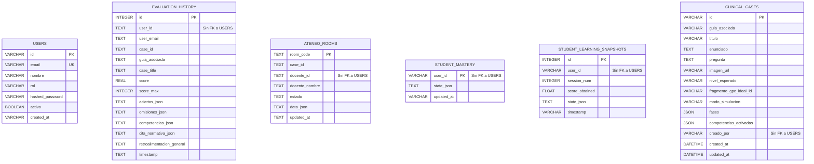
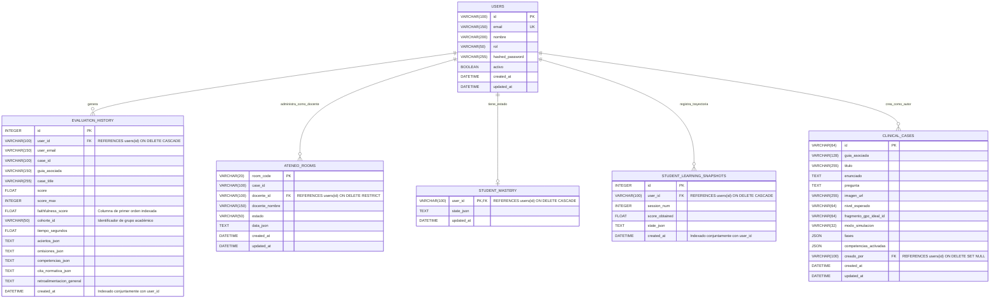

# Plan de Arquitectura y Profesionalización de la Base de Datos (Ateneo+ DB)

Este documento establece el diagnóstico forense, el modelo entidad-relación normalizado y la hoja de ruta técnica paso a paso para elevar la capa de persistencia de **Ateneo+** a estándares de producción institucional (+10 años en ingeniería de software), soportando tanto desarrollo local en SQLite WAL como despliegues de alta disponibilidad en PostgreSQL.

---

## 1. Diagnóstico Forense del Esquema Actual

### 1.1. Inventario de Tablas y Registros Físicos (`backend/data/history.db`)

| Tabla | Registros | Clave Primaria | Relaciones Formales (FK) | Índices Compuestos |
|:------|:----------|:---------------|:-------------------------|:-------------------|
| **`users`** | 3 | `id` (VARCHAR 100) | Ninguna | Ninguno |
| **`evaluation_history`** | 33 | `id` (INTEGER AUTO) | Ninguna (posee `user_id` sin FK) | Ninguno |
| **`ateneo_rooms`** | 25 | `room_code` (TEXT) | Ninguna (posee `docente_id` sin FK) | Ninguno |
| **`student_mastery`** | 1 | `user_id` (VARCHAR 100) | Ninguna (posee `user_id` sin FK) | Ninguno |
| **`student_learning_snapshots`** | 1 | `id` (INTEGER AUTO) | Ninguna (posee `user_id` sin FK) | Ninguno |
| **`clinical_cases`** | 0 | `id` (VARCHAR 64) | Ninguna (posee `creado_por` sin FK) | Ninguno |

### 1.2. Diagrama del Estado Actual (Modelos Desconectados)

---

## 2. Modelo Entidad-Relación Objetivo (Estándar Senior)

El esquema normalizado introduce integridad referencial estricta, índices compuestos para aceleración de analíticas y columnas de primer orden para métricas clínicas:

---

## 3. Diccionario de Datos Exhaustivo

### 3.1. Tabla: `users`
Almacena credenciales e identidades con control de acceso basado en roles (RBAC).

| Columna | Tipo SQL | Nulo | Restricciones / Por Defecto | Descripción |
|:--------|:---------|:----:|:----------------------------|:------------|
| `id` | `VARCHAR(100)` | No | Clave Primaria | Identificador único del usuario (`usr_alumno_001`, `usr_docente_001`, etc.). |
| `email` | `VARCHAR(150)` | No | `UNIQUE`, Índice | Correo electrónico institucional para inicio de sesión. |
| `nombre` | `VARCHAR(200)` | No | Ninguna | Nombre y apellidos del usuario. |
| `rol` | `VARCHAR(50)` | No | `'alumno'` | Rol de seguridad (`alumno`, `docente`, `administrador`). |
| `hashed_password` | `VARCHAR(255)` | No | Ninguna | Hash seguro de contraseña mediante algoritmo Bcrypt con salt dinámico. |
| `activo` | `BOOLEAN` | No | `TRUE` | Estado de habilitación de la cuenta. |
| `created_at` | `DATETIME` | No | `CURRENT_TIMESTAMP` | Fecha y hora UTC de registro en la plataforma. |
| `updated_at` | `DATETIME` | Sí | `ON UPDATE CURRENT_TIMESTAMP` | Fecha y hora UTC de la última modificación de perfil. |

---

### 3.2. Tabla: `evaluation_history`
Almacena el historial formativo de simulaciones clínicas resueltas con retroalimentación RAG.

| Columna | Tipo SQL | Nulo | Restricciones / Por Defecto | Descripción |
|:--------|:---------|:----:|:----------------------------|:------------|
| `id` | `INTEGER` | No | Clave Primaria, Autoincremental | Identificador secuencial de la evaluación. |
| `user_id` | `VARCHAR(100)` | No | `FK -> users(id) ON DELETE CASCADE` | Estudiante evaluado. Elimina historial si el usuario es borrado. |
| `user_email` | `VARCHAR(150)` | No | Ninguna | Correo histórico capturado en el momento de la evaluación. |
| `case_id` | `VARCHAR(100)` | No | Índice | Identificador del caso clínico evaluado. |
| `guia_asociada` | `VARCHAR(150)` | No | Ninguna | Guía de Práctica Clínica del MSP asociada al caso. |
| `case_title` | `VARCHAR(255)` | No | Ninguna | Título descriptivo del caso. |
| `score` | `FLOAT` | No | Check `(score >= 0 AND score <= 10)` | Puntuación obtenida (0.0 a 10.0). |
| `score_max` | `INTEGER` | No | `10` | Puntuación máxima de referencia. |
| `faithfulness_score` | `FLOAT` | Sí | Índice | Métrica de fidelidad normativa calculada por el algoritmo anti-alucinación. |
| `cohorte_id` | `VARCHAR(50)` | Sí | `'general'`, Índice | Agrupador institucional para analítica B2B de directores y docentes. |
| `tiempo_segundos` | `FLOAT` | Sí | `0.0` | Tiempo invertido por el alumno en redactar y someter el caso. |
| `aciertos_json` | `TEXT` | No | `'[]'` | Lista serializada JSON con aspectos normativos acertados. |
| `omisiones_json` | `TEXT` | No | `'[]'` | Lista serializada JSON con aspectos normativos omitidos. |
| `competencias_json`| `TEXT` | No | `'[]'` | Lista serializada JSON de competencias clínicas deficientes por eje. |
| `cita_normativa_json`| `TEXT` | No | `'{}'` | Objeto JSON con la referencia exacta a la norma del MSP (página, fragmento). |
| `retroalimentacion_general`| `TEXT`| No| `''` | Dictamen pedagógico cualitativo emitido por el modelo LLM. |
| `created_at` | `DATETIME` | No | `CURRENT_TIMESTAMP`, Índice | Marca temporal de la evaluación. |

**Índices Compuestos de Rendimiento:**
* `ix_eval_user_created`: `(user_id, created_at DESC)` — Acelera la consulta del historial cronológico del alumno (`/api/history`).
* `ix_eval_cohort_guide`: `(cohorte_id, guia_asociada)` — Acelera el cálculo del *Índice de Brecha Formativa (IBF)* institucional (`/api/history/ibf-cohort`).

---

### 3.3. Tabla: `ateneo_rooms`
Almacena las sesiones sincrónicas de resolución colaborativa de casos entre docentes y estudiantes.

| Columna | Tipo SQL | Nulo | Restricciones / Por Defecto | Descripción |
|:--------|:---------|:----:|:----------------------------|:------------|
| `room_code` | `VARCHAR(20)` | No | Clave Primaria, Índice | Código nemotécnico de 6 caracteres (ej. `ATENEO-4Z1A`). |
| `case_id` | `VARCHAR(100)` | No | Índice | Caso clínico asignado a la sesión colaborativa. |
| `docente_id` | `VARCHAR(100)` | No | `FK -> users(id) ON DELETE RESTRICT` | Docente creador y moderador de la sala. |
| `docente_nombre`| `VARCHAR(150)`| No | Ninguna | Nombre visible del moderador. |
| `estado` | `VARCHAR(50)` | No | `'espera'` | Estado de la sala (`espera`, `discusion`, `cerrada`). |
| `data_json` | `TEXT` | No | `'{}'` | Estado serializado de participantes, intervenciones y dictámenes. |
| `created_at` | `DATETIME` | No | `CURRENT_TIMESTAMP` | Fecha de creación de la sala. |
| `updated_at` | `DATETIME` | No | `CURRENT_TIMESTAMP` | Fecha y hora de última actividad sincrónica. |

---

### 3.4. Tabla: `student_mastery`
Almacena el estado latente consolidado de dominio continuo para las 7 competencias clínicas (BKT).

| Columna | Tipo SQL | Nulo | Restricciones / Por Defecto | Descripción |
|:--------|:---------|:----:|:----------------------------|:------------|
| `user_id` | `VARCHAR(100)` | No | Clave Primaria, `FK -> users(id) ON DELETE CASCADE` | Estudiante al que pertenece el perfil psicométrico. |
| `state_json` | `TEXT` | No | `'{}'` | Diccionario JSON `{ competencia_id: p_mastery }` (probabilidad $P(L_t)$ de 0 a 1). |
| `updated_at` | `DATETIME` | No | `CURRENT_TIMESTAMP` | Fecha de última actualización del motor BKT. |

---

### 3.5. Tabla: `student_learning_snapshots`
Almacena los puntos discretos de la curva de aprendizaje longitudinal para reconstrucción psicométrica.

| Columna | Tipo SQL | Nulo | Restricciones / Por Defecto | Descripción |
|:--------|:---------|:----:|:----------------------------|:------------|
| `id` | `INTEGER` | No | Clave Primaria, Autoincremental | Identificador secuencial del snapshot. |
| `user_id` | `VARCHAR(100)` | No | `FK -> users(id) ON DELETE CASCADE` | Estudiante evaluado. |
| `session_num` | `INTEGER` | No | Ninguna | Número ordinal de la sesión evaluativa (1, 2, 3...). |
| `score_obtained` | `FLOAT` | No | Ninguna | Calificación obtenida en esa sesión clínica. |
| `state_json` | `TEXT` | No | `'{}'` | Snapshot de las probabilidades de maestría tras la sesión. |
| `created_at` | `DATETIME` | No | `CURRENT_TIMESTAMP` | Marca temporal del snapshot. |

**Índice Compuesto de Rendimiento:**
* `ix_snapshot_user_session`: `(user_id, session_num ASC)` — Acelera la reconstrucción de curvas de aprendizaje en el panel adaptativo (`/api/adaptive/learning-path`).

---

### 3.6. Tabla: `clinical_cases`
Almacena casos clínicos dinámicos creados institucionalmente por docentes en la base de datos relacional.

| Columna | Tipo SQL | Nulo | Restricciones / Por Defecto | Descripción |
|:--------|:---------|:----:|:----------------------------|:------------|
| `id` | `VARCHAR(64)` | No | Clave Primaria, Índice | Identificador canónico del caso (ej. `case_asma_01`). |
| `guia_asociada` | `VARCHAR(128)` | No | Índice | Guía de Práctica Clínica vinculada. |
| `titulo` | `VARCHAR(255)` | No | Ninguna | Título descriptivo del caso médico. |
| `enunciado` | `TEXT` | No | Ninguna | Cuadro clínico inicial del paciente. |
| `pregunta` | `TEXT` | No | Ninguna | Pregunta formativa a responder por el estudiante. |
| `imagen_url` | `VARCHAR(255)` | Sí | Ninguna | URL relativa o estática de paraclínicos (ECG, Rx, Labs). |
| `nivel_esperado` | `VARCHAR(64)` | Sí | `'pregrado_avanzado'` | Nivel pedagógico de dificultad. |
| `fragmento_gpc_ideal_id` | `VARCHAR(64)` | Sí | Ninguna | Identificador del fragmento normativo de referencia. |
| `modo_simulacion` | `VARCHAR(32)` | Sí | `'single_turn'` | Modalidad (`single_turn` o `fases`). |
| `fases` | `JSON` | Sí | Ninguna | Estructura jerárquica de fases clínicas secuenciales. |
| `competencias_activadas`| `JSON` | Sí | Ninguna | Lista de competencias del grafo KST involucradas. |
| `creado_por` | `VARCHAR(100)` | Sí | `FK -> users(id) ON DELETE SET NULL` | Docente autor del caso dinámico. |
| `created_at` | `DATETIME` | No | `CURRENT_TIMESTAMP` | Fecha de creación del caso. |
| `updated_at` | `DATETIME` | Sí | `ON UPDATE CURRENT_TIMESTAMP` | Fecha de última edición. |

---

## 4. Plan de Ejecución por Fases (Paso a Paso sin Parches)

### Fase 1: Habilitación de Integridad Referencial en el Motor
1. Actualizar `backend/core/database.py`:
   - Configurar listener para ejecutar `PRAGMA foreign_keys=ON;` en SQLite cada vez que se establece una conexión (junto con el modo WAL ya activo).
   - Estandarizar la ruta por defecto de la base de datos hacia `backend/data/ateneo_clinical.db` (preservando migración automática transparente desde `history.db` para no perder los datos existentes).

### Fase 2: Refactorización de Modelos Relacionales (SQLAlchemy 2.0)
1. Actualizar `modules/auth/models.py`:
   - Migrar `created_at` a `DateTime(timezone=True)` con `func.now()`.
2. Actualizar `modules/analytics_history/models.py`:
   - Agregar `ForeignKey("users.id", ondelete="CASCADE")` a `user_id`.
   - Agregar columnas de primer orden: `faithfulness_score: Float`, `cohorte_id: String(50)`, `tiempo_segundos: Float`.
   - Migrar `timestamp` a `DateTime(timezone=True)`.
   - Crear índices compuestos `ix_eval_user_created` e `ix_eval_cohort_guide`.
3. Actualizar `modules/collaboration/models.py`:
   - Agregar `ForeignKey("users.id", ondelete="RESTRICT")` a `docente_id`.
   - Migrar `updated_at` a `DateTime(timezone=True)`.
4. Actualizar `modules/adaptive/models.py`:
   - Agregar `ForeignKey("users.id", ondelete="CASCADE")` a `StudentMasteryModel.user_id` y `StudentSnapshotModel.user_id`.
   - Migrar fechas a `DateTime(timezone=True)`.
   - Crear índice compuesto `ix_snapshot_user_session` en `student_learning_snapshots`.
5. Actualizar `modules/cases/models.py`:
   - Agregar `ForeignKey("users.id", ondelete="SET NULL")` a `creado_por`.

### Fase 3: Migración de Datos y Preservación de Registros Existentes
1. Crear un script de migración determinístico que:
   - Cree la base de datos con el nuevo esquema normalizado.
   - Migre los 3 usuarios, 33 evaluaciones, 25 salas y estados psicométricos existentes en `history.db` garantizando que no se pierda ningún dato histórico.
   - Verifique que la integridad referencial sea 100% válida.

### Fase 4: Sincronización de Repositorios de Dominio
1. Actualizar `HistoryRepository`:
   - Sincronizar inserciones para poblar `faithfulness_score` y `cohorte_id` como columnas directas.
   - Optimizar consultas de analítica de coordinadores (`analyze_coordinator_cohort_analytics`) para utilizar agregaciones SQL nativas (`func.avg`) sobre las nuevas columnas indexadas.

### Fase 5: Verificación Integral de Regresión
1. Ejecutar la suite completa de pruebas del backend (`uv run python -m tests.run_all_tests`).
2. Validar que las 6 suites aprueben al 100% con las nuevas restricciones de llaves foráneas e índices.
3. Ejecutar la suite de pruebas del frontend (`npm run test`) para constatar cero alteraciones en los contratos del cliente.
4. Actualizar `.agents/memory.md`.
