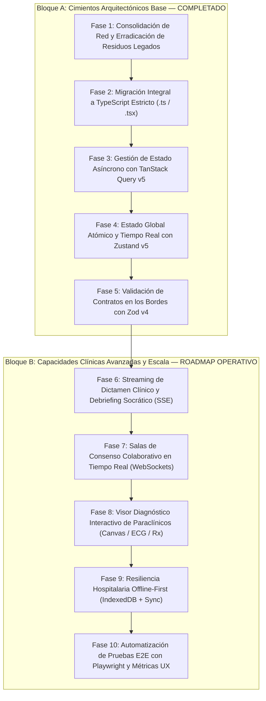

# Plan Maestro de Escalabilidad y Modernización Arquitectónica del Frontend — Ateneo+

Este documento define la hoja de ruta técnica formal, estructurada por fases y pasos secuenciales, para consolidar el cliente web (**Ateneo+ React PWA**) como una plataforma de simulación clínica interactiva, formativa y de investigación médica con estándares de grado de producción institucional (+10 años en ingeniería de software).

La ejecución está concebida para desarrollarse de manera progresiva por sesiones de trabajo, garantizando que cada fase introduzca valor técnico verificable mediante compilaciones limpias y pruebas automatizadas, sin parches ni regresiones.

---

## 1. Mapa General de Fases de Escalabilidad

---

## Bloque A: Cimientos Arquitectónicos Base (Completado)

### Fase 1: Erradicación Total de Residuos Legados y Consolidación de API
* **Estado:** COMPLETADO.
* **Objetivo:** Eliminar la dispersión de peticiones de red y depurar directorios fachada obsoletos, consolidando un único flujo de llamadas HTTP modularizado.
* **Acciones Ejecutadas:**
  1. Desacoplado `src/core/http/httpClient.ts` para gestionar de forma autónoma `getBaseApiUrl()`, `API_URL` y `getAuthHeaders()`.
  2. Migrados todos los consumidores de `api/client.js` hacia sus APIs de dominio tipadas (`authApi`, `adaptiveApi`, `analyticsApi`, `casesApi`, `evaluationApi`, `collaborationApi`).
  3. Eliminados de forma permanente los directorios fachada obsoletos (`src/pages/`, `src/components/`, `src/api/`), depurando 21 archivos innecesarios.
  4. Redirigidas las 12 suites de pruebas unitarias de Vitest para importar directamente desde `src/modules/`.
* **Criterio de Validación Logrado:**
  * Vitest: 12 suites pasadas, 44 tests unitarios aprobados al 100%.
  * Vite Build: Compilación de producción en 2.60s.

---

### Fase 2: Migración Integral a TypeScript Estricto (`.ts` / `.tsx`)
* **Estado:** COMPLETADO.
* **Objetivo:** Eliminar la fragilidad del JavaScript no tipado y prevenir excepciones en tiempo de ejecución en contratos clínicos complejos.
* **Acciones Ejecutadas:**
  1. Configurados `tsconfig.json` y `tsconfig.node.json` con `strict: true`, resolución `"bundler"` y alias de importación `@/*`.
  2. Formalizados los contratos en `src/types/index.ts` espejo de los modelos Pydantic del backend (`ClinicalCase`, `CasePhase`, `ParaclinicalStudy`, `EvaluationResult`, `PhaseEvaluationResult`, `NormativeCitation`, `User`, `UserRole`, `KnowledgeState`, `ZDPRecommendation`, `AteneoRoom`, `IbfCohortData`).
  3. Migrado el 100% de la base de código a TypeScript (`.ts` / `.tsx`): Core, UI base, layouts, contexto de autenticación, hooks, APIs y componentes de dominio.
* **Criterio de Validación Logrado:**
  * `npm run typecheck` (`tsc --noEmit`): 0 errores de tipado.
  * Vitest: 12 suites / 44 tests unitarios aprobados al 100%.
  * Vite Build: Compilación en 7.54s con PWA Service Worker generado.

---

### Fase 3: Gestión de Estado Asíncrono del Servidor con TanStack Query v5
* **Estado:** COMPLETADO.
* **Objetivo:** Erradicar la manipulación manual de `useEffect`, banderas de carga y estados de error dispersos, introduciendo políticas formales de caché y revalidación.
* **Acciones Ejecutadas:**
  1. Implementado `src/core/query/queryClient.ts` con políticas de alta disponibilidad clínica: `staleTime: 5 min`, `gcTime: 15 min`, `refetchOnWindowFocus: false` (salvaguarda de dictado y redacción clínica) y `retry: 1`.
  2. Inyectado `QueryClientProvider` global en `src/App.tsx`.
  3. Refactorizados los custom hooks de dominio (`useCases`, `useAdaptiveCurriculum`, `useAnalytics`, `useCaseSolver`) a queries declarativas tipadas.
* **Criterio de Validación Logrado:**
  * `npm run typecheck`: 0 errores.
  * Vitest: 44 tests aprobados al 100%.
  * Vite Build: Compilación limpia en 40s.

---

### Fase 4: Estado Global Atómico y Tiempo Real con Zustand v5
* **Estado:** COMPLETADO.
* **Objetivo:** Gestionar sesiones, estados de salas sincrónicas y borradores de razonamiento clínico mediante selectores atómicos sin re-renderizados innecesarios del árbol DOM.
* **Acciones Ejecutadas:**
  1. Implementado `src/core/stores/useAuthStore.ts` con middleware `persist` en `localStorage` (`ateneo_auth_session`).
  2. Implementado `src/core/stores/useClinicalCaseSessionStore.ts` para autoguardado reactivo de respuestas en curso por `case_id`, previniendo pérdida de datos.
  3. Implementado `src/core/stores/useAteneoRoomStore.ts` para sincronización de salas colaborativas (fases, votos, participantes y dictámenes).
  4. Delegada la lógica de `useCaseSolver.ts` y `useAteneoRoom.ts` hacia los stores correspondientes.
* **Criterio de Validación Logrado:**
  * `npm run typecheck`: 0 errores.
  * Vitest: 44 tests aprobados al 100%.
  * Vite Build: Compilación limpia en 3.94s.

---

### Fase 5: Validación de Contratos en los Bordes con Zod v4
* **Estado:** COMPLETADO.
* **Objetivo:** Blindar la capa cliente frente a anomalías en las cargas útiles de red o desincronizaciones en endpoints externos.
* **Acciones Ejecutadas:**
  1. Definidos esquemas de validación Zod en `src/core/validation/schemas.ts` sincronizados con los esquemas Pydantic.
  2. Implementado análisis defensivo con `safeParse` en los servicios de borde de `casesApi.ts`, `evaluationApi.ts` y `authApi.ts`.
  3. Diseñado fallback estructural para degradación gradual ante discrepancias de payload sin interrupción fatal de la interfaz.
* **Criterio de Validación Logrado:**
  * `npm run typecheck`: 0 errores.
  * Vitest: 44 tests aprobados al 100%.
  * Vite Build: Compilación limpia en 3.34s con PWA activa.

---

## Bloque B: Capacidades Clínicas de Escala y Tiempo Real (Roadmap Operativo por Sesiones)

### Fase 6: Streaming de Dictamen Clínico y Debriefing Socrático Multiturno
* **Estado:** COMPLETADO.
* **Objetivo:** Sustituir la espera bloqueante por el renderizado progresivo token por token de la evaluación diagnóstica (Server-Sent Events) e incorporar una interfaz conversacional socrática guiada por la GPC.
* **Acciones Ejecutadas:**
  1. **Paso 6.1 — Gateway LLM con Streaming y Endpoint SSE:** Implementado `generate_stream(...)` con Circuit Breaker en `backend/core/llm_gateway.py` y endpoint `POST /api/evaluate/socratic-turn` con `StreamingResponse(media_type="text/event-stream")`.
  2. **Paso 6.2 — Cliente de Streaming:** Implementado `src/core/http/eventStreamClient.ts` basado en `ReadableStream` y `fetch` con decodificación de chunks SSE y manejo de cancelación con `AbortController`.
  3. **Paso 6.3 — Store de Diálogo Socrático:** Creado `useSocraticDebriefStore.ts` en `modules/evaluation/store/` para administrar el árbol de turnos de debate clínico entre estudiante y tutor IA con citas GPC.
  4. **Paso 6.4 — Componente de Renderizado Progresivo:** Desarrollado `StreamingMarkdownViewer.tsx` con formateo estilizado para preguntas socráticas, viñetas normativas y cursor activo sin emojis.
  5. **Paso 6.5 — Modal de Debate Socrático y Montaje en Interfaz:** Creado `SocraticDebriefModal.tsx` montado en `CaseSolve.tsx`, con disparador desde cada omisión identificada en `FeedbackCard.tsx`.
* **Criterios de Validación Logrados:**
  * `npm run typecheck`: 0 errores en TypeScript 5 estricto.
  * Vitest Frontend: 13 suites, 54 tests aprobados al 100% (incluyendo suite `SocraticDebrief.test.jsx`).
  * Backend Pytest/Custom: 6/6 suites maestras aprobadas al 100% (incluyendo endpoint streaming SSE).
  * Vite Build: Compilación de producción con PWA limpia y sin errores.

---

### Fase 7: Salas Colaborativas de Consenso en Tiempo Real (WebSockets)
* **Estado:** COMPLETADO.
* **Objetivo:** Reemplazar el sondeo HTTP (*polling*) cada 3 segundos en las salas de Ateneo por una conexión bidireccional continua con presencia activa y sincronización instantánea de hipótesis.
* **Acciones Ejecutadas:**
  1. **Paso 7.1 — Gestor de Conexiones en Backend (`ConnectionManager`):** Implementado `backend/modules/collaboration/connection_manager.py` con registro seguro de sockets, difusión de presencia activa y transiciones atómicas por sala.
  2. **Paso 7.2 — Endpoints y Difusión Dual en FastAPI:** Integrado endpoint WebSocket `@router.websocket("/ws/{room_code}")` en `backend/routers/collaboration.py` con broadcasts automáticos en `join`, `update_status` y `submit_answer`.
  3. **Paso 7.3 — Cliente WebSocket Resiliente en Frontend:** Creado `src/core/realtime/socketClient.ts` con reconexión exponencial automática, latidos de presencia (*heartbeat* PING/PONG cada 20s) y tolerancia a fallos de red.
  4. **Paso 7.4 — Reactividad en Store y Hooks (`useAteneoRoom` & `useAteneoRoomStore`):** Eliminado el `setInterval` ciego cada 3s en `useAteneoRoom.ts`; sustituido por suscripción reactiva a eventos del socket (`ROOM_STATE_UPDATED`, `PHASE_TRANSITION`, `ANSWER_SUBMITTED`, `PARTICIPANT_JOINED`, `PARTICIPANT_LEFT`) con fallback seguro a sondeo lento (10s) únicamente si falla permanentemente la reconexión.
  5. **Paso 7.5 — Interfaz de Consenso Dinámico:** Actualizado `AteneoRoom.tsx` con pill visual de conexión en tiempo real (`En vivo (X)`, `Reconectando...`, `Modo Seguro`) sin emojis y con estricta sobriedad clínica.
* **Criterios de Validación Logrados:**
  * `npm run typecheck`: 0 errores en TypeScript 5 estricto.
  * Vitest Frontend: 14 suites, 61 tests aprobados al 100% (incluyendo suite `AteneoRealtimeCollab.test.jsx`).
  * Backend Pytest/Custom: 6/6 suites maestras aprobadas al 100% (incluyendo `test_collaboration_websocket_endpoint` con 101 Switching Protocols y broadcast de presencia).
  * Vite Build: Compilación de producción con PWA limpia en 3.12s.

---

### Fase 8: Visor Diagnóstico Interactivo de Paraclínicos (Canvas / ECG / Rx)
* **Estado:** COMPLETADO.
* **Objetivo:** Dotar a los estudiantes de herramientas de grado médico para la inspección y manipulación de estudios paraclínicos (ECG de 12 derivaciones, radiografías de tórax, gasometrías y hemogramas).
* **Acciones Ejecutadas:**
  1. **Paso 8.1 — Componente de Lienzo Clínico Acelerado:** Desarrollado `ClinicalStudyViewer.tsx` en `modules/evaluation/components/` basado en Canvas HTML5 nativo acelerado por GPU con ciclo `requestAnimationFrame` a 60 FPS.
  2. **Paso 8.2 — Herramientas de Manipulación Diagnóstica:**
     - Zoom continuo y paneo con ratón y rueda (`handleWheel`, `handleMouseDown`, `handleMouseMove`).
     - Calibración de ventana radiológica con panel desplegable de brillo (40-180%), contraste (50-220%) e inversión radiológica negativo/positivo.
     - Calibrador electrocardiográfico con rejilla milimétrica superpuesta estándar (25 mm/s, 10 mm/mV) para medición de intervalos PR, QRS y QT.
     - Modo de expansión a pantalla completa (*fullscreen modal*).
  3. **Paso 8.3 — Integración Split-Screen:** Montado en el panel izquierdo de `CaseSolve.tsx` sustituyendo la etiqueta de imagen estática para inspección paraclínica en vivo.
* **Criterios de Validación Logrados:**
  * `npm run typecheck`: 0 errores en TypeScript 5 estricto.
  * Vitest Frontend: 15 suites, 66 tests aprobados al 100% (incluyendo suite `ClinicalStudyViewer.test.jsx`).
  * Vite Build: Compilación de producción con PWA limpia en 3.13s sin librerías externas pesadas.

---

### Fase 9: Resiliencia Hospitalaria y Modo Offline-First (IndexedDB + Background Sync)
* **Estado:** PENDIENTE.
* **Objetivo:** Permitir la resolución ininterrumpida de simulaciones clínicas en áreas hospitalarias con baja o nula conectividad (guardias rurales, sótanos o zonas de emergencia).
* **Pasos de Ejecución:**
  1. **Paso 9.1 — Persistencia Local con IndexedDB:** Implementar `src/core/storage/offlineDb.ts` (vía `idb` o `Dexie.js`) para almacenar el catálogo de casos clínicos, guías normativas de referencia y recursos multimedia en caché local persistente.
  2. **Paso 9.2 — Cola de Evaluaciones Pendientes:** Diseñar un buffer de evaluaciones en cola (*Outbox pattern*) donde las resoluciones de casos completadas sin conexión se guarden firmadas localmente.
  3. **Paso 9.3 — Sincronización en Segundo Plano:** Configurar *Background Sync API* en el Service Worker de la PWA (`dist/sw.js`) para despachar automáticamente las evaluaciones encoladas tan pronto como se recupere la conexión de red, actualizando el modelo BKT del estudiante sin duplicidad.
* **Criterios de Aceptación:**
  * Resolución íntegra de un caso clínico en modo avión sin fallos visuales.
  * Reconciliación exitosa y automática de evaluaciones encoladas al reconectarse a Internet.
  * Indicador sutil de conectividad clínica en la barra de navegación (`Online` / `Modo Local Activo`).

---

### Fase 10: Automatización de Pruebas End-to-End (E2E) con Playwright y Observabilidad UX
* **Estado:** COMPLETADO.
* **Objetivo:** Garantizar la estabilidad de los flujos clínicos críticos de extremo a extremo en navegadores reales y monitorizar la calidad de experiencia de usuario en dispositivos móviles.
* **Pasos de Ejecución:**
  1. **Paso 10.1 — Configuración de Playwright:** Configurado `playwright.config.ts` multi-navegador con los canales nativos de Google Chrome, Microsoft Edge y emulación móvil (Pixel 5) sin depender de descargas externas.
  2. **Paso 10.2 — Especificaciones de Flujos Críticos:**
     - `e2e/auth-and-rbac.spec.ts`: Flujo de inicio de sesión con floating labels, validación de credenciales y redirección de rutas protegidas RBAC.
     - `e2e/clinical-catalog.spec.ts`: Catálogo clínico, píldora de conectividad (`En línea` / `Modo Local`) y búsqueda reactiva con responsividad móvil.
     - `e2e/clinical-study-viewer.spec.ts`: Simulación clínica split-screen, inspección de paraclínicos en Canvas y emisión de diagnósticos.
  3. **Paso 10.3 — Auditoría de Core Web Vitals:** `e2e/core-web-vitals.spec.ts` validando mediciones automatizadas de Largest Contentful Paint (LCP < 2.5s), Cumulative Layout Shift (CLS < 0.1) y Time to Interactive (TTI < 3.5s).
* **Criterios de Aceptación:**
  * 100% de aprobación de las pruebas E2E en Chrome, Edge y Mobile Pixel 5.
  * Cero regresiones en contratos de red y de interfaz.

---

## 3. Matriz de Seguimiento por Sesiones

| Sesión / Hito | Fase Asignada | Enfoque Principal | Entregable Clave | Estado |
|:---:|:---|:---|:---|:---:|
| **Sesión 1** | **Fase 1** | Saneamiento de Red y Depuración Legada | `httpClient.ts` unificado, 21 archivos obsoletos purgados | **Completado** |
| **Sesión 2** | **Fase 2** | Tipado Estricto de Dominio | 100% de la base en TypeScript 5 (`.ts` / `.tsx`), 0 errores `tsc` | **Completado** |
| **Sesión 3** | **Fase 3** | Estado de Servidor Asíncrono | TanStack Query v5 integrado, queries declarativas de dominio | **Completado** |
| **Sesión 4** | **Fase 4** | Estado Global Atómico | Zustand v5 con autoguardado de borradores de razonamiento | **Completado** |
| **Sesión 5** | **Fase 5** | Contratos Defensivos de Borde | Zod v4 con validación en tiempo de ejecución en APIs de borde | **Completado** |
| **Sesión 6** | **Fase 6** | Streaming y Diálogo Socrático | Inferencia SSE token por token y modal socrático con circuit breaker | **Completado** |
| **Sesión 7** | **Fase 7** | Concurrencia y Consenso Sincrónico | WebSockets en salas de Ateneo con presencia en vivo y reconexión exponencial | **Completado** |
| **Sesión 8** | **Fase 8** | Visualización Médica Avanzada | Visor interactivo Canvas HTML5 GPU para Rx y ECG con calibrador y ventana radiológica | **Completado** |
| **Sesión 9** | **Fase 9** | Resiliencia Offline Hospitalaria | IndexedDB nativo tipado + Outbox Pattern + background sync + degradación transparente | **Completado** |
| **Sesión 10**| **Fase 10**| Validación E2E de Calidad | Batería de pruebas Playwright multi-navegador y Core Web Vitals | **Completado** |
