# Plan Maestro de Arquitectura, Robustez y Escalabilidad del Frontend (Ateneo+ PWA)

Este documento define la auditoría integral, el diagnóstico de capacidad y la hoja de ruta técnica paso a paso para consolidar el cliente web (**Ateneo+ React PWA**) bajo estándares de ingeniería de software senior (+10 años en producción), garantizando su escalamiento ordenado desde la fase actual de simulación clínica interactiva hacia una plataforma de grado hospitalario y universitario multi-institucional de alta concurrencia.

---

## 0. Dependencias con Otros Planes

Este plan complementa la arquitectura fullstack. La ejecucion de sus bloques avanzados depende de los otros planes:

| Bloque / Fase de este Plan | Requiere Backend | Requiere BD |
|:---------------------------|:-----------------|:------------|
| **Bloque A** (Fases 1-5) | Independiente (consume API existente) | Independiente |
| **Bloque B** (Fases 6-10) | Fase 1 Backend completada (routers limpios) | Independiente |
| **Fase 11** (Analytics offline / IBF) | Fases 4-5 Backend (repositorios SQL nativos) | BD Fase 4 completada |
| **Fase 14** (Multi-Tenancy UI) | Fase 6 Backend (TenantModel activo) | BD Fase 2-3 completadas |
| **Fase 16** (OpenTelemetry cliente) | Fase 9 Backend (logging estructurado activo) | Independiente |

**Orden canonico:** BD (Fases 1-5) > Backend (Fases 1-10) > Frontend Bloque C (Fases 11-16)

---

## 1. Visión Arquitectónica y Proyección de Escala (10x - 100x)

Ateneo+ evoluciona desde un prototipo de investigación médica hacia una plataforma de simulación diagnóstica y evaluación clínica para múltiples facultades de medicina, hospitales docentes y miles de estudiantes e internos rotativos concurrentes.

El frontend debe garantizar:
1. **Rendimiento Perceptual Sub-Segundo:** Tiempos de carga inicial y transiciones entre casos clínicos inferiores a 1.5 segundos en dispositivos hospitalarios de baja potencia o redes móviles inestables.
2. **Alta Fidelidad Diagnóstica:** Soporte de herramientas médicas estándar, desde la calibración de trazados electrocardiográficos de 12 derivaciones hasta la inspección de estudios tomográficos axiales multicorte (DICOM/PACS).
3. **Resiliencia Operativa Continua:** Funcionamiento ininterrumpido en entornos hospitalarios sin cobertura (*Offline-First* con reconciliación atómica en segundo plano).
4. **Gobernanza Multi-Institucional:** Capacidad de adaptación dinámica (*White-Labeling* y Multi-Tenancy) para universidades asociadas, redes hospitalarias públicas y privadas.

```mermaid
graph TD
    subgraph Capa_Presentacion [Capa de Presentacion & Enrutamiento]
        R["AppRoutes (React.lazy + Suspense)"]
        G["ProtectedRoute (RBAC: Alumno, Docente, Admin)"]
        LAYOUT["AppLayout & Navbar (Pills de Conectividad & Presencia)"]
    end

    subgraph Capa_Dominio [Capa de Dominio & Custom Hooks (ViewModel)]
        CASES_VM["useCases (Filtros & Busqueda Semantica)"]
        SOLVER_VM["useCaseSolver (Razonamiento, Fases & Multimodal)"]
        SOCRATIC_VM["useSocraticDebriefStore (Dialogo Streaming)"]
        ROOM_VM["useAteneoRoom (Consenso & Presencia Reactiva)"]
        ADAPTIVE_VM["useAdaptiveCurriculum (KST/BKT & ZDP)"]
        ANALYTICS_VM["useAnalytics (IBF de Cohorte & Radar)"]
    end

    subgraph Capa_Estado [Capa de Gestion de Estado Transversal]
        TQ["TanStack Query v5 (Cache de Servidor & Revalidaciones)"]
        Z_AUTH["useAuthStore (Sesion Persistida)"]
        Z_SESSION["useClinicalCaseSessionStore (Autoguardado de Borradores)"]
        Z_ROOM["useAteneoRoomStore (Consenso Sincronico)"]
        Z_SOCRATIC["useSocraticDebriefStore (Arbol Pedagogico)"]
    end

    subgraph Capa_Transporte [Capa de Transporte & Resiliencia Offline]
        HTTP["httpClient (Fetch + Bearer JWT + RFC 7807)"]
        SSE["eventStreamClient (SSE Streaming + AbortController)"]
        WS["socketClient (WebSocket Resiliente + Heartbeats 20s)"]
        OFFLINE["offlineDb (IndexedDB ateneo_offline_v1)"]
        SYNC["useConnectivitySync (Outbox Pattern & Background Sync)"]
        ZOD["Zod v4 (Validacion Defensiva de Contratos en Borde)"]
    end

    subgraph Capa_Especializada [Servicios Especializados de Grado Medico]
        CANVAS_GPU["ClinicalStudyViewer (Canvas 2D 60 FPS / ECG / Rx)"]
        DICOM_PACS["Visor DICOM WADO-RS / Stacks Axiales (Roadmap C)"]
        OSCE_ENGINE["Motor de Estaciones OSCE / ECOE (Roadmap C)"]
        WEBRTC["Tele-Debriefing Audio Streaming (Roadmap C)"]
    end

    R --> G --> LAYOUT
    LAYOUT --> CASES_VM
    LAYOUT --> SOLVER_VM
    LAYOUT --> ROOM_VM
    LAYOUT --> ADAPTIVE_VM
    LAYOUT --> ANALYTICS_VM

    SOLVER_VM --> CANVAS_GPU
    SOLVER_VM --> SOCRATIC_VM
    SOLVER_VM --> Z_SESSION
    SOLVER_VM --> TQ

    ROOM_VM --> Z_ROOM
    ROOM_VM --> WS

    CASES_VM --> TQ
    CASES_VM --> OFFLINE

    ADAPTIVE_VM --> TQ
    ANALYTICS_VM --> TQ

    TQ --> ZOD --> HTTP
    SOCRATIC_VM --> SSE
    SYNC --> OFFLINE
    SYNC --> HTTP
```

---

## 2. Diagnóstico Exhaustivo del Frontend Actual

### 2.1 Inventario de Tecnologías y Mapeo de Capas

| Capa / Módulo | Tecnología / Patrón | Responsabilidad Actual | Diagnóstico y Brechas Detectadas |
|:--------------|:--------------------|:-----------------------|:---------------------------------|
| **Compilación y Empaquetado** | Vite 6, Rollup, PostCSS | Transpilación TypeScript, HMR, code-splitting dinámico y generación de PWA (`vite-plugin-pwa`). | Compilación óptima (< 4s). Requiere optimización avanzada de chunks para dependencias médicas pesadas proyectadas (DICOM parser). |
| **Tipado y Contratos** | TypeScript 5 estricto (`strict: true`), Zod v4 | Contratos de dominio clínico sincronizados con Pydantic (`ClinicalCase`, `EvaluationResult`, etc.) y validación en tiempo de ejecución. | Robusto (0 errores `tsc`). Requiere tipado estricto en esquemas de tele-simulación y multi-estaciones OSCE. |
| **Presentación y UI** | React 18, Tailwind CSS, Lucide Icons | Interfaz split-screen 50/50, inputs floating label (Google Accounts), paleta médica institucional y cero emojis. | Cero violaciones de diseño. Los tokens están estáticos en Tailwind; requiere ThemeProvider dinámico para multi-tenancy. |
| **Controladores (ViewModel)** | Custom Hooks (`useCaseSolver`, `useCases`, etc.) | Desacoplamiento de lógica clínica, concurrencia de audio (Web Speech API) y orquestación de llamadas. | Cohesión alta. Subcomponente `useVoiceRecognition.ts` en `modules/evaluation/hooks` mantiene reexportación delegada histórica. |
| **Estado del Servidor** | TanStack Query v5 | Caché de casos, trayectorias KST y métricas con políticas defensivas (`staleTime: 5m`, `gcTime: 15m`). | Excelente resiliencia. Falta persistencia de cache de TanStack Query directamente sobre IndexedDB para navegación offline prolongada. |
| **Estado Global en Cliente** | Zustand v5 con middleware `persist` | Sesión de usuario (`useAuthStore`), borradores clínicos (`useClinicalCaseSessionStore`), salas (`useAteneoRoomStore`). | Modular y atómico. Evita re-renderizados innecesarios del lienzo split-screen. |
| **Tiempo Real y Streaming** | SSE (`eventStreamClient`), WebSockets (`socketClient`) | Debriefing socrático multiturno token por token y salas colaborativas sincrónicas con presencia y reconexión exponencial. | Altamente funcional con reconexión defensiva y heartbeats. Falta canal de audio bidireccional WebRTC. |
| **Persistencia Local** | IndexedDB nativo (`ateneo_offline_v1`) | Almacenes para catálogo de casos, evaluaciones encoladas (*Outbox*) y resultados locales. | Operativo y probado. Requiere sincronización de recursos binarios de gran volumen (archivos de imagen/estudios). |
| **Visualización Médica** | Canvas HTML5 acelerado por hardware | Paneo, zoom infinito, ventana radiológica (brillo/contraste/inversión) y calibrador ECG milimétrico a 60 FPS. | Excelente para imágenes 2D estáticas. Carece de soporte para formatos médicos nativos DICOM multicorte (TAC/RMN). |
| **Pruebas y Aseguramiento** | Vitest 5, Testing Library, Playwright | 16 suites unitarias (72 tests) y 4 especificaciones E2E multi-navegador (15 tests en Chrome, Edge y Mobile Pixel 5). | 100% PASS verificado. Requiere pruebas automatizadas de regresión visual de componentes UI (Visual Regression Testing). |

### 2.2 Métricas de Rendimiento y Calidad Verificadas

* **Compilación de Producción:** `dist/assets/index-*.js` en **321.29 kB / 99.92 kB gzip**, construido en **16.72s**. El crecimiento respecto a mediciones anteriores (184 kB) refleja la incorporación de Zustand v5, TanStack Query v5, Zod v4, `eventStreamClient`, `socketClient` y `offlineDb`. PWA con 26 activos precacheados (537.26 KiB). El chunk de `CaseSolve` es el más pesado (66.75 kB gzip: 18.32 kB) — candidato a optimización con lazy import de dependencias de Canvas en Fase 11.
* **Cobertura de Tipado:** 0 errores en `npm run typecheck` (`tsc --noEmit`).
* **Suites de Pruebas Unitarias:** 16 suites y 72 tests aprobados al 100% (`vitest run`). Duración variable según entorno (6.4s en CI optimizado, ~34s en desarrollo con carga de modelo BGE-M3).
* **Suites End-to-End Multi-Navegador:** 15/15 tests aprobados al 100% en 30.6s (`playwright test`).
* **Core Web Vitals en Cliente:** Largest Contentful Paint (LCP) < 2.5s, Cumulative Layout Shift (CLS) < 0.1, TTFB < 1.0s, DOM Interactive < 3.5s.

---

## 3. Matriz de Hallazgos y Brechas de Escala Institucional

| ID | Área / Subsistema | Severidad | Diagnóstico Técnico | Causa Raíz | Solución Arquitectónica (Cero Parches) |
|:---|:------------------|:----------|:--------------------|:-----------|:---------------------------------------|
| **F1** | Visualización Médica | Alta | Ausencia de soporte para estándares de imagenología clínica hospitalaria (DICOM / PACS / WADO-RS). | El visor actual (`ClinicalStudyViewer.tsx`) fue diseñado exclusivamente para imágenes web convencionales (PNG/JPG). | Integrar micro-adaptador con `Cornerstone.js` / `OHIF Viewer Core` para renderizar estudios DICOM reales con múltiples cortes axiales, sagitales y cálculo de unidades Hounsfield (HU). |
| **F2** | Motor de Simulación | Alta | Falta de soporte estructurado para circuitos de Examen Clínico Objetivo Estructurado (OSCE / ECOE). | El simulador está modelado para resolución monousuario o fases secuenciales simples, sin temporización formal por estación. | Desarrollar el motor de circuito OSCE con rotación automática de estaciones, rúbricas de evaluación ciega para jurados docentes y telemetría de desempeño por estación. |
| **F3** | Tiempo Real & Audio | Media | Carencia de comunicación de audio bidireccional y tele-debriefing sincrónico en salas colaborativas. | Las salas actuales comunican estado y deliberación diagnóstica mediante texto WebSocket sin canal de audio integrado. | Implementar tele-simulación mediante WebRTC y AudioWorklet para deliberación socrática y pases de visita clínica remota con supresión de ruido. |
| **F4** | Multi-Tenancy & UI | Media | Acoplamiento estático de la identidad visual a una única entidad universitaria/institucional. | Los colores, imagotipos y temas están configurados de forma fija en la plantilla de Tailwind CSS sin ThemeProvider dinámico. | Implementar un sistema de tokens de diseño dinámicos basados en variables CSS nativas inyectadas por Tenant Context, permitiendo personalización institucional institucional limpia sin recompilación. |
| **F5** | Internacionalización | Media | Carencia de internacionalización (i18n) y localización nosológica para expansión a redes de salud de la región andina. | Todos los textos, etiquetas y mensajes de interfaz están hardcodeados en español ecuatoriano en el código fuente. | Implementar arquitectura i18n tipada con `react-i18next`, organizando diccionarios por subdominios clínicos y desacoplando la taxonomía de guías locales (MSP Ecuador, MINSA Perú, OMS/OPS). |
| **F6** | Observabilidad RUM | Media | Ausencia de monitoreo de usuario real (Real User Monitoring - RUM) y telemetría de errores en clientes de producción. | La auditoría de Core Web Vitals se ejecuta únicamente en CI con Playwright, sin captura de anomalías en dispositivos reales de estudiantes. | Integrar OpenTelemetry Web SDK / Sentry Browser con captura estructurada de Web Vitals reales, fallas de red, excepciones de renderizado y trazabilidad con `X-Request-ID`. |
| **F7** | Sistema de Diseño | Baja | Carencia de catálogo vivo de componentes de interfaz y pruebas de regresión visual automatizadas. | Los componentes UI (`FloatingLabelInput`, `ClinicalButton`, etc.) residen en `core/ui/` sin documentación visual interactiva aislada. | Formalizar el catálogo de componentes institucionales con Storybook y pruebas de regresión visual (Chromatic / Playwright screenshots). |
| **F8** | Escalabilidad Modular | Baja | Riesgo de crecimiento monolítico del bundle si múltiples cátedras desarrollan simuladores clínicos independientes. | Toda la aplicación reside en un único repositorio y configuración de bundler sin particionado por microfrontends. | Evaluar arquitectura de Module Federation con Vite (`@originjs/vite-plugin-federation`) para desacoplar módulos clínicos especializados desarrollados por diferentes facultades. |

---

## 4. Plan de Escalabilidad en 16 Fases (Estructurado en 3 Bloques Estratégicos)

```mermaid
graph LR
    subgraph Bloque_A [Bloque A: Cimientos Arquitectonicos Base - COMPLETADO]
        F1[Fase 1: Saneamiento API] --> F2[Fase 2: TypeScript Estricto]
        F2 --> F3[Fase 3: TanStack Query v5]
        F3 --> F4[Fase 4: Zustand v5]
        F4 --> F5[Fase 5: Zod v4 Borde]
    end

    subgraph Bloque_B [Bloque B: Capacidades Clinicas & Tiempo Real - COMPLETADO]
        F6[Fase 6: Streaming SSE Socratico] --> F7[Fase 7: WebSockets Colaborativos]
        F7 --> F8[Fase 8: Visor Canvas 60 FPS]
        F8 --> F9[Fase 9: Offline IndexedDB + Outbox]
        F9 --> F10[Fase 10: Playwright E2E & Vitals]
    end

    subgraph Bloque_C [Bloque C: Grado Hospitalario & Escala Masiva - ROADMAP OPERATIVO]
        F11[Fase 11: Imagenologia DICOM / PACS] --> F12[Fase 12: Motor OSCE / ECOE]
        F12 --> F13[Fase 13: Tele-Debriefing WebRTC]
        F13 --> F14[Fase 14: Multi-Tenant White-Label]
        F14 --> F15[Fase 15: i18n & Localizacion]
        F15 --> F16[Fase 16: Observabilidad RUM]
    end

    F5 --> F6
    F10 --> F11
```



---

## Bloque A: Cimientos Arquitectónicos Base (Completado)

### Fase 1: Erradicación Total de Residuos Legados y Consolidación de API
* **Estado:** COMPLETADO.
* **Objetivo:** Eliminar la dispersión de peticiones de red y depurar directorios fachada obsoletos, consolidando un único flujo de llamadas HTTP modularizado.
* **Acciones Ejecutadas:**
  1. Desacoplado `src/core/http/httpClient.ts` para gestionar de forma autónoma `getBaseApiUrl()`, `API_URL` y `getAuthHeaders()`.
  2. Migrados todos los consumidores de `api/client.js` hacia sus APIs de dominio tipadas (`authApi`, `adaptiveApi`, `analyticsApi`, `casesApi`, `evaluationApi`, `collaborationApi`).
  3. Eliminados de forma permanente los directorios fachada obsoletos (`src/pages/`, `src/components/`, `src/api/`), depurando 21 archivos innecesarios.
  4. Redirigidas las suites de pruebas unitarias de Vitest para importar directamente desde `src/modules/`.
* **Criterio de Validación Logrado:**
  * Vitest: 12 suites pasadas, 44 tests unitarios aprobados al 100%.
  * Vite Build: Compilación de producción en 2.60s.

---

### Fase 2: Migración Integral a TypeScript Estricto (`.ts` / `.tsx`)
* **Estado:** COMPLETADO.
* **Objetivo:** Eliminar la fragilidad del JavaScript no tipado y prevenir excepciones en tiempo de ejecución en contratos clínicos complejos.
* **Acciones Ejecutadas:**
  1. Configurados `tsconfig.json` y `tsconfig.node.json` con `strict: true`, resolución `"bundler"` y alias de importación `@/*`.
  2. Formalizados los contratos en `src/types/index.ts` sincronizados con los esquemas Pydantic del backend (`ClinicalCase`, `CasePhase`, `ParaclinicalStudy`, `EvaluationResult`, `PhaseEvaluationResult`, `NormativeCitation`, `User`, `UserRole`, `KnowledgeState`, `ZDPRecommendation`, `AteneoRoom`, `IbfCohortData`).
  3. Migrado el 100% de la base de código a TypeScript (`.ts` / `.tsx`): Core, UI base, layouts, contexto de autenticación, hooks, APIs y componentes de dominio.
* **Criterio de Validación Logrado:**
  * `npm run typecheck` (`tsc --noEmit`): 0 errores de tipado.
  * Vitest: 12 suites / 44 tests unitarios aprobados al 100%.
  * Vite Build: Compilación en 7.54s con PWA Service Worker generado.

---

### Fase 3: Gestión de Estado Asíncrono del Servidor con TanStack Query v5
* **Estado:** COMPLETADO.
* **Objetivo:** Erradicar la manipulación manual de `useEffect`, banderas de carga y estados de error dispersos, introduciendo políticas formales de caché y revalidación.
* **Acciones Ejecutadas:**
  1. Implementado `src/core/query/queryClient.ts` con políticas de alta disponibilidad clínica: `staleTime: 5 min`, `gcTime: 15 min`, `refetchOnWindowFocus: false` (salvaguarda de dictado y redacción clínica) y `retry: 1`.
  2. Inyectado `QueryClientProvider` global en `src/App.tsx`.
  3. Refactorizados los custom hooks de dominio (`useCases`, `useAdaptiveCurriculum`, `useAnalytics`, `useCaseSolver`) a queries declarativas tipadas.
* **Criterio de Validación Logrado:**
  * `npm run typecheck`: 0 errores.
  * Vitest: 44 tests aprobados al 100%.
  * Vite Build: Compilación limpia en 40s.

---

### Fase 4: Estado Global Atómico y Tiempo Real con Zustand v5
* **Estado:** COMPLETADO.
* **Objetivo:** Gestionar sesiones, estados de salas sincrónicas y borradores de razonamiento clínico mediante selectores atómicos sin re-renderizados innecesarios del árbol DOM.
* **Acciones Ejecutadas:**
  1. Implementado `src/core/stores/useAuthStore.ts` con middleware `persist` en `localStorage` (`ateneo_auth_session`).
  2. Implementado `src/core/stores/useClinicalCaseSessionStore.ts` para autoguardado reactivo de respuestas en curso por `case_id`, previniendo pérdida de datos.
  3. Implementado `src/core/stores/useAteneoRoomStore.ts` para sincronización de salas colaborativas (fases, votos, participantes y dictámenes).
  4. Delegada la lógica de `useCaseSolver.ts` y `useAteneoRoom.ts` hacia los stores correspondientes.
* **Criterio de Validación Logrado:**
  * `npm run typecheck`: 0 errores.
  * Vitest: 44 tests aprobados al 100%.
  * Vite Build: Compilación limpia en 3.94s.

---

### Fase 5: Validación de Contratos en los Bordes con Zod v4
* **Estado:** COMPLETADO.
* **Objetivo:** Blindar la capa cliente frente a anomalías en las cargas útiles de red o desincronizaciones en endpoints externos.
* **Acciones Ejecutadas:**
  1. Definidos esquemas de validación Zod en `src/core/validation/schemas.ts` sincronizados con los esquemas Pydantic.
  2. Implementado análisis defensivo con `safeParse` en los servicios de borde de `casesApi.ts`, `evaluationApi.ts` y `authApi.ts`.
  3. Diseñado fallback estructural para degradación gradual ante discrepancias de payload sin interrupción fatal de la interfaz.
* **Criterio de Validación Logrado:**
  * `npm run typecheck`: 0 errores.
  * Vitest: 44 tests aprobados al 100%.
  * Vite Build: Compilación limpia en 3.34s con PWA activa.

---

## Bloque B: Capacidades Clínicas de Escala y Tiempo Real (Completado)

### Fase 6: Streaming de Dictamen Clínico y Debriefing Socrático Multiturno
* **Estado:** COMPLETADO.
* **Objetivo:** Sustituir la espera bloqueante por el renderizado progresivo token por token de la evaluación diagnóstica (Server-Sent Events) e incorporar una interfaz conversacional socrática guiada por la GPC.
* **Acciones Ejecutadas:**
  1. **Gateway LLM con Streaming y Endpoint SSE:** Implementado `generate_stream(...)` con Circuit Breaker en `backend/core/llm_gateway.py` y endpoint `POST /api/evaluate/socratic-turn` con `StreamingResponse(media_type="text/event-stream")`.
  2. **Cliente de Streaming:** Implementado `src/core/http/eventStreamClient.ts` basado en `ReadableStream` y `fetch` con decodificación de chunks SSE y manejo de cancelación con `AbortController`.
  3. **Store de Diálogo Socrático:** Creado `useSocraticDebriefStore.ts` en `modules/evaluation/store/` para administrar el árbol de turnos de debate clínico entre estudiante y tutor IA con citas GPC.
  4. **Componente de Renderizado Progresivo:** Desarrollado `StreamingMarkdownViewer.tsx` con formateo estilizado para preguntas socráticas, viñetas normativas y cursor activo sin emojis.
  5. **Modal de Debate Socrático y Montaje en Interfaz:** Creado `SocraticDebriefModal.tsx` montado en `CaseSolve.tsx`, con disparador desde cada omisión identificada en `FeedbackCard.tsx`.
* **Criterios de Validación Logrados:**
  * `npm run typecheck`: 0 errores en TypeScript 5 estricto.
  * Vitest Frontend: 13 suites, 54 tests aprobados al 100% (incluyendo suite `SocraticDebrief.test.jsx`).
  * Backend: Endpoint streaming SSE verificado en `tests.run_all_tests`.
  * Vite Build: Compilación de producción con PWA limpia y sin errores.

---

### Fase 7: Salas Colaborativas de Consenso en Tiempo Real (WebSockets)
* **Estado:** COMPLETADO.
* **Objetivo:** Reemplazar el sondeo HTTP (*polling*) cada 3 segundos en las salas de Ateneo por una conexión bidireccional continua con presencia activa y sincronización instantánea de hipótesis.
* **Acciones Ejecutadas:**
  1. **Gestor de Conexiones en Backend (`ConnectionManager`):** Implementado `backend/modules/collaboration/connection_manager.py` con registro seguro de sockets, difusión de presencia activa y transiciones atómicas por sala.
  2. **Endpoints y Difusión Dual en FastAPI:** Integrado endpoint WebSocket `@router.websocket("/ws/{room_code}")` en `backend/routers/collaboration.py` con broadcasts automáticos en `join`, `update_status` y `submit_answer`.
  3. **Cliente WebSocket Resiliente en Frontend:** Creado `src/core/realtime/socketClient.ts` con reconexión exponencial automática, latidos de presencia (*heartbeat* PING/PONG cada 20s) y tolerancia a fallos de red.
  4. **Reactividad en Store y Hooks (`useAteneoRoom` & `useAteneoRoomStore`):** Eliminado el `setInterval` ciego cada 3s en `useAteneoRoom.ts`; sustituido por suscripción reactiva a eventos del socket (`ROOM_STATE_UPDATED`, `PHASE_TRANSITION`, `ANSWER_SUBMITTED`, `PARTICIPANT_JOINED`, `PARTICIPANT_LEFT`) con fallback seguro a sondeo lento (10s) únicamente si falla permanentemente la reconexión.
  5. **Interfaz de Consenso Dinámico:** Actualizado `AteneoRoom.tsx` con pill visual de conexión en tiempo real (`En vivo (X)`, `Reconectando...`, `Modo Seguro`) sin emojis y con estricta sobriedad clínica.
* **Criterios de Validación Logrados:**
  * `npm run typecheck`: 0 errores en TypeScript 5 estricto.
  * Vitest Frontend: 14 suites, 61 tests aprobados al 100% (incluyendo suite `AteneoRealtimeCollab.test.jsx`).
  * Backend: WebSocket verificado con 101 Switching Protocols y broadcast de presencia.
  * Vite Build: Compilación de producción con PWA limpia en 3.12s.

---

### Fase 8: Visor Diagnóstico Interactivo de Paraclínicos (Canvas / ECG / Rx)
* **Estado:** COMPLETADO.
* **Objetivo:** Dotar a los estudiantes de herramientas de grado médico para la inspección y manipulación de estudios paraclínicos (ECG de 12 derivaciones, radiografías de tórax, gasometrías y hemogramas).
* **Acciones Ejecutadas:**
  1. **Componente de Lienzo Clínico Acelerado:** Desarrollado `ClinicalStudyViewer.tsx` en `modules/evaluation/components/` basado en Canvas HTML5 nativo acelerado por GPU con ciclo `requestAnimationFrame` a 60 FPS.
  2. **Herramientas de Manipulación Diagnóstica:**
     - Zoom continuo y paneo con ratón y rueda (`handleWheel`, `handleMouseDown`, `handleMouseMove`).
     - Calibración de ventana radiológica con panel desplegable de brillo (40-180%), contraste (50-220%) e inversión radiológica negativo/positivo.
     - Calibrador electrocardiográfico con rejilla milimétrica superpuesta estándar (25 mm/s, 10 mm/mV) para medición de intervalos PR, QRS y QT.
     - Modo de expansión a pantalla completa (*fullscreen modal*).
  3. **Integración Split-Screen:** Montado en el panel izquierdo de `CaseSolve.tsx` sustituyendo la etiqueta de imagen estática para inspección paraclínica en vivo.
* **Criterios de Validación Logrados:**
  * `npm run typecheck`: 0 errores en TypeScript 5 estricto.
  * Vitest Frontend: 15 suites, 66 tests aprobados al 100% (incluyendo suite `ClinicalStudyViewer.test.jsx`).
  * Vite Build: Compilación de producción con PWA limpia en 3.13s sin dependencias externas pesadas.

---

### Fase 9: Resiliencia Hospitalaria y Modo Offline-First (IndexedDB + Background Sync)
* **Estado:** COMPLETADO.
* **Objetivo:** Permitir la resolución ininterrumpida de simulaciones clínicas en áreas hospitalarias con baja o nula conectividad (guardias rurales, sótanos o zonas de emergencia).
* **Acciones Ejecutadas:**
  1. **Persistencia Local con IndexedDB:** Implementado `src/core/storage/offlineDb.ts` nativo tipado (`ateneo_offline_v1`) con 3 object stores (`cases`, `outbox`, `evaluations`) e índices para consultas por estado y `case_id`, sin dependencias externas pesadas.
  2. **Cola de Evaluaciones Pendientes (Outbox Pattern):** Diseñado buffer de evaluaciones en cola (`queueEvaluation`, `getPendingEvaluations`, `updateOutboxStatus`, `clearSynced`) que almacena y firma localmente las resoluciones completadas sin conexión.
  3. **Sincronización en Segundo Plano y Orquestador de Red:** Implementado `src/core/storage/useConnectivitySync.ts` supervisando eventos de red (`online`/`offline`) y despachando automáticamente las evaluaciones pendientes encoladas al restablecerse la conectividad.
  4. **Indicador Visual de Conectividad Clínica:** Integrado pill visual de estado en `Navbar.tsx` (`Modo Local`, botón de sincronización `X pendientes`, y `En línea` en verde esmeralda) sin cajas decorativas ni emojis.
  5. **Resiliencia en Flujos de Dominio:** Conectados `useCases.ts` y `useCaseSolver.ts` con la base local para persistencia automática de catálogo y emisión de dictamen provisional durante guardias sin cobertura.
* **Criterios de Validación Logrados:**
  * Resolución íntegra de casos clínicos en modo sin conexión sin fallos visuales.
  * Reconciliación exitosa y automática de evaluaciones encoladas al recuperar conectividad.
  * Vitest: 16 suites y 72 tests unitarios aprobados al 100% (incluyendo `OfflineSync.test.tsx`).
  * Vite Build: Compilación limpia en 19.53s con Service Worker PWA (`dist/sw.js`) y 26 activos precacheados.

---

### Fase 10: Automatización de Pruebas End-to-End (E2E) con Playwright y Observabilidad UX
* **Estado:** COMPLETADO.
* **Objetivo:** Garantizar la estabilidad de los flujos clínicos críticos de extremo a extremo en navegadores reales y monitorizar la calidad de experiencia de usuario en dispositivos móviles.
* **Acciones Ejecutadas:**
  1. **Configuración de Playwright Multi-Navegador:** Configurado `playwright.config.ts` multi-navegador con los canales nativos de Google Chrome, Microsoft Edge y emulación móvil (Pixel 5) sin depender de descargas externas.
  2. **Especificaciones de Flujos Críticos:**
     - `e2e/auth-and-rbac.spec.ts`: Flujo de inicio de sesión con floating labels, validación de credenciales y redirección de rutas protegidas RBAC.
     - `e2e/clinical-catalog.spec.ts`: Catálogo clínico, píldora de conectividad (`En línea` / `Modo Local`) y búsqueda reactiva con responsividad móvil.
     - `e2e/clinical-study-viewer.spec.ts`: Simulación clínica split-screen, inspección de paraclínicos en Canvas y emisión de diagnósticos.
  3. **Auditoría de Core Web Vitals:** `e2e/core-web-vitals.spec.ts` validando mediciones automatizadas de Largest Contentful Paint (LCP < 2.5s), Cumulative Layout Shift (CLS < 0.1) y Time to Interactive (TTI < 3.5s).
* **Criterios de Validación Logrados:**
  * 15/15 pruebas E2E aprobadas (100% PASS) en Google Chrome, Microsoft Edge y Mobile Pixel 5.
  * Cero regresiones en contratos de red y de interfaz.

---

## Bloque C: Arquitectura de Grado Hospitalario y Escala Institucional Masiva (Roadmap Operativo Futuro)

### Fase 11: Soporte de Imagenología Médica Estándar (DICOM / PACS / WADO-RS & Stacks Axiales)
* **Objetivo:** Integrar visualización diagnóstica de tomografías computarizadas (TAC), resonancias magnéticas (RMN) y radiología digital en formato estándar DICOM, superando la limitación de imágenes estáticas web (PNG/JPG).
* **Pasos de Ejecución:**
  1. Integrar micro-librería médica desacoplada (`@cornerstonejs/core` y `@cornerstonejs/tools`) mediante carga dinámica (`lazy import`) para evitar penalizar el bundle general.
  2. Diseñar adaptador de streaming DICOM (`src/modules/evaluation/components/DicomStudyViewer.tsx`) con soporte para protocolos WADO-RS / WADO-URI.
  3. Implementar controles de navegación volumétrica: scroll de cortes axiales/sagitales/coronales, medición de densidad en unidades Hounsfield (HU), ajuste de ventanas ósea/mediastínica/pulmonar y herramientas de medición de distancias (caliper).
* **Criterios de Aceptación:**
  * Carga y navegación fluida a 60 FPS de series tomográficas de más de 150 cortes sin congelamiento del hilo principal del navegador.
  * Mantenimiento del aislamiento del bundle: CornerstoneJS no debe cargarse en rutas no clínicas (`/`, `/teacher`, `/admin`).

---

### Fase 12: Motor de Exámenes Clínicos Objetivos Estructurados (OSCE / ECOE Multiestación)
* **Objetivo:** Adaptar Ateneo+ para soportar exámenes oficiales de grado y certificación médica mediante circuitos cronometrados de estaciones clínicas estandarizadas.
* **Pasos de Ejecución:**
  1. Modelar esquemas de dominio en `src/types/osce.ts`: `OsceCircuit`, `OsceStation`, `StationRubric`, `OsceSessionTimer`.
  2. Implementar controlador de circuito (`src/modules/cases/hooks/useOsceCircuit.ts`) con sincronización estricta por servidor de tiempo (evitando fraude por manipulación del reloj local).
  3. Diseñar interfaz de estación con bloqueo forzado al expirar el tiempo (ej. 8 minutos por estación), transición automática al siguiente hito clínico y generación de actas de evaluación ciega para jurados evaluadores.
* **Criterios de Aceptación:**
  * Rotación sincronizada de cohorte en un circuito de 10 estaciones sin desfasajes de tiempo entre alumnos.
  * Cierre y despacho automático de respuestas con firma criptográfica al vencer el temporizador de estación.

---

### Fase 13: Tele-Simulación y Audio Streaming Bidireccional de Baja Latencia (WebRTC)
* **Objetivo:** Habilitar rondas clínicas virtuales sincrónicas (*tele-ateneos*) y debriefing de audio bidireccional de baja latencia entre el docente tutor y los estudiantes en sala.
* **Pasos de Ejecución:**
  1. Implementar cliente WebRTC en `src/core/realtime/webrtcClient.ts` con señalización sobre los WebSockets ya operativos en `socketClient.ts`.
  2. Configurar `AudioWorklet` nativo para captura de voz de alta fidelidad, cancelación acústica de eco (AEC) y compresión Opus.
  3. Integrar controles visuales de audio en `AteneoRoom.tsx`: estado de micrófono, indicador de nivel de voz (VU meter) y panel de participantes en línea con roles de moderador.
* **Criterios de Aceptación:**
  * Latencia de audio inferior a 150 ms entre moderador y estudiantes.
  * Cero interrupciones en la sincronización de votos y dictámenes clínicos de la sala.

---

### Fase 14: Gobernanza Multi-Tenant y White-Labeling Institucional (Dynamic Theme Provider)
* **Objetivo:** Permitir que múltiples universidades y redes hospitalarias personalicen la identidad de marca, logotipos, colores corporativos y guías clínicas asignadas sin requerir ramas de código divergentes.
* **Pasos de Ejecución:**
  1. Implementar `src/core/theme/ThemeProvider.tsx` basado en variables CSS personalizadas (`--ateneo-brand-primary`, `--ateneo-canvas-bg`, `--ateneo-card-radius`).
  2. Inyectar dinámicamente la configuración del Tenant desde el payload de autenticación (`useAuthStore`) o el subdominio de acceso (`medicina.uce.edu.ec`, `salud.usfq.edu.ec`).
  3. Desarrollar panel de vista previa de identidad para directores administradores en `AdminDashboard.tsx`.
* **Criterios de Aceptación:**
  * Transición instantánea de identidad visual sin recarga de página al cambiar de contexto institucional.
  * Estricto cumplimiento de accesibilidad WCAG AA en todas las variantes cromáticas institucionales permitidas.

---

### Fase 15: Internacionalización Estricta y Localización Nosológica (i18n Tipado)
* **Objetivo:** Adaptar la plataforma para expansión regional en América Latina (Ecuador, Colombia, Perú, Bolivia) y publicaciones biomédicas internacionales en inglés.
* **Pasos de Ejecución:**
  1. Integrar `i18next` y `react-i18next` con tipos TypeScript estrictos para claves de traducción en `src/core/i18n/`.
  2. Particionar diccionarios por espacios de nombres (*namespaces*): `common`, `clinical_cases`, `evaluation`, `analytics`, `errors`.
  3. Implementar adaptador nosológico para desglosar referencias según la autoridad de salud correspondiente (MSP Ecuador, MINSA Perú, OMS/OPS).
* **Criterios de Aceptación:**
  * Conmutación dinámica de idioma sin pérdida de datos en curso en simulaciones activas.
  * Cero claves faltantes detectadas en tiempo de compilación con `tsc`.

---

### Fase 16: Observabilidad Forense en Cliente (Real User Monitoring RUM + OpenTelemetry Web SDK)
* **Objetivo:** Monitorizar en tiempo real el rendimiento real y la estabilidad de la aplicación en dispositivos de estudiantes en guardias hospitalarias.
* **Pasos de Ejecución:**
  1. Configurar OpenTelemetry Web SDK / Sentry Browser con muestreo adaptativo en `src/core/observability/telemetry.ts`.
  2. Inyectar automáticamente metadatos en cada evento: `user_id`, `tenant_id`, `route`, `network_type` (4G/3G/WiFi/Offline), `device_memory` y `hardware_concurrency`.
  3. Enlazar trazas de cliente con el backend mediante la propagación estándar de cabeceras W3C Trace Context (`traceparent`) y `X-Request-ID`.
* **Criterios de Aceptación:**
  * Captura y reporte automático de excepciones no controladas en menos de 5 segundos.
  * Consumo de red para telemetría inferior a 2 kB por sesión clínica.

---

## 5. Matriz de Seguimiento Integral por Fases y Entregables Clave

| Sesión / Hito | Fase Asignada | Enfoque Principal | Entregable Clave | Estado |
|:---:|:---|:---|:---|:---:|
| **Sesión 1** | **Fase 1** | Saneamiento de Red y Depuración Legada | `httpClient.ts` unificado, 21 archivos obsoletos purgados | **Completado** |
| **Sesión 2** | **Fase 2** | Tipado Estricto de Dominio | 100% de la base en TypeScript 5 (`.ts` / `.tsx`), 0 errores `tsc` | **Completado** |
| **Sesión 3** | **Fase 3** | Estado de Servidor Asíncrono | TanStack Query v5 integrado, queries declarativas de dominio | **Completado** |
| **Sesión 4** | **Fase 4** | Estado Global Atómico | Zustand v5 con autoguardado de borradores de razonamiento | **Completado** |
| **Sesión 5** | **Fase 5** | Contratos Defensivos de Borde | Zod v4 con validación en tiempo de ejecución en APIs de borde | **Completado** |
| **Sesión 6** | **Fase 6** | Streaming y Diálogo Socrático | Inferencia SSE token por token y modal socrático con circuit breaker | **Completado** |
| **Sesión 7** | **Fase 7** | Concurrencia y Consenso Sincrónico | WebSockets en salas de Ateneo con presencia en vivo y reconexión exponencial | **Completado** |
| **Sesión 8** | **Fase 8** | Visualización Médica Avanzada | Visor interactivo Canvas HTML5 GPU para Rx y ECG con calibrador y ventana radiológica | **Completado** |
| **Sesión 9** | **Fase 9** | Resiliencia Offline Hospitalaria | IndexedDB nativo tipado + Outbox Pattern + background sync + degradación transparente | **Completado** |
| **Sesión 10**| **Fase 10**| Validación E2E de Calidad | Batería de pruebas Playwright multi-navegador y Core Web Vitals | **Completado** |
| **Sesión 11**| **Fase 11**| Imagenología Médica Estándar | Visor DICOM WADO-RS con CornerstoneJS y stacks axiales multicorte | **Planificado** |
| **Sesión 12**| **Fase 12**| Circuitos de Certificación Médica | Motor de examen clínico objetivo estructurado (OSCE / ECOE) cronometrado | **Planificado** |
| **Sesión 13**| **Fase 13**| Tele-Simulación y Audio en Tiempo Real | WebRTC bidireccional y AudioWorklet para pases de visita y debriefing | **Planificado** |
| **Sesión 14**| **Fase 14**| Multi-Tenancy y White-Labeling | ThemeProvider dinámico con CSS variables para universidades asociadas | **Planificado** |
| **Sesión 15**| **Fase 15**| Internacionalización Regional | i18n tipado con react-i18next y adaptadores nosológicos (MSP/MINSA/OMS) | **Planificado** |
| **Sesión 16**| **Fase 16**| Observabilidad Forense en Producción | Real User Monitoring (RUM) con OpenTelemetry Web SDK y Sentry | **Planificado** |
