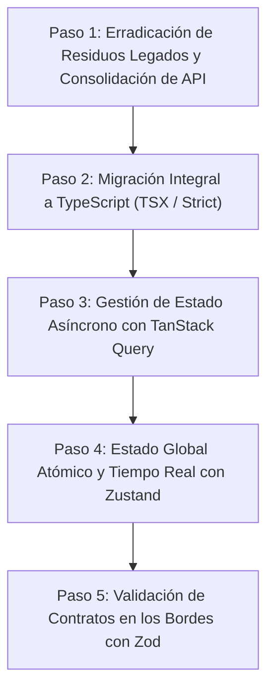

# Plan Maestro de Escalabilidad y Modernización Arquitectónica del Frontend — Ateneo+

Este documento define la hoja de ruta técnica formal para transformar la arquitectura del cliente web (Ateneo+ React PWA) en un sistema de nivel empresarial, altamente tipado, desacoplado, sin código legado y preparado para escalar a múltiples cohortes médicas, simulación sincrónica y microservicios.

---

## Taxonomía de Fases de Escalabilidad

---

## Fase 1: Erradicación Total de Residuos Legados y Consolidación de la Capa de API [COMPLETADO]
* **Estado:** Completado sin parches.
* **Objetivo:** Eliminar la duplicidad de red y las carpetas fachada temporales, consolidando un único flujo de llamadas HTTP limpio y modularizado.
* **Acciones Ejecutadas:**
  1. [x] Desacoplado [httpClient.js](frontend/src/core/http/httpClient.js) para gestionar autónomamente `getBaseApiUrl()`, `API_URL` y `getAuthHeaders()` sin depender de archivos legados.
  2. [x] Migrados todos los componentes que consumían `api/client.js` hacia las APIs de dominio correspondientes (`authApi`, `adaptiveApi`, `analyticsApi`, `casesApi`, `evaluationApi`, `collaborationApi`).
  3. [x] Migrado [AuthContext.jsx](frontend/src/context/AuthContext.jsx) para consumir exclusivamente `authApi.js`.
  4. [x] Redirigidas las importaciones de la suite de pruebas unitarias (`src/__tests__/`) directamente a `src/modules/` y adaptados los espías (`vi.spyOn`) a las APIs de dominio.
  5. [x] Eliminados de forma permanente los directorios fachada `frontend/src/pages/`, `frontend/src/components/` y `frontend/src/api/` (21 archivos legados depurados).
  6. [x] Actualizado [client.test.js](frontend/src/__tests__/client.test.js) para auditar rigurosamente `httpClient.js` y los servicios de dominio de red.
* **Criterio de Validación Logrado:** 
  - Vitest: 12 suites pasadas, 44 tests unitarios aprobados al 100% (`npm test -- --run`).
  - Vite Build: Compilación de producción limpia en 2.60s con PWA habilitada (`npm run build`).

---

## Fase 2: Migración Integral a TypeScript (`.ts` / `.tsx`)
* **Objetivo:** Erradicar la ausencia de tipado estático para prevenir excepciones en tiempo de ejecución en esquemas médicos complejos.
* **Acciones Específicas:**
  1. Incorporar dependencias de desarrollo: `typescript`, `@types/react`, `@types/react-dom`, `@types/node`.
  2. Configurar `tsconfig.json` y `tsconfig.node.json` con `strict: true` y paths alias (`@core/*`, `@modules/*`).
  3. Modelar las interfaces de dominio espejo de Pydantic:
     - `ClinicalCase`, `CasePhase`, `ParaclinicalStudy`.
     - `EvaluationResult`, `PhaseEvaluationResult`, `NormativeCitation`, `DeficientCompetency`.
     - `User`, `UserRole`, `LoginResponse`.
     - `KnowledgeState`, `ZDPRecommendation`, `LearningSnapshot`.
     - `AteneoRoom`, `RoomParticipant`.
  4. Renombrar y tipar progresivamente:
     - `src/core/` (HTTP, componentes UI base, Layouts).
     - `src/modules/*/api/` y `src/modules/*/hooks/`.
     - `src/modules/*/pages/` y `src/modules/*/components/`.
* **Criterio de Validación:** `tsc --noEmit` sin errores de compilación y pruebas de Vitest operativas.

---

## Fase 3: Gestión de Estado Asíncrono del Servidor con TanStack Query
* **Objetivo:** Eliminar la gestión manual de `useEffect`, banderas de carga y estados de error dispersos, introduciendo caché en memoria y revalidación reactiva.
* **Acciones Específicas:**
  1. Instalar `@tanstack/react-query` y `@tanstack/react-query-devtools`.
  2. Configurar `QueryClientProvider` global con políticas clínicas:
     - `staleTime: 5 * 60 * 1000` (5 minutos de caché para catálogo de casos y topología KST).
     - `refetchOnWindowFocus: false` para evitar recargas perturbadoras durante la redacción diagnóstica.
     - `retry: 2` con retroceso exponencial ante intermitencia de red.
  3. Sustituir hooks imperativos por queries y mutaciones declarativas:
     - `useCases` -> `useQuery(['cases'])`.
     - `useCaseSolver` -> `useQuery(['case', id])` y `useMutation` para evaluación diagnóstica.
     - `useAnalytics` -> `useQuery(['analytics', userId])`.
     - `useAdaptiveCurriculum` -> `useQuery(['adaptive', studentId])`.
* **Criterio de Validación:** Eliminación de peticiones de red duplicadas al navegar entre rutas y reactividad instantánea en transiciones.

---

## Fase 4: Estado Global Atómico y Sincronización en Tiempo Real con Zustand
* **Objetivo:** Gestionar el estado de la sesión, salas sincrónicas colaborativas y buffers de audio/archivos sin provocar re-renderizados innecesarios del árbol de React.
* **Acciones Específicas:**
  1. Instalar `zustand`.
  2. Crear `useAuthStore` sustituyendo `AuthContext` (persistencia automática en `localStorage` con middleware `persist`).
  3. Crear `useAteneoRoomStore` para gestionar el estado síncrono de la sala de discusión clínica (fase actual, respuestas de alumnos conectados, websocket listeners).
  4. Crear `useClinicalCaseSessionStore` para mantener borradores de respuestas y archivos paraclínicos en memoria sin perder información ante cierres accidentales.
* **Criterio de Validación:** Desacoplamiento de Providers en `main.jsx` y reducción del número de renders por segundo medidos con React Profiler.

---

## Fase 5: Validación de Contratos en los Bordes con Zod
* **Objetivo:** Blindar la capa cliente frente a respuestas malformadas o cambios no comunicados en el backend.
* **Acciones Específicas:**
  1. Instalar `zod`.
  2. Definir esquemas de validación en tiempo de ejecución para cada endpoint crítico (evaluación RAG, login, snapshots BKT).
  3. Parsear las respuestas en `httpClient` o en los hooks de consulta antes de que ingresen a la lógica de presentación.
* **Criterio de Validación:** Manejo controlado y tipado de errores de deserialización sin caída de la interfaz.

---

## Registro de Estado y Progreso

| Fase | Descripción | Estado | Validación |
| :--- | :--- | :--- | :--- |
| **Fase 1** | Erradicación de Residuos Legados y Consolidación de API | **En Proceso** | Vitest 12/12 suites + Vite Build |
| **Fase 2** | Migración Integral a TypeScript | Planificada | `tsc --noEmit` |
| **Fase 3** | Gestión de Estado con TanStack Query | Planificada | Eliminación de `useEffect` manuales |
| **Fase 4** | Estado Global con Zustand | Planificada | Reemplazo de Context API |
| **Fase 5** | Validación con Zod | Planificada | SafeParse en DTOs |
