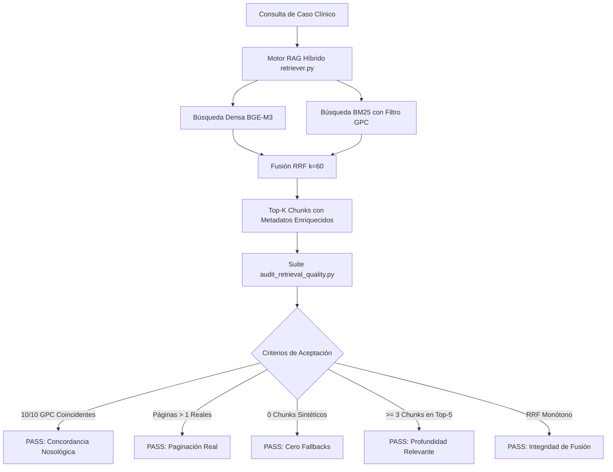

# Arquitectura RAG Híbrida (BGE-M3 + BM25 + RRF), Tablas Markdown y Fine-Tuning Supervisado

## 1. Introducción y Marco Metodológico de Arquitectura

El sistema **Ateneo** implementa una arquitectura de Recuperación Aumentada por Generación (RAG) Híbrida de Estado del Arte acoplada a un modelo recuperador supervisado mediante Fine-Tuning y un modelo de lenguaje multimodal estructurado. Su objetivo es evaluar formativa y cuantitativamente el razonamiento clínico (diagnóstico, terapéutico, preventivo y de seguimiento) contrastándolo estrictamente contra el cuerpo de las Guías de Práctica Clínica (GPC) oficiales del Ministerio de Salud Pública (MSP) del Ecuador.

```text
                               ETAPA 1: RECUPERACIÓN HÍBRIDA RRF (BGE-M3 + BM25)
┌─────────────────────────┐     ┌───────────────────────────┐     ┌───────────────────────────┐
│ 42 GPCs (MSP Ecuador)   │ ──► │ Extracción & Tablas MD    │ ──► │ Embeddings Densos BGE-M3  │
│ (2013-2019 / raw_pdfs)  │     │ (PyMuPDF + chunker)       │     │ (1024 dims - Fine-Tuned)  │
└─────────────────────────┘     └───────────────────────────┘     └─────────────┬─────────────┘
                                                                                │
                                                                                ▼
┌─────────────────────────┐     ┌───────────────────────────┐     ┌───────────────────────────┐
│ Razonamiento Estudiante │ ──► │ Consulta Híbrida (RRF)    │ ──► │ ChromaDB + Sparse BM25    │
│ (Texto o Voz es-EC)     │     │ Rank Fusion: k=60         │     │ (7,052 fragmentos normat.)│
└─────────────────────────┘     └───────────────────────────┘     └─────────────┬─────────────┘
                                                                                │
                                                                                ▼
                               ETAPA 2: FUSIÓN MULTIMODAL SIMULTÁNEA │ Fragmento Top-1 RRF
                                                                                │
┌─────────────────────────┐     ┌───────────────────────────┐                  │
│ ECG + Rx + Labs + Foto  │ ──► │ Prompt Builder Multimodal │ ◄────────────────┘
│ (N estudios simultáneos)│     │ (prompt_builder.py)        │
└─────────────────────────┘     └─────────────┬─────────────┘
                                              │ List[Part.from_bytes] + prompt
                                              ▼
                                ┌───────────────────────────┐
                                │ Evaluador Gemini API      │
                                │ (1 request multimodal)    │
                                │ response_mime_type: JSON  │
                                └─────────────┬─────────────┘
                                              │
                                              ▼
                                ┌───────────────────────────┐     ┌───────────────────────────┐
                                │ Validador Pydantic        │ ──► │ SQLite + PDF Institucional │
                                │ (EvaluationResult)        │     │ (ReportLab + SHA-256)     │
                                └─────────────┬─────────────┘     └───────────────────────────┘
                                              │
                                              ▼
                                ┌───────────────────────────┐
                                │ FeedbackCard + Radar      │
                                │ (4 ejes clínicos)         │
                                └───────────────────────────┘
```

---

## 2. Motor de Búsqueda Híbrida y Reciprocal Rank Fusion (RRF) ([../backend/rag/retriever.py](../backend/rag/retriever.py))

Para superar las limitaciones del suavizado semántico en términos médicos exactos (fármacos, dosis como *"500 mg"* o acrónimos como *"CURB-65"*), Ateneo implementa **Reciprocal Rank Fusion**:

### 2.1 Búsqueda Densa (Dense Vector Search)
* **Backbone:** Modelo denso supervisado `ateneo-bge-m3-ecuador-v2` re-entrenado en GPU NVIDIA A100 (80GB VRAM) mediante pérdida MNRL ($\tau=0.02$) sobre el banco de 1,710 tripletas del MSP Ecuador (1,024 dimensiones latentes, métrica coseno), con fallback de alta disponibilidad a `BAAI/bge-m3`.
* **Persistencia Vectorial (ChromaDB v2):** Colección persistente `gpc_msp_v2` ubicada en `backend/data/chroma_db_v2/` con índice HNSW optimizado (`cosine`, $M=16$, $ef=64$) y base relacional SQLite en modo WAL con verificación de integridad FTS5.
* **Proyección:** Captura la intención médica general y la semántica profunda de las 42 Guías de Práctica Clínica oficiales (7,052 fragmentos normativos indivisibles).

### 2.2 Búsqueda Léxica Dispersa (Sparse BM25 Search)
* **Algoritmo:** `BM25Okapi` ($k_1=1.5, b=0.75$) implementado en `backend/data/extracted/bm25_index_v2.pkl` (14.00 MB).
* **Tokenización Especializada:** Sensible a terminología nosológica, guiones de patologías y unidades posológicas exactas (`mg/kg/h`, `cmH2O`, acrónimos `CURB-65`, `HELLP`).
* **Función:** Recupera de forma determinista coincidencias exactas de fármacos, criterios de riesgo y dosis numéricas.

### 2.3 Algoritmo de Fusión RRF ($k=60$)
Para cada documento candidato $d$ presente en los resultados densos o léxicos:
$$\text{RRF\_Score}(d) = \frac{1}{60 + \text{rank}_{\text{dense}}(d)} + \frac{1}{60 + \text{rank}_{\text{bm25}}(d)}$$

Los fragmentos se ordenan de forma descendente según su $\text{RRF\_Score}$, garantizando que el documento Top-1 posea tanto relevancia semántica contextual como precisión léxica exacta. En el Test Set Ciego Out-of-Distribution ($N=283$ consultas sobre guías no vistas), este ensamble alcanza Hit@5 de $9.89\%$ y MRR@5 de $5.87\%$, mientras que el modelo denso supervisado alcanza Hit@5 de $11.66\%$ y MRR@5 de $7.12\%$ ($+274.7\%$ vs modelo base, Wilcoxon $W=365.0, p=0.0001018$).

---

## 3. Extracción Estructurada de Tablas Clínicas en Markdown ([../backend/ingestion_v2/02_extract_corpus_native.py](../backend/ingestion_v2/02_extract_corpus_native.py))

Para preservar el 100% de la información contenida en matrices de dosis, esquemas terapéuticos y clasificaciones de severidad, el parser avanzado utiliza **`pdfplumber`**:

1. **Detección Matricial de Celdas:** Extrae las tablas de cada página y las formatea automáticamente a sintaxis Markdown:
   ```markdown
   | Parámetro Clínico | Criterio de Riesgo | Conducta MSP |
   | --- | --- | --- |
   | Presión Arterial | >= 160/110 mmHg | Sulfato de Magnesio IV |
   ```
2. **Detección Automática de Año de Edición:** Extrae el año de publicación desde la carpeta contenedora (`raw_pdfs/2019/`, `raw_pdfs/2013/`) o desde el texto oficial, persistiendo el metadato `ano_publicacion` en ChromaDB.

---

## 4. Metodología de Fine-Tuning Supervisado (MNRL)

### 4.1 Función de Pérdida Multiple Negatives Ranking Loss (MNRL)
El modelo `ateneo-bge-m3-ecuador` se ajusta mediante la pérdida de contraste:
$$\mathcal{L}_{\text{MNRL}} = -\log \frac{e^{\text{sim}(q_i, p_i^+) / \tau}}{\sum_{j=1}^{B} e^{\text{sim}(q_i, p_j^+) / \tau} + \sum_{k=1}^{B} e^{\text{sim}(q_i, n_k^-) / \tau}}$$

Donde:
* $q_i$: Consulta o caso clínico.
* $p_i^+$: Fragmento normativo positivo de la GPC del MSP.
* $n_k^-$: Negativo difícil (*Hard Negative*) de la misma especialidad o con alta similitud léxica.
* $\tau$: Temperatura de escala.

---

## 5. Integración con Visor Interactivo en Frontend ([../frontend/src/modules/evaluation/components/PdfViewerModal.tsx](../frontend/src/modules/evaluation/components/PdfViewerModal.tsx))

Cada cita normativa generada por el evaluador se vincula al endpoint `/api/cases/pdf-location/{guia_id}`. El frontend en React permite abrir el visor de PDF oficial con salto directo `#page={pagina}`, permitiendo la auditoría instantánea de la fuente oficial en vivo durante congresos o sesiones docentes.

---

## 6. Motor de Simulación Dinámica por Fases Clínicas Secuenciales

Para superar las limitaciones del modelo estático de pregunta y respuesta única (*Single-Turn QA*), **Ateneo+** implementa un motor de simulación clínica interactivo estructurado en tres hitos formativos con desbloqueo progresivo:

```text
┌─────────────────────────────────────────────────────────────────────────────┐
│ FASE 1: ANAMNESIS & SOSPECHA DIAGNÓSTICA PRELIMINAR                        │
│ • Entrada: Motivo de consulta, antecedentes patológicos y signos vitales.   │
│ • Evaluación RAG: Enfoque en el eje "Diagnóstico" y severidad preliminar.   │
│ • Desbloqueo: Revela los paraclínicos solicitados y pasa a la Fase 2.      │
├─────────────────────────────────────────────────────────────────────────────┤
│ FASE 2: SOLICITUD E INTERPRETACIÓN DE ESTUDIOS PARACLÍNICOS (MULTIMODAL)   │
│ • Entrada: Acceso a trazados ECG de 12 derivaciones, Rx y analítica lab.   │
│ • Evaluación RAG: Correlación cruzada multimodal de hallazgos patológicos.  │
│ • Desbloqueo: Se confirma el diagnóstico definitivo según la GPC del MSP.  │
├─────────────────────────────────────────────────────────────────────────────┤
│ FASE 3: PRESCRIPCIÓN TERAPÉUTICA DE EMERGENCIA & SEGUIMIENTO LONGITUDINAL  │
│ • Entrada: Confirmación diagnóstica y evolución del paciente.              │
│ • Evaluación RAG: Esquemas farmacológicos exactos (dosis/vía), metas de    │
│   control, criterios de alta y monitoreo en los ejes Tratamiento/Control.  │
│ • Cierre: Síntesis del Dictamen Global Consolidado (Radar 4 ejes + PDF).   │
└─────────────────────────────────────────────────────────────────────────────┘
```

### 6.1 Componentes Técnicos del Subsistema de Simulación
* **Esquemas Pydantic (`models/schemas.py`):** `PhaseSchema` para modelar cada hito dentro del caso clínico y `PhaseEvaluationResult` para el retorno estructurado con `score_fase`, aciertos, omisiones, cita y datos de desbloqueo.
* **Constructor de Prompts Especializado (`rag/prompt_builder.py`):** `build_phase_prompt` ajusta el contexto y la directiva evaluativa según el hito activo (sin penalizar prematuramente en Fase 1 por detalles farmacológicos de Fase 3).
* **Endpoint Transaccional (`routers/evaluation.py`):** `POST /api/evaluate/phase` recibe el estado de la fase actual, acumula el historial previo y procesa el request multimodal.
* **Experiencia de Usuario en Frontend (`frontend/src/modules/evaluation/`):**
  * `SimulationStepper.tsx`: Componente de navegación de pasos con estados visuales (Activo, Completado con score, Bloqueado).
  * `PhaseFeedbackCard.tsx`: Panel de retroalimentación inmediata post-fase con cita textual de la GPC y botón de avance.
  * Al culminar la Fase 3, `CaseSolve.tsx` consolida los resultados de los tres hitos en un único `EvaluationResult` maestro, alimentando el `SkillRadarChart.tsx` y habilitando la descarga del dictamen PDF oficial.

---

## 7. Motor de Currículo Adaptativo (KST + BKT + ZDP)

Para la transición del sistema de plataforma *reactiva* (el estudiante elige casos al azar) a *proactiva* (la IA selecciona el camino óptimo de aprendizaje), **Ateneo+** incorpora un **Intelligent Tutoring System (ITS)** basado en tres pilares teóricos.

### 7.1 Componentes de Implementación (`backend/adaptive/`)

* **[`knowledge_space.py`](../backend/adaptive/knowledge_space.py):** Define el grafo acíclico dirigido $G = (V, E)$ de 7 competencias clínicas y sus prerrequisitos. Implementado con `networkx.DiGraph`. Garantiza que la topología sea un DAG válido (sin ciclos).
* **[`knowledge_tracer.py`](../backend/adaptive/knowledge_tracer.py):** Implementa el Bayesian Knowledge Tracing (BKT, Corbett & Anderson, 1994). Recorre el historial SQLite del estudiante en orden cronológico y aplica la regla de Bayes para actualizar $P(L_t^{(c)})$ por cada competencia $c$.
* **[`curriculum_engine.py`](../backend/adaptive/curriculum_engine.py):** Detecta la Zona de Desarrollo Próximo (ZDP, Vygotsky 1978): $\text{ZDP} = \{c \in V \mid 0.40 \le P(L^{(c)}) \le 0.75 \land \text{prereqs dominados}\}$. Selecciona el caso del catálogo que maximiza la cobertura de nodos ZDP y genera una justificación pedagógica en lenguaje natural.

### 7.2 Endpoints REST del Subsistema Adaptativo (`routers/adaptive.py`)

| Endpoint | Método | Descripción |
| :--- | :---: | :--- |
| `/api/adaptive/next-case` | GET | Caso óptimo recomendado con justificación ZDP y nivel de dominio actual. |
| `/api/adaptive/knowledge-state` | GET | Vector completo de dominio $P(L^{(c)})$ por competencia clínica del estudiante. |
| `/api/adaptive/learning-path` | GET | Trayectoria de aprendizaje: competencias dominadas, en progreso y en ZDP. |
| `/api/adaptive/topology` | GET | Topología del grafo KST (nodos, aristas, DAG verificado) para el frontend. |

### 7.3 Componentes de Interfaz (`frontend/src/modules/adaptive/components/`)

* **[`AdaptiveNextCase.tsx`](../frontend/src/modules/adaptive/components/AdaptiveNextCase.tsx):** Tarjeta de recomendación inteligente en la vista de catálogo. Muestra la competencia objetivo ZDP, el nivel de dominio actual y la justificación pedagógica. Botón CTA navega directamente al caso.
* **[`KnowledgeSpaceGraph.tsx`](../frontend/src/modules/adaptive/components/KnowledgeSpaceGraph.tsx):** Modal interactivo con visualización de los 7 nodos KST, badges de estado (Dominado / ZDP / Inicial) y barras de porcentaje de dominio.

---

## 8. Analítica Institucional, Salas Colaborativas y RBAC

### 8.1 Sistema de Roles y Control de Acceso (RBAC)

El sistema define tres roles mutuamente excluyentes (`backend/models/schemas.py: UserRole`):
* **Alumno:** Acceso de lectura y resolución de casos. Sin acceso a analítica de cohorte.
* **Docente:** Panel de analítica B2B con IBF, tendencias y generación de reportes de grupo.
* **Administrador:** Catálogo completo de usuarios, rotación de claves y configuración del sistema.

La autenticación se implementa mediante JWT Bearer (HS256, `python-jose`). El middleware `get_current_user` en `auth/security.py` valida la firma y el rol en cada endpoint protegido.

### 8.2 Salas de Ateneo Sincrónicas (`routers/collaboration.py`)

Las salas de discusión colaborativa permiten a múltiples estudiantes resolver el mismo caso clínico simultáneamente. El motor de consenso agrega las respuestas individuales y genera retroalimentación grupal comparativa con el fragmento normativo del MSP. Cada sala posee un código de acceso único de 6 caracteres (alfanumérico), persistencia relacional administrada por `RoomRepository` (`backend/modules/collaboration/repository.py`) sobre `AteneoRoomModel` en SQLAlchemy y fachada de compatibilidad en `models/room_session.py`.

### 8.3 Índice de Brecha Formativa Institucional (IBF) y Alertas Docentes

El motor IBF (`models/learning_analytics.py`) calcula la distancia entre el rendimiento promedio de una cohorte y el estándar normativo MSP (8.0/10) en 4 ejes clínicos:

$$\text{IBF}_e = \max\left(0, 1 - \frac{\overline{\text{Score}}_{\text{cohorte}, e}}{8.0}\right)$$

Cuando $\text{IBF} > 0.40$, el sistema genera automáticamente una alerta de intervención curricular prioritaria para el coordinador académico visible en `CoordinatorAnalytics.tsx`.

---

## 9. Auditoría Continua de Calidad RAG, Concordancia Nosológica y Prevención de Degradación ([../backend/tests/audit_retrieval_quality.py](../backend/tests/audit_retrieval_quality.py))

Para prevenir la degradación silenciosa del motor de recuperación ante cambios en esquemas de datos o reindexaciones vectoriales, Ateneo+ cuenta con un subsistema de auditoría automatizada continua ejecutado en la pirámide de pruebas maestras (`backend/tests/run_all_tests.py`).

### 9.1 Dimensiones de Calidad Evaluadas

1. **Concordancia Nosológica Estricta (100% Target):** Comprueba que cada consulta de caso clínico canónico ($N=10$) recupere en su posición Top-1 fragmentos pertenecientes de forma unívoca a la Guía de Práctica Clínica oficial del MSP Ecuador asociada al caso, validando tanto el identificador normativo de documento (`gpc_id`) como el título de la guía.
2. **Profundidad de Relevancia en Top-5:** Exige que en los 5 fragmentos devueltos por el recuperador híbrido existan al menos 3 candidatos legítimos pertinentes a la guía clínica evaluada, asegurando densidad informativa y robustez ante reformulaciones.
3. **Paginación Real Auténtica ($> 1$):** Verifica que los metadatos `pagina`, `pagina_pdf` y `pagina_impresa_real` correspondan a los números de página físicos del documento oficial indexados en ChromaDB v2, erradicando la anomalía de asignación artificial a la portada (página 1).
4. **Erradicación Absoluta de Fallbacks Falsos (0% Presencia):** Prohíbe terminantemente la presencia de fragmentos sintéticos o identificadores provisionales (`fallback_gpc_001`), forzando que la recuperación opere con fail-fast estricto.
5. **Monotonía de Fusión RRF:** Valida matemáticamente que los puntajes $\text{RRF\_Score}$ calculados sobre los candidatos densos y dispersos sean estrictamente decrecientes y consistentes.
6. **Anclaje Fáctico de Citas Normativas (`_anchor_cita_to_chunk`):** Garantiza que cada dictamen emitido por el evaluador clínico vincule su cita médica al fragmento auténtico de ChromaDB v2, extrayendo el extracto textual fidedigno del MSP y bloqueando cualquier alucinación del modelo generativo.



### 9.2 Resultados de Certificación Empírica (10 Casos Canónicos Oficiales)

| Caso Clínico Canónico | GPC Oficial MSP Asociada | Pág. Real Top-1 | RRF Score | Top-5 Pertinentes | Estado Auditoría |
|---|---|---|---|---|---|
| `case_preeclampsia_01` | Trastornos Hipertensivos del Embarazo | 30 | 0.03175 | 5 / 5 | PASS |
| `case_hemorragia_01` | Prevención y Manejo de Hemorragia Postparto | 14 | 0.03226 | 5 / 5 | PASS |
| `case_tb_01` | Prevención, Diagnóstico y Control de Tuberculosis | 47 | 0.02991 | 5 / 5 | PASS |
| `case_vih_01` | Atención Integral con Infección por VIH | 39 | 0.02971 | 5 / 5 | PASS |
| `case_hta_01` | Hipertensión Arterial (HTA) | 31 | 0.02944 | 5 / 5 | PASS |
| `case_erc_01` | Enfermedad Renal Crónica | 31 | 0.03151 | 5 / 5 | PASS |
| `case_ehirn_01` | Enfermedad Hemolítica del Recién Nacido | 25 | 0.03202 | 5 / 5 | PASS |
| `case_nac_01` | Neumonía Adquirida en la Comunidad (NAC) | 32 | 0.03252 | 5 / 5 | PASS |
| `case_sepsis_neonatal_01` | Ruptura Prematura de Membranas / Sepsis Neonatal | 23 | 0.03125 | 5 / 5 | PASS |
| `case_aborto_01` | Diagnóstico y Tratamiento del Aborto Espontáneo | 17 | 0.03041 | 5 / 5 | PASS |

La suite está acoplada al ejecutor de integración continua local (`backend/tests/run_all_tests.py`), certificando que cualquier modificación futura en los extractores o modelos vectoriales mantenga el 100% de concordancia normativa.


