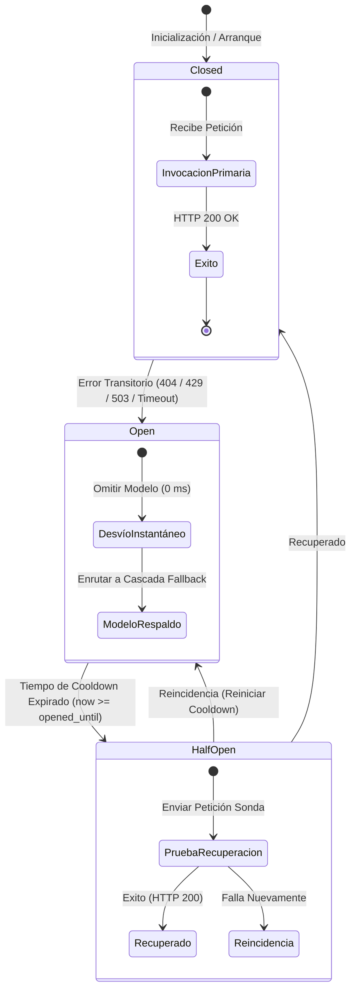

# Arquitectura de Resiliencia de IA y Centralización de Configuración (Docs-as-Code)

Este documento técnico formaliza el diseño, implementación y ciclo de vida del subsistema de inferencia resiliente (**ResilientLLMGateway**) y el esquema de configuración bajo el paradigma **12-Factor App (Single Source of Truth)** en la plataforma Ateneo+.

---

## 1. Motivación y Causa Raíz

En sistemas de simulación clínica interactiva asistidos por modelos de lenguaje de gran escala (LLM), la disponibilidad y predictibilidad de la inferencia resultan indispensables:

1. **Obsolescencia Dinámica de Modelos en la Nube:** Proveedores externos como Google retiran o deprecian versiones previas de sus APIs (por ejemplo, el retorno de error HTTP `404 Not Found` en identificadores de modelo descontinuados como `gemini-2.5-flash` para nuevos proyectos).
2. **Límites de Tasa y Cuotas Transitorias (HTTP 429):** La concurrencia docente o las ráfagas evaluativas pueden agotar temporalmente las cuotas por minuto (RPM) o tokens por minuto (TPM).
3. **Penalización por Reintentos Ciegos (Latencia Fantasma):** Un ciclo lineal ingenuo de reintentos (`for model in models`) impone esperas secuenciales de 10 a 30 segundos a cada usuario concurrentemente si el modelo inicial no responde, degradando la experiencia en el aula clínica.
4. **Dispersión de Configuración:** La coexistencia de múltiples archivos `.env` en directorios raíz y subcarpetas introduce asincronía en despliegues con Docker.

---

## 2. Diagrama de Arquitectura y Máquina de Estados

El siguiente diagrama ilustra la arquitectura de enrutamiento tolerante a fallos y la máquina de estados del Circuit Breaker:



---

## 3. Especificación del ResilientLLMGateway (`backend/services/llm_gateway.py`)

### 3.1 Estados del Circuito (`CircuitStatus`)

| Estado | Descripción Técnica | Comportamiento ante Petición Entrante |
| :--- | :--- | :--- |
| `CLOSED` | El modelo opera con normalidad. | Se invoca directamente como primera opción. |
| `OPEN` | El modelo falló previamente con un error transitorio. Se encuentra en periodo de cuarentena. | Se omite de forma instantánea (**0 ms de latencia**) y se pasa al siguiente modelo de la cadena. |
| `HALF_OPEN` | El tiempo de enfriamiento (`GEMINI_CIRCUIT_COOLDOWN_SECONDS`) ha vencido. | Permite que una única petición evalúe si el servicio externo se ha restablecido. |

### 3.2 Clasificación Semántica de Excepciones

El Gateway discrimina estrictamente la causa raíz del error HTTP retornado por la API:

| Código / Cadena de Error | Clasificación | Acción del Gateway |
| :--- | :--- | :--- |
| `401 Unauthorized`, `403 Forbidden`, `API_KEY_INVALID`, `PermissionDenied` | **Error Fatal** | Lanza `FatalLLMException` de inmediato. No reintenta en otros modelos para evitar ciclos inútiles con credenciales corruptas. |
| `404 Not Found`, `no longer available` | **Modelo No Disponible** | Marca el modelo en `OPEN` por el tiempo de cooldown y conmuta al siguiente nodo de la jerarquía. |
| `429 Too Many Requests`, `ResourceExhausted` | **Cuota Agotada / Rate Limit** | Marca el modelo en `OPEN` por 300 segundos y delega la petición al modelo de respaldo. |
| `503 Service Unavailable`, `Timeout`, `Unavailable` | **Fallo Transitorio de Servidor/Red** | Abre el circuito temporalmente y conmuta en cascada. |

---

## 4. Cadena de Fallback Configurable

La jerarquía de conmutación se parametriza externamente sin requerir recompilación de código:

```dotenv
GEMINI_MODEL=gemini-3.8-flash
GEMINI_FALLBACK_MODELS=gemini-flash-lite-latest,gemini-flash-latest,gemini-3.5-flash-lite,gemini-3.7-flash
GEMINI_CIRCUIT_COOLDOWN_SECONDS=300
```

1. **Nodo 1 (Primario):** `gemini-3.8-flash` (alta velocidad de inferencia, soporte multimodal y adherencia estricta a esquemas JSON).
2. **Nodo 2 (Secundario):** `gemini-flash-lite-latest` (menor consumo de cuota y latencia reducida).
3. **Nodo 3 (Terciario):** `gemini-flash-latest` (versión balanceada general).
4. **Nodo 4 (Cuaternario):** `gemini-3.5-flash-lite` (generación de respaldo complementario).
5. **Nodo 5 (Quinto):** `gemini-3.7-flash` (nodo de alta capacidad para contingencias).

---

## 5. Centralización de Entorno (12-Factor App)

Para garantizar la reproducibilidad y eliminar la deuda técnica por duplicidad:

* **Raíz Única:** Todo el stack (`docker-compose.yml`, FastAPI en host o contenedor, Vite Frontend) lee de un único archivo [.env](file:///home/jorge/Escritorio/Proyectos/Ateneo/clinical_rag/.env).
* **Validación Tipada con Pydantic:** [backend/config.py](file:///home/jorge/Escritorio/Proyectos/Ateneo/clinical_rag/backend/config.py) implementa `AppSettings`, validando tipos, rutas absolutas resueltas (`Path(__file__).resolve().parent`) y configuración de CORS antes de permitir peticiones HTTP.
* **Orquestación en Docker:** [docker-compose.yml](file:///home/jorge/Escritorio/Proyectos/Ateneo/clinical_rag/docker-compose.yml) inyecta las variables con `env_file: - .env` e implementa `start_period: 30s` en el healthcheck del backend para acomodar la carga del modelo transformer `BAAI/bge-m3` (2.2 GB) sin marcar estados insalubres falsos.
