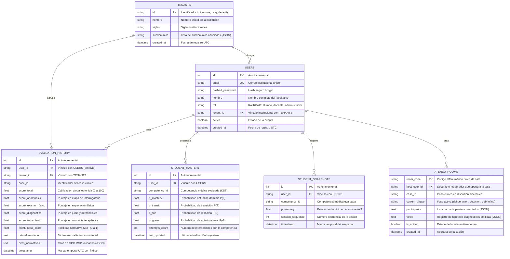

# Arquitectura y Modelado de la Base de Datos Relacional (Docs-as-Code)

Este documento especifica el modelo entidad-relación, restricciones relacionales, índices de rendimiento y mecanismos de transaccionalidad ACID implementados en la base de datos de la plataforma Ateneo+.

---

## 1. Justificación y Causa Raíz

Históricamente, la plataforma almacenaba el historial de evaluaciones en un módulo de persistencia directa en SQLite sin control de concurrencia (`history_db.py`), lo que generaba bloqueos de archivo durante evaluaciones simultáneas y carecía de llaves foráneas formales para vincular a los estudiantes con sus métricas psicométricas.

### 1.1 Decisiones Arquitectónicas Implementadas (Bloque 1)
1. **Migración a SQLAlchemy 2.0 con Tipado Estricto:** Toda entidad hereda de `DeclarativeBase` con mapeo explícito mediante `Mapped[]` y `mapped_column()`.
2. **Concurrencia con Write-Ahead Logging (WAL):** Se configuró el motor SQLite para operar con `PRAGMA journal_mode=WAL` y `PRAGMA synchronous=NORMAL`, permitiendo lectores concurrentes sin bloqueo ante escrituras.
3. **Persistencia Agnóstica Hacia PostgreSQL:** La capa de conexión (`backend/core/database.py`) conmuta transparentemente a PostgreSQL si la variable de entorno `DATABASE_URL` está configurada, utilizando pool de conexiones (`pool_size=10`, `max_overflow=20`).
4. **Activación de Llaves Foráneas:** Aplicación obligatoria de `PRAGMA foreign_keys=ON` en cada conexión SQLite mediante el evento `connect` de SQLAlchemy.
5. **Fechas con Zona Horaria UTC:** Todos los campos temporales emplean `DateTime(timezone=True)` con `server_default=func.now()`.

---

## 2. Diagrama Entidad-Relación (Mermaid ERD)

---

## 3. Especificación Detallada de Tablas y Restricciones

### 3.1 Tabla `users` (Gestión de Identidades y RBAC)
* **Archivo de Definición:** `backend/modules/auth/models.py`.
* **Propósito:** Almacena usuarios autenticados, credenciales cifradas y roles de acceso.

| Columna | Tipo de Dato | Nulo | Restricciones / Índices | Descripción Técnica |
| :--- | :--- | :---: | :--- | :--- |
| `id` | `INTEGER` | NO | `PRIMARY KEY AUTOINCREMENT` | Identificador interno subrogado. |
| `email` | `VARCHAR(255)` | NO | `UNIQUE`, `INDEX (idx_users_email)` | Correo electrónico de acceso institucional. |
| `hashed_password` | `VARCHAR(255)` | NO | — | Hash criptográfico generado mediante Bcrypt ($cost=12$). |
| `nombre` | `VARCHAR(255)` | NO | — | Nombre y apellidos del usuario. |
| `rol` | `VARCHAR(50)` | NO | `INDEX (idx_users_rol)` | Rol RBAC: `alumno`, `docente` o `administrador`. |
| `tenant_id` | `VARCHAR(50)` | NO | `FOREIGN KEY (tenants.id)`, `INDEX` | Sede universitaria u hospitalaria asociada. |
| `activo` | `BOOLEAN` | NO | `DEFAULT TRUE` | Indicador de cuenta habilitada. |
| `created_at` | `DATETIME` | NO | `DEFAULT (CURRENT_TIMESTAMP)` | Registro de alta en UTC. |

### 3.2 Tabla `evaluation_history` (Historial Transaccional Clínico)
* **Archivo de Definición:** `backend/modules/analytics_history/models.py`.
* **Propósito:** Registro inmutable de cada intento de resolución clínica por parte del estudiante.

| Columna | Tipo de Dato | Nulo | Restricciones / Índices | Descripción Técnica |
| :--- | :--- | :---: | :--- | :--- |
| `id` | `INTEGER` | NO | `PRIMARY KEY AUTOINCREMENT` | Clave primaria. |
| `user_id` | `VARCHAR(255)` | NO | `INDEX (idx_history_user_id)` | Identificador del estudiante evaluado. |
| `tenant_id` | `VARCHAR(50)` | NO | `INDEX (idx_history_tenant_id)` | Discriminador multi-inquilino para analítica. |
| `case_id` | `VARCHAR(100)` | NO | `INDEX (idx_history_case_id)` | Código del caso clínico resuelto. |
| `score_total` | `FLOAT` | NO | `CHECK (score_total >= 0 AND score_total <= 100)` | Puntuación global del caso. |
| `score_anamnesis` | `FLOAT` | NO | — | Puntuación segmentada en anamnesis. |
| `score_examen_fisico`| `FLOAT` | NO | — | Puntuación en exploración clínica. |
| `score_diagnostico` | `FLOAT` | NO | — | Puntuación en diagnóstico diferencial. |
| `score_tratamiento` | `FLOAT` | NO | — | Puntuación en plan terapéutico y fármacos. |
| `faithfulness_score`| `FLOAT` | NO | `DEFAULT 1.0` | Medida de fidelidad frente a Guías MSP. |
| `retroalimentacion` | `TEXT` | SÍ | — | Dictamen pedagógico estructurado. |
| `citas_normativas` | `TEXT` | SÍ | — | JSON con citas bibliográficas de las GPC. |
| `timestamp` | `DATETIME` | NO | `INDEX (idx_history_timestamp)` | Fecha y hora UTC de la evaluación. |

### 3.3 Tablas de Psicometría y Modelado del Estudiante (`student_mastery` y `student_snapshots`)
* **Archivo de Definición:** `backend/modules/adaptive/models.py`.
* **Propósito:** Mantiene el estado bayesiano actual y las trayectorias longitudinales del estudiante a lo largo del Espacio de Conocimiento (KST).

| Tabla | Columna Clave | Tipo | Propósito |
| :--- | :--- | :--- | :--- |
| `student_mastery` | `(user_id, competency_id)` | Compuesta | Registro del parámetro actual de maestría $P(L)$ tras cada actualización. |
| `student_snapshots`| `(user_id, session_sequence)` | Compuesta | Punto en el tiempo para graficar curvas de aprendizaje y cálculo del IBF. |

---

## 4. Script Determinístico de Migración de Datos

Para migrar la base histórica no tipada hacia la nueva arquitectura relacional, se diseñó e implementó el script idempotente:
* **Ubicación:** `scripts/migrate_history_to_ateneo_clinical.py`.
* **Características Técnicas:**
  1. Ejecución transaccional protegida: si una fila falla, la migración completa hace rollback.
  2. Parseo y normalización de fechas ISO 8601 a objetos `datetime` UTC nativos.
  3. Desglose automático de puntuaciones por fase clínica y cálculo defensivo de `faithfulness_score`.
  4. Deduplicación por clave natural `(user_id, case_id, timestamp)`.

---

## 5. Pruebas Automatizadas de Integridad de Datos

La arquitectura de persistencia está respaldada por suites unitarias de base de datos en `backend/tests/`:
* `test_auth_security.py`: Valida unicidad de correo, integridad de FKs y hashing seguro de contraseñas.
* `test_api_endpoints.py`: Valida transacciones ACID de inserción y consulta en `evaluation_history` y `ateneo_rooms`.
* `test_paper_differentiators.py`: Valida agregaciones SQL nativas (`AVG`, `COUNT`, agrupamiento por cohorte y cálculo de IBF).
