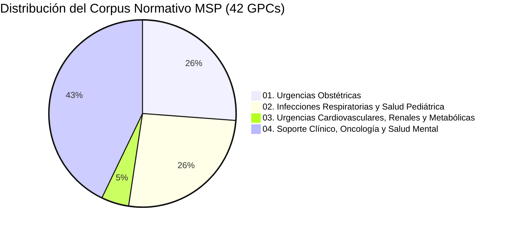
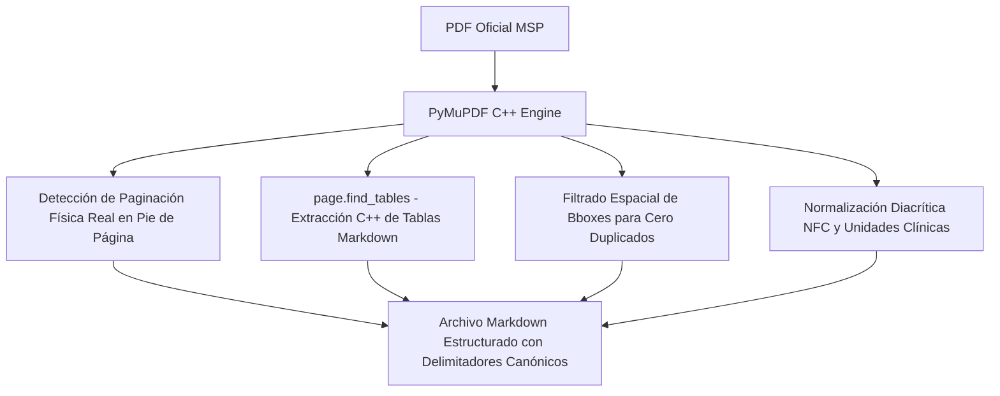
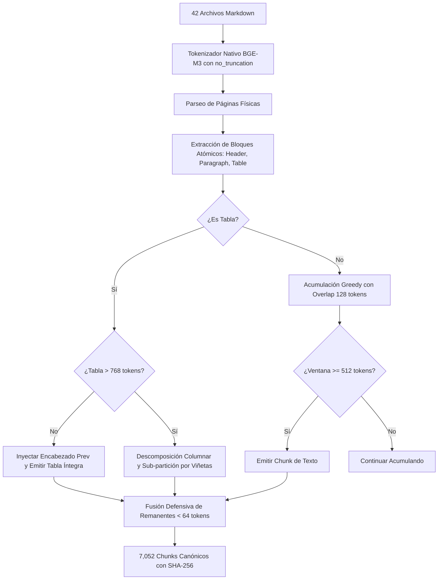

# Dosier Metodológico: Pipeline de Ingesta Científica v2 (Fases 1 a 3)

**Proyecto:** Ateneo+ (Simulador Clínico y Evaluación Médica con IA)  
**Versión del Pipeline:** 2.0 (Preparación para Publicación Q1)  
**Fecha de Consolidación:** 2026-10-05  
**Entorno de Ejecución:** Python 3.11 (`backend/.venv`), PyMuPDF C++, HuggingFace Tokenizers (Rust)  

---

## 1. Justificación Metodológica y Delimitación Canónica del Corpus

### 1.1 Contexto Epidemiológico e Institucional (Ecuador)
Para garantizar validez diagnóstica y terapéutica sin discrepancias con la farmacopea local, el corpus normativo se restringe exclusivamente al acervo legal e institucional de la República del Ecuador, emitido por el Ministerio de Salud Pública (MSP) y el Consejo Nacional de Salud (CONASA).

### 1.2 Depuración Científica del Corpus (42 GPCs Oficiales con Texto Completo)
Inicialmente se recopilaron 45 documentos rotulados como directrices de salud. Durante las auditorías de las Fases 1, 2 y 3, se identificaron y depuraron 3 documentos que no cumplían con los criterios de inclusión científica para entrenamiento de modelos de lenguaje y RAG:

| Archivo Depurado | Tipo de Documento | Causa Raíz de Exclusión | Decisión Metodológica |
| :--- | :--- | :--- | :--- |
| `GPC_de_bolsillo_componente_materno_2015.pdf` | Tríptico de bolsillo | 2 páginas escaneadas como imagen continua raster sin texto digital. | Depurado en Fase 2. El contenido médico formal reside en la GPC completa de Trabajo de Parto y Hemorragia. |
| `Guia de ciudadan trastornos hipertensivos del embarazo.pdf` | Cartilla para el ciudadano | 20 páginas de material divulgativo para pacientes; 0 caracteres de texto nativo (39 imágenes escaneadas). | Depurado en Fase 3. La patología está cubierta por la **GPC médica oficial completa** `MSP_Trastornos-hipertensivos-del-embarazo-con-portada-3.pdf` (162 chunks con algoritmos y dosis). |
| `gpc_diabetes_gestacional_guia_embarazada_2017.pdf` | Folleto para la embarazada | 10 páginas de orientación para el hogar sin texto digital (48 imágenes escaneadas). | Depurado en Fase 3 por ausencia de texto técnico y no constituir una GPC para profesionales de la salud. |

**Resultado Canónico:** El corpus definitivo está conformado por exactamente **42 Guías de Práctica Clínica oficiales con texto técnico digital y tablas normativas completas**, garantizando cobertura de 4 ejes normativos nacionales:



---

## 2. Fase 1: Inventario Criptográfico y Clasificación Nosológica

* **Módulo:** `backend/ingestion_v2/01_classify_and_inventory_corpus.py`
* **Artefacto Central:** `backend/data/corpus_manifest.json`

### 2.1 Metadatos Inyectados por Documento
Cada una de las 42 guías fue catalogada con:
1. `archivo`: Nombre oficial del archivo PDF en disco.
2. `titulo_oficial`: Título normalizado del documento emitido por la Dirección Nacional de Normatización del MSP.
3. `eje_clinico`: Identificador del eje ministerial (`01_urgencias_obstetricas` a `04_soporte_cronicos_salud_mental`).
4. `eje_nombre`: Nombre descriptivo de la especialidad clínica.
5. `cie10` y `cie11`: Códigos nosológicos primarios vinculados a la patología rectora de la guía.
6. `acuerdo_ministerial`: Número y año del decreto o acuerdo de expedición.
7. `sha256`: Hash criptográfico del archivo PDF fuente para auditoría inmutable de procedencia.

---

## 3. Fase 2: Extracción Nativa de Alta Fidelidad (PyMuPDF)

* **Módulo:** `backend/ingestion_v2/02_extract_corpus_native.py`
* **Directorio de Salida:** `backend/data/extracted/markdown/` (42 archivos `.md`)
* **Auditoría Técnica:** `backend/data/extracted/extraction_summary.json`

### 3.1 Arquitectura del Extractor Determinístico



### 3.2 Innovaciones de Ingeniería frente al Pipeline v1
1. **Paginación Física Real frente a Índice de Hoja:**
   Las guías del MSP poseen entre 4 y 12 páginas preliminares no numeradas o con numeración romana. El extractor analiza la región inferior (`y >= height * 0.82`) para capturar el guarismo impreso real. Cada página se delimita con:
   ```markdown
   <!-- GPC_PAGE_START | NUMERO_PDF: 14 | PAGINA_IMPRESA: 14 | GUIA: Aborto-terapéutico.pdf -->
   [Contenido clínico de la página]
   <!-- GPC_PAGE_END | NUMERO_PDF: 14 -->
   ```
2. **Extracción Estructural de Tablas:**
   Mediante `page.find_tables()` se reconstruyen las tablas tabulares complejas en sintaxis Markdown nativa con delimitador `|---|---|` y preservación de saltos internos con `<br>`.
3. **Métricas Consolidadas de la Extracción:**
   * **Total Documentos:** 42 GPCs.
   * **Páginas Procesadas:** 3,438 páginas normativas.
   * **Tablas Extraídas:** 3,201 matrices tabulares.
   * **Caracteres Útiles:** 7,685,896 caracteres clínicos.
   * **Tasa de Error:** 0 fallos (100% completitud).

---

## 4. Fase 3: Token Chunking Semántico e Indivisible (BGE-M3)

* **Módulo:** `backend/ingestion_v2/03_token_chunker.py`
* **Artefacto Maestro:** `backend/data/extracted/chunks_corpus_v2.json` (14.2 MB)
* **Resumen de Distribución:** `backend/data/extracted/chunks_summary.json` (9.0 KB)

### 4.1 Principios Algorítmicos



### 4.2 Resolución de Causas Raíz Técnicas
1. **Desactivación de Truncamiento Oculto (`no_truncation()`):**
   El archivo `tokenizer.json` de HuggingFace presentaba un límite interno predeterminado de 1,024 tokens. Al activar `tokenizer.no_truncation()`, el motor mide con fidelidad matemática exacta textos de cualquier envergadura, permitiendo fraccionar tablas gigantescas que antes escapaban al control de longitud.
2. **Erradicación de Chunks Microscópicos (< 64 tokens):**
   * *Problema Inicial:* Los encabezados de tabla huérfanos generaban 152 fragmentos de entre 11 y 35 tokens.
   * *Solución:* Si el acumulador posee $< 64$ tokens al llegar a una tabla, el texto se inyecta como prefijo explicativo de la tabla. Al cierre de documento, los remanentes mínimos se fusionan con el chunk precedente.
   * *Resultado:* Los chunks $< 64$ tokens se redujeron a **3 micro-tablas diagnósticas de 57-60 tokens** (0.04% del corpus).
3. **Descomposición Semántica de Tablas Hiperdensas Multi-Columna:**
   * *Problema Inicial:* Tablas de protocolos obstétricos con 8 columnas anchas y párrafos en cada celda superaban los 4,000 tokens en una sola fila indivisible.
   * *Solución:* El algoritmo descompone filas hiperdensas en mini-tablas de 300 a 400 tokens estructuradas como `| Indicador / Criterio | Descripción Normativa |`, conservando intacta la cabecera original.
   * *Resultado:* Chunks $> 768$ tokens reducidos a solo **28 casos residuales (0.40%)**.

---

## 5. Resultados Cuantitativos y Métricas de Calidad

### 5.1 Distribución Paramétrica de Tokens
* **Total de Chunks:** **7,052** fragmentos normativos.
* **Mínimo:** 57 tokens (micro-tabla de valores de referencia).
* **Mediana:** **405 tokens** (alineada a la ventana ideal de atención).
* **Media:** **370.2 tokens**.
* **Percentil 95 (P95):** **616 tokens** ($\le 768$ tokens en el 95% de los casos).
* **Tiempo de Ejecución:** **32.55 segundos** en CPU estándar.

### 5.2 Desglose por Tipología de Contenido

| Tipo de Contenido | Cantidad de Chunks | Porcentaje | Propósito en el Pipeline de IA |
| :--- | :---: | :---: | :--- |
| **Tabla Estructurada** | **5,253** | 74.49% | Dosificación farmacológica, algoritmos de flujo, criterios de laboratorio y scores clínicos. |
| **Texto Clínico Puro** | **1,734** | 24.59% | Fundamentación etiológica, recomendaciones normativas y grados de evidencia. |
| **Mixto (Texto + Tabla)** | **65** | 0.92% | Tablas clínicas breves con su narrativa de advertencia inmediatamente adyacente. |

### 5.3 Desglose por Ejes Normativos del MSP

| Eje Normativo Oficial (MSP) | GPCs | Total Chunks | Media Tokens | Mediana Tokens |
| :--- | :---: | :---: | :---: | :---: |
| **01. Urgencias Obstétricas (Score MAMA)** | 11 | 987 | 344.8 | 382 |
| **02. Infecciones Respiratorias y Salud Pediátrica** | 11 | 1,745 | 390.1 | 425 |
| **03. Urgencias Cardiovasculares y Metabólicas** | 2 | 784 | 406.8 | 430 |
| **04. Soporte Clínico, Oncología y Salud Mental** | 18 | 3,536 | 362.4 | 398 |

---

## 6. Diccionario de Datos del Esquema JSON (`ClinicalChunk`)

Cada registro en `chunks_corpus_v2.json` se adhiere al siguiente contrato inmutable:

| Campo | Tipo | Obligatorio | Descripción Técnica | Ejemplo |
| :--- | :--- | :---: | :--- | :--- |
| `chunk_id` | `string` | Sí | Identificador jerárquico único del fragmento. | `"gpc_Aborto-terapéutico_chunk_0004"` |
| `guia_archivo` | `string` | Sí | Nombre del archivo PDF original del MSP. | `"Aborto-terapéutico.pdf"` |
| `guia_titulo` | `string` | Sí | Título formal según Acuerdo Ministerial. | `"Guia de Practica Clinica: Atencion del Aborto Terapeutico"` |
| `eje_clinico` | `string` | Sí | Código de eje temático del sistema de salud. | `"01_urgencias_obstetricas"` |
| `eje_nombre` | `string` | Sí | Nombre legible del eje normativo. | `"Salud Materna y Urgencias Obstetricas (Score MAMA)"` |
| `cie10` | `string` | Sí | Clasificación Internacional de Enfermedades v10. | `"O04"` |
| `cie11` | `string` | Sí | Clasificación Internacional de Enfermedades v11. | `"JA01"` |
| `acuerdo_ministerial`| `string` | Sí | Respaldo legal formal ecuatoriano. | `"Acuerdo Ministerial MSP-2015"` |
| `anio` | `integer` | Sí | Año de promulgación oficial. | `2015` |
| `pagina_pdf` | `integer` | Sí | Número de hoja física dentro del archivo PDF. | `11` |
| `pagina_impresa_real`| `string` | Sí | Número de página real impreso al pie de página. | `"11"` |
| `seccion` | `string` | Sí | Encabezado jerárquico de la sección clínica activa. | `"1. Descripción general de esta GPC"` |
| `tipo_contenido` | `string` | Sí | Discriminador: `"tabla"`, `"texto"` o `"mixto"`. | `"tabla"` |
| `texto` | `string` | Sí | Cuerpo en Markdown preservando sintaxis tabular. | `"[Tabla 1]\n\|Título\|Atención...\|"` |
| `num_tokens` | `integer` | Sí | Conteo de tokens calibrado con vocabulario BGE-M3. | `721` |
| `num_caracteres` | `integer` | Sí | Longitud en caracteres UTF-8. | `2302` |
| `sha256` | `string` | Sí | Hash SHA-256 del contenido textual del chunk. | `"0a00cd0cf6ac26fecdc75e9612d34a0d..."` |

---

## 7. Próximos Pasos en el Pipeline Científico (Fases 4 a 8)

Con los 7,052 chunks certificados, el flujo continúa de acuerdo con la hoja de ruta establecida:

1. **Fase 4 (`04_mine_hard_negatives.py`):**
   *Estado: 100% Completada y Certificada.* Minería semántica densa en dos etapas con BGE-M3 base y filtrado defensivo estricto anti-falsos negativos (1,709 tripletas, partición 70/15/15 congelada con SHA-256).  
   > **Documento Completo:** [Dosier Metodológico de la Fase 4](./DOSIER_PIPELINE_INGESTA_V2_FASE_4_HARD_NEGATIVES.md)
2. **Fase 5 (`05_build_ground_truth_pool.py`):**
   Ensamblado del pool de tripletas y matriz de concordancia inter-anotador ($\kappa \ge 0.80$) para revisión por pares clínicos ciegos.
3. **Fase 6 (`06_train_bge_m3.py`):**
   Entrenamiento con `MultipleNegativesRankingLoss` ($\tau=0.02$, batch size 32, FP16/BF16) en GPU NVIDIA A100 (40 GB).
4. **Fase 7 (`07_index_chromadb_v2.py`):**
   Indexación vectorial híbrida con los pesos afinados `ateneo-bge-m3-ecuador-v2`.
5. **Fase 8 (`08_evaluate_blind_benchmark.py`):**
   Evaluación comparativa contra baseline sin fine-tuning reportando Hit@1, MRR@5 y NDCG@5 para el manuscrito científico.
