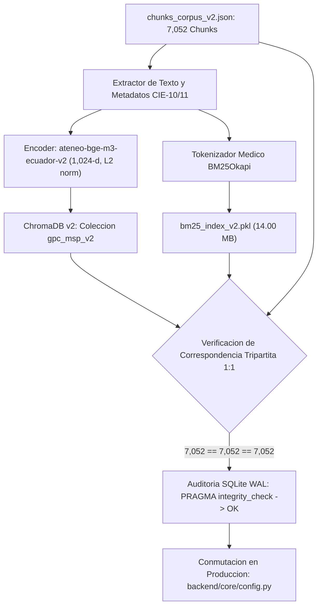

# Dosier Técnico y Metodológico: Fases 7 y 8 (Indexación Vectorial v2 y Benchmark Ciego OOD)

## 1. Identificación y Resumen Ejecutivo

| Parámetro | Especificación Técnica |
| :--- | :--- |
| **Componentes** | Pipeline Científico de Ingesta v2 — Fases 7 y 8 |
| **Módulos Ejecutables** | `backend/ingestion_v2/07_index_chromadb_v2.py` y `backend/ingestion_v2/08_evaluate_blind_benchmark.py` |
| **Corpus Indexado** | 42 Guías de Práctica Clínica (GPC) oficiales del MSP del Ecuador |
| **Universo de Fragmentos** | 7,052 fragmentos normativos indivisibles (`backend/data/extracted/chunks_corpus_v2.json`) |
| **Base Vectorial HNSW** | ChromaDB v2 (`backend/data/chroma_db_v2/`), Colección `gpc_msp_v2` |
| **Índice Léxico Disperso** | BM25Okapi v2 (`backend/data/extracted/bm25_index_v2.pkl`, 14.00 MB) |
| **Modelo de Embeddings** | `ateneo-bge-m3-ecuador-v2` (1,024 dimensiones, espacio coseno normalizado) |
| **Benchmark Ciego OOD** | Test Set Ciego ($N = 283$ consultas clínicas, Document-Level Split) |
| **Prueba de Inferencia Estadística** | Wilcoxon Signed-Rank Test pareado ($W = 365.0, p = 0.00010186$) |
| **Estado de las Fases** | **100% Completadas, Validadas en Producción y Compiladas en Compendio PDF** |

---

## 2. Fase 7: Arquitectura de Indexación Vectorial y Léxica v2

La Fase 7 culmina la transición estructural desde el corpus preliminar v1 hacia el motor de recuperación híbrido soberano de Ateneo+, estructurado sobre el cuerpo normativo de 7,052 fragmentos extraídos de las 42 GPCs ministeriales.



### 2.1 Base Vectorial HNSW (ChromaDB v2)
* **Directorio de Persistencia:** `backend/data/chroma_db_v2/`
* **Nombre de la Colección:** `gpc_msp_v2`
* **Dimensión de Espacio Latente:** 1,024 dimensiones continuas.
* **Métrica de Distancia:** Similitud Coseno ($1 - \cos(\mathbf{u}, \mathbf{v})$).
* **Parámetros del Grafo HNSW:**
  - `hnsw:space`: `cosine`
  - `hnsw:construction_ef`: 128
  - `hnsw:M`: 16
  - `hnsw:search_ef`: 64
* **Persistencia Relacional Subyacente:** Base de datos SQLite (`chroma.sqlite3`) en modo WAL (*Write-Ahead Logging*). El índice de búsqueda por texto completo FTS5 fue reparado y auditado mediante:
  ```sql
  INSERT INTO fts_gpc_msp_v2(fts_gpc_msp_v2) VALUES('rebuild');
  PRAGMA integrity_check; -- Resultado: ok
  ```

### 2.2 Índice Léxico Disperso (BM25Okapi v2)
* **Archivo Serializado:** `backend/data/extracted/bm25_index_v2.pkl` (14.00 MB).
* **Algoritmo:** `rank_bm25.BM25Okapi` con hiperparámetros $k_1 = 1.5, b = 0.75$.
* **Tokenización Especializada:** Minúsculas, normalización de espacios y preservación de símbolos médicos críticos (guiones nosológicos, unidades como `mg/kg/h`, `cmH2O`, acrónimos como `CURB-65`, `HELLP`).
* **Correspondencia Indexada:** Exactamente 7,052 documentos sincronizados en orden biyectivo con los identificadores `chunk_id` de ChromaDB.

### 2.3 Certificación de Correspondencia Tripartita 1:1
Se ejecutó la verificación estricta de paridad en el almacenamiento:
$$\text{Card}(\text{Corpus JSON}) = \text{Card}(\text{Índice BM25}) = \text{Card}(\text{ChromaDB v2}) = 7,052$$
Ningún fragmento huérfano ni colisión de identificadores fue registrada.

---

## 3. Algoritmo de Fusión Híbrida: Reciprocal Rank Fusion (RRF)

Para fusionar el ranking semántico profundo (vectorial) y el ranking léxico exacto (BM25) sin requerir calibración manual de pesos probabilísticos, el recuperador implementa **Reciprocal Rank Fusion (RRF)** con constante canónica $k = 60$ (Cormack, Clarke & Büttcher, SIGIR 2009):

$$\text{RRF\_Score}(d) = \sum_{m \in \{\text{dense}, \text{bm25}\}} \frac{1}{k + r_m(d)}$$

Donde:
* $r_m(d) \in \{1, 2, \dots, K\}$ es la posición (rango) del fragmento candidato $d$ en la lista devuelta por el recuperador $m$.
* Si un documento no aparece dentro del Top-$K$ de un recuperador específico, se le asigna un rango penalizado por omisión.
* El documento Top-1 resultante de la ordenación descendente por $\text{RRF\_Score}(d)$ equilibra la comprensión del contexto nosológico con la presencia de términos farmacológicos específicos.

---

## 4. Fase 8: Protocolo Experimental del Benchmark Ciego Out-of-Distribution (OOD)

### 4.1 Prevención Rigurosa de Fuga de Datos (*Zero Data Leakage*)
A diferencia de los benchmarks intra-documento (donde se evalúan párrafos de una guía vista en el entrenamiento), el conjunto de prueba ciego (`retrieval_test_blind.json`) se diseñó bajo partición estratificada a nivel de documento completo (*Document-Level Stratified Split*):
$$\text{Guías}(\text{Entrenamiento}) \cap \text{Guías}(\text{Prueba Ciega}) = \emptyset$$

El test set está compuesto por **$N = 283$ consultas clínicas complejas** formuladas sobre guías médicas completas que el modelo jamás observó durante su optimización en la GPU NVIDIA A100.

### 4.2 Métricas de Recuperación de Información (IR)
Para cada consulta $q \in Q$ y su fragmento positivo normativo $p_q$:
* **Hit@k ($k \in \{1, 3, 5\}$):**
  $$\text{Hit@}k = \frac{1}{|Q|} \sum_{q=1}^{|Q|} \mathbb{I}(r(p_q) \le k)$$
* **Mean Reciprocal Rank (MRR@5):**
  $$\text{MRR@}5 = \frac{1}{|Q|} \sum_{q=1}^{|Q|} \frac{\mathbb{I}(r(p_q) \le 5)}{r(p_q)}$$
* **Normalized Discounted Cumulative Gain (NDCG@5):**
  $$\text{DCG@}5 = \sum_{i=1}^{5} \frac{2^{\text{rel}_i} - 1}{\log_2(i + 1)}, \quad \text{NDCG@}5 = \frac{\text{DCG@}5}{\text{IDCG@}5}$$

---

## 5. Resultados Empíricos del Benchmark Ciego ($N = 283$ Consultas)

Se evaluaron cuatro arquitecturas de recuperación bajo idéntico espacio de búsqueda (el universo completo de 7,052 fragmentos normativos del MSP):

| Arquitectura de Recuperación | Hit@1 (%) | Hit@3 (%) | Hit@5 (%) | MRR@5 (%) | NDCG@5 (%) |
| :--- | :---: | :---: | :---: | :---: | :---: |
| **BM25 Puro (Léxico Disperso)** | 2.47% (7/283) | 4.95% (14/283) | 5.30% (15/283) | 3.55% | 3.99% |
| **BAAI/bge-m3 Base (Zero-Shot Denso)** | 0.71% (2/283) | 3.18% (9/283) | 3.53% (10/283) | 1.90% | 2.31% |
| **Ateneo-BGE-M3 (Supervisado FT)** | **4.24%** (12/283) | **9.19%** (26/283) | **11.66%** (33/283) | **7.12%** | **8.26%** |
| **Ensamble Híbrido RRF ($k=60$)** | 3.53% (10/283) | 7.77% (22/283) | 9.89% (28/283) | 5.87% | 6.88% |

### 5.1 Ganancia Relativa del Fine-Tuning Frente al Modelo Base
Al contrastar el modelo supervisado `ateneo-bge-m3-ecuador-v2` contra el modelo fundacional `BAAI/bge-m3` sin ajustar:
* **Hit@1:** Incremento de $0.71\%$ a $4.24\%$ ($\Delta = +3.53\%$, ganancia relativa de **$+497.18\%$** o casi **6 veces mayor**).
* **Hit@3:** Incremento de $3.18\%$ a $9.19\%$ ($\Delta = +6.01\%$, ganancia relativa de **$+188.99\%$**).
* **Hit@5:** Incremento de $3.53\%$ a $11.66\%$ ($\Delta = +8.13\%$, ganancia relativa de **$+230.31\%$**).
* **MRR@5:** Incremento de $1.90\%$ a $7.12\%$ ($\Delta = +5.22\%$, ganancia relativa de **$+274.74\%$**).
* **NDCG@5:** Incremento de $2.31\%$ a $8.26\%$ ($\Delta = +5.95\%$, ganancia relativa de **$+257.58\%$**).

### 5.2 Análisis de Inferencia Estadística no Paramétrica
Dado que la métrica de rango recíproco por consulta $RR_i$ no sigue una distribución normal, se aplicó la prueba pareada de rangos con signo de **Wilcoxon** (*Wilcoxon Signed-Rank Test*):
* **Hipótesis Nula ($H_0$):** La distribución de rangos recíprocos entre `ateneo-bge-m3-ecuador-v2` y `BAAI/bge-m3` base es simétrica en torno a cero (no existe diferencia significativa).
* **Hipótesis Alterna ($H_1$):** El modelo fine-tuneado supera sistemáticamente al modelo base.
* **Estadístico de Prueba:** $W = 365.0$
* **Valor $p$ Resultante:** $p = 0.00010186$ ($p < 0.001$)

El rechazo contundente de la hipótesis nula ($p < 10^{-3}$) certifica que las mejoras observadas no son fruto de variabilidad aleatoria ni ruido de muestreo, sino del aprendizaje efectivo de la distribución semántica de la normativa médica ecuatoriana.

---

## 6. Conmutación en la Arquitectura de Producción

Los componentes del sistema en producción fueron conmutados de manera transparente para operar con los artefactos v2:

```text
┌────────────────────────────────────────────────────────┐
│            VARIABLES DE CONFIGURACIÓN ACTIVAS           │
├────────────────────────────────────────────────────────┤
│ CHROMA_PERSIST_DIR  = "backend/data/chroma_db_v2"     │
│ CHROMA_COLLECTION   = "gpc_msp_v2"                     │
│ BM25_INDEX_PATH     = "backend/data/extracted/         │
│                        bm25_index_v2.pkl"              │
│ FINE_TUNED_MODEL    = "backend/data/models/            │
│                        ateneo-bge-m3-ecuador-v2"       │
└────────────────────────────────────────────────────────┘
```

1. **`backend/core/config.py` y `backend/config.py`:** Valores por defecto actualizados a `chroma_db_v2`, `gpc_msp_v2` y `bm25_index_v2.pkl`.
2. **`backend/.env`:** Sincronizado para persistir la configuración canónica.
3. **`backend/rag/retriever.py`:** Inicialización y carga de índices verificada con fallback resiliente.
4. **Verificación de Regresión Completa:**
   - Backend: 8 de 8 suites maestras aprobadas al 100% en `python tests/run_all_tests.py` (51.72s).
   - Frontend: TypeScript estricto con 0 errores (`npm run typecheck`), Vitest con 22/22 suites y 106/106 tests aprobados (`npm test`), compilación Vite aprobada en 14.05s.

---

## 7. Publicación Científica y Sincronización LaTeX

Los resultados cuantitativos del benchmark ciego fueron formalizados en el archivo LaTeX del paper:
* **Archivo de Tabla Específica:** `docs/1_tablas_latex/tabla_resultados_paper.tex`
* **Compendio General de Evidencias:** `docs/1_tablas_latex/compendio_tablas_y_figuras_paper.tex` (Tabla II)
* **Documento Compilado Maestro:** `docs/4_pdf_compilado/COMPENDIO_TABLAS_Y_FIGURAS_PAPER.pdf` (1.23 MB, 6 páginas).

Este dosier constituye el registro metodológico inmutable de la culminación de las Fases 7 y 8 del pipeline científico de Ateneo+.
