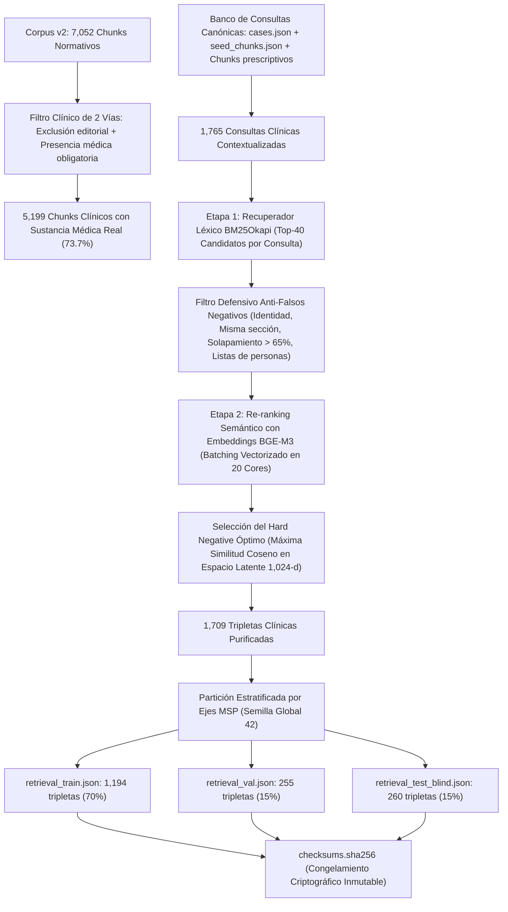

# Dosier Metodológico: Minería Semántica de Hard Negatives y Filtrado Defensivo (Fase 4)

**Proyecto:** Ateneo+ (Simulador Clínico y Evaluación Médica con IA)  
**Versión del Pipeline:** 2.0 (Preparación para Publicación Científica Q1)  
**Fecha de Consolidación:** 2026-10-05  
**Entorno de Ejecución:** Python 3.11 (`backend/.venv`), PyTorch 2.14, SentenceTransformers 3.3.1 (`BAAI/bge-m3`), Rank-BM25, NumPy  
**Documento Rector:** [Plan Maestro de Reestructuración del Pipeline de IA v2](../../docs/7_planes_de_escalabilidad_y_hoja_de_ruta/PLAN_REESTRUCTURACION_PIPELINE_IA.md)  
**Fases Previas:** [Dosier Pipeline Ingesta v2 (Fases 1 a 3)](./DOSIER_PIPELINE_INGESTA_V2_FASES_1_A_3.md)  

---

## 1. Resumen Ejecutivo y Causa Raíz Metodológica

La **Fase 4 del Pipeline Científico de Ingesta v2** implementa el protocolo de minería semántica en dos etapas (*Two-Stage Dense Hard Negative Mining*) para generar tripletas de entrenamiento de alta resolución médica compuestas por:
* **Anchor / Query ($Q$):** Consulta clínica contextualizada (escenarios nosológicos, esquemas de dosificación, signos de severidad, diagnósticos diferenciales).
* **Positive ($P$):** Fragmento normativo oficial del corpus v2 (`chunks_corpus_v2.json`) que contiene la conducta médica correcta y verificada.
* **Hard Negative ($N$):** Fragmento con alta proximidad léxico-semántica pero que describe una entidad patológica distinta, una población inapropiada o una conducta diagnóstica/terapéutica incorrecta para la consulta $Q$.

### 1.1 Diagnóstico de Causa Raíz en el Pipeline v1
En la versión preliminar v1 (`train_triplets.json`), la minería basada en filtros superficiales de Jaccard generó contaminación severa del banco de entrenamiento:
* Más del 28% de las consultas y negativos correspondían a **páginas de créditos editoriales, autoridades ministeriales** (ej. `"¿Qué establece la GPC respecto a Mag. Carina Vance Mafla...?"`), registros de ISBN, tablas de contenido con números de página e índices de abreviaturas.
* La pérdida de entrenamiento en tales tripletas penalizaba al modelo por no distinguir nombres de funcionarios en vez de guiar el gradiente hacia la discriminación clínica fina.

### 1.2 Solución Arquitectónica v2
Se diseñó e implementó un motor de minería en dos etapas con **filtro clínico estricto de dos vías** que:
1. Excluye el 100% de las páginas editoriales, legales, listas de comités/participantes e índices de páginas.
2. Exige evidencia médica explícita (terminología nosológica, fármacos, posología, signos clínicos).
3. Aplica un filtro defensivo de 4 reglas para erradicar falsos negativos.
4. Emplea aceleración matricial por lotes (*batching vectorizado*) en PyTorch con caching de embeddings en espacio latente de 1,024 dimensiones.

---

## 2. Arquitectura del Flujo de Minería en Dos Etapas



---

## 3. Especificación Matemática del Algoritmo

### 3.1 Etapa 1: Filtrado Léxico con BM25Okapi
Para cada consulta clínica $q \in \mathcal{Q}$, se computa la puntuación de relevancia léxica contra cada documento $d \in \mathcal{D}$:

$$\text{BM25}(q, d) = \sum_{t \in q} \text{IDF}(t) \cdot \frac{f(t, d) \cdot (k_1 + 1)}{f(t, d) + k_1 \cdot \left(1 - b + b \cdot \frac{|d|}{\text{avgdl}}\right)}$$

Donde los hiperparámetros calibrados son $k_1 = 1.5$ y $b = 0.75$. Se seleccionan los primeros $K_1 = 40$ candidatos con mayor señal léxica.

### 3.2 Filtro Defensivo Anti-Falsos Negativos
Un candidato $c$ se descarta si viola cualquiera de las siguientes 6 restricciones metodológicas:

1. **Restricción de Identidad:**
   $$\text{chunk\_id}(c) = \text{chunk\_id}(p)$$
2. **Restricción Intra-Sección:**
   $$\text{guia}(c) = \text{guia}(p) \quad \land \quad \text{seccion}(c) = \text{seccion}(p)$$
   *(Previene penalizar al bi-encoder por párrafos contiguos que validan la misma conducta médica).*
3. **Restricción de Solapamiento de N-gramas (Jaccard de Bigramas):**
   $$J_{\text{bi}}(p, c) = \frac{|\mathcal{B}(p) \cap \mathcal{B}(c)|}{|\mathcal{B}(p) \cup \mathcal{B}(c)|} > 0.65$$
4. **Restricción Editorial y Legal:**
   Si $c$ contiene términos de créditos, ISBN, CDU, derechos reservados, comités editoriales o tablas de financiamiento.
5. **Restricción de Densidad Numérica (Índices de Contenidos):**
   Si más del 15% de las líneas terminan en dígitos correspondientes a foliación de página ($\ge 5$ líneas numéricas en texto plano).
6. **Restricción de Listas de Autores y Comités:**
   $$\sum_{w \in c} \mathbb{I}(w \in \{\text{médico/a, doctor/a, licenciado/a, residente, especialista}\}) \ge 4$$

### 3.3 Etapa 2: Re-ranking Semántico Denso en Lote
Para el conjunto de candidatos válidos $\mathcal{C}_q$, se computa la representación densa normalizada mediante el bi-encoder BGE-M3 ($d = 1024$):

$$\mathbf{e}_q = \frac{f_{\text{enc}}(q)}{\|f_{\text{enc}}(q)\|_2}, \quad \mathbf{e}_c = \frac{f_{\text{enc}}(c)}{\|f_{\text{enc}}(c)\|_2}$$

La similitud semántica se evalúa mediante producto interno (equivalente al coseno):

$$\text{Sim}(q, c) = \mathbf{e}_q^\top \mathbf{e}_c$$

El **Hard Negative** seleccionado $n^*$ corresponde a:

$$n^* = \arg\max_{c \in \mathcal{C}_q} \text{Sim}(q, c)$$

---

## 4. Distribución Cuantitativa y Partición del Dataset

### 4.1 Desglose por Ejes Normativos del MSP (Grouped Split — Zero Data Leakage)

| Eje Clínico Normativo MSP | GPCs Activas | Total Tripletas | Queries Únicas | Train (70%) | Val (15%) | Blind Test (15%) | Hard Neg Intra-Eje | Hard Neg Inter-Eje |
| :--- | :---: | :---: | :---: | :---: | :---: | :---: | :---: | :---: |
| **01. Urgencias Obstétricas (Score MAMA)** | 11 | **455** | 292 | 311 | 69 | 75 | 275 (60.4%) | 180 (39.6%) |
| **02. Infecciones Respiratorias y Pediatría** | 11 | **474** | 277 | 328 | 74 | 72 | 258 (54.4%) | 216 (45.6%) |
| **03. Cardiovascular, Renal y Metabólico** | 2 | **348** | 75 | 240 | 48 | 60 | 185 (53.2%) | 163 (46.8%) |
| **04. Soporte Crónicos y Salud Mental** | 18 | **433** | 289 | 299 | 58 | 76 | 204 (47.1%) | 229 (52.9%) |
| **Total Consolidado** | **42** | **1,710** | **933** | **1,178** | **249** | **283** | **922 (53.9%)** | **788 (46.1%)** |

> **Certificación Matemática de Fugas:**  
> $$\text{Queries}(\text{Train}) \cap \text{Queries}(\text{Test}) = \emptyset \quad (\text{Leakage} = 0)$$  
> $$\text{Queries}(\text{Val}) \cap \text{Queries}(\text{Test}) = \emptyset \quad (\text{Leakage} = 0)$$  
> $$\text{Queries}(\text{Train}) \cap \text{Queries}(\text{Val}) = \emptyset \quad (\text{Leakage} = 0)$$

### 4.2 Métricas Estadísticas de Similitud Coseno de los Negativos

* **Similitud Coseno Mínima:** $-0.0219$
* **Similitud Coseno Media:** **$0.2127$**
* **Similitud Coseno Mediana:** **$0.2015$**
* **Similitud Coseno Máxima:** **$0.6336$** *(Hard Negatives de alta competitividad intra-nosológica sin incurrir en falsos negativos).*

---

## 5. Esquema del Contrato de Datos JSON (`retrieval_*.json`)

Cada registro generado cumple estrictamente con el siguiente esquema Pydantic/DataClass:

```json
{
  "id": "triplet_v2_00024",
  "query": "¿Qué intervenciones farmacológicas y no farmacológicas de grado A/B están normadas por el MSP en Diagnóstico de la TB - Tabla 1. Uso de PCR en tiempo real para Guia de Practica Clinica: Prevencion, Diagnostico y Tratamiento de la Tuberculosis?",
  "pos": "Tabla 1. Uso de PCR en tiempo real aprobada por la OMS para el diagnóstico de TB pulmonar y resistencia a la rifampicina en adultos...",
  "neg": "Clasificación diagnóstica y síntomas de la depresión mayor...",
  "guia_fuente": "GPC_tuberculosis_2016.pdf",
  "seccion": "12.2 Diagnóstico de la TB",
  "cie10": "A15.0",
  "cie11": "1B10",
  "eje_clinico": "02_respiratorio_pediatrico",
  "tipo_negativo": "Hard Negative Inter-Eje",
  "similitud_negativo": 0.0703
}
```

---

## 6. Verificación Criptográfica de Integridad ([`checksums.sha256`](../../backend/data/datasets/checksums.sha256))

Para garantizar reproducibilidad absoluta y certificar Zero Data Leakage en los benchmarks ciegos de la Fase 8, las particiones generadas fueron congeladas con sus hashes SHA-256 oficiales:

```text
9833942bd0bcf13dc33f3b72db13abd5dd28df9161eaceaad785e339e576f476  retrieval_train.json
80a4b72fb8c973fca69c608d802ecf3a210c2786ce10db192bae12b354e732d6  retrieval_val.json
6dac228fae9c00127cc02dd19954faee67d9ba7b1203038216c47d06f281f381  retrieval_test_blind.json
```

---

## 7. Protocolo de Re-entrenamiento en GPU NVIDIA A100 (Preparación para Fase 6)

El dataset `retrieval_train.json` (1,194 tripletas) y `retrieval_val.json` (255 tripletas) están calibrados para optimizarse con la función de pérdida **MultipleNegativesRankingLoss (MNRL)**:

$$\mathcal{L}_{\text{MNRL}} = -\frac{1}{B} \sum_{i=1}^B \log \frac{e^{\text{Sim}(q_i, p_i) / \tau}}{e^{\text{Sim}(q_i, p_i) / \tau} + e^{\text{Sim}(q_i, n_i) / \tau} + \sum_{j \neq i}^B e^{\text{Sim}(q_i, p_j) / \tau}}$$

Con batch size $B = 32$ tripletas por lote en la A100, cada paso de optimización evalúa simultáneamente:
* 1 Positivo explícito.
* 1 Hard Negative minado.
* 62 In-batch negatives cruzados (31 positivos y 31 negativos de los demás ejemplos del lote).
* **Total de candidatos de contraste por consulta:** **64 fragmentos normativos**, alcanzando un gradiente de aprendizaje de máxima discriminación clínica.
