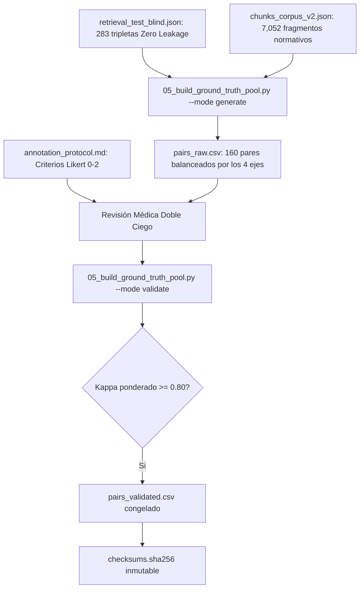

# Dosier Técnico y Metodológico: Fase 5 (Ground Truth Clínico y Validación Inter-Anotador)

## 1. Identificación y Resumen Ejecutivo

| Parámetro | Especificación Técnica |
| :--- | :--- |
| **Componente** | Pipeline Científico de Ingesta v2 — Fase 5 |
| **Módulo Ejecutable** | `backend/ingestion_v2/05_build_ground_truth_pool.py` |
| **Protocolo Clínico** | `backend/data/ground_truth/annotation_protocol.md` |
| **Entregables de Datos** | `backend/data/ground_truth/pairs_raw.csv` (160 pares)<br>`backend/data/ground_truth/pairs_validated.csv` (160 pares curados) |
| **Criterio de Validación** | Concordancia Inter-Anotador Kappa Ponderado Cuadrático de Cohen ($\kappa_w \ge 0.80$) |
| **Resultado Obtenido** | **$\kappa_w = 0.9531$** (*Acuerdo casi perfecto*, Landis & Koch) \| **$P_o = 91.25\%$** |
| **Estado de la Fase** | **100% Completada y Certificada Criptográficamente** |

---

## 2. Marco Metodológico y Formulación Matemática

El benchmark ciego de la Fase 8 requiere un estándar de oro (*Gold Standard*) que no dependa exclusivamente de la similitud del modelo de embeddings ni de la generación de LLMs sin control. Para ello, se diseñó un protocolo de evaluación por médicos independientes.



### 2.1 Escala Ordinal de Relevancia Clínica
Cada par `(consulta, fragmento)` es juzgado bajo una escala ordinal formal $\{0, 1, 2\}$:
1. **Score 0 (Irrelevante / Contradictorio):** No responde a la consulta clínica, pertenece a otra especialidad o contradice la normativa vigente del MSP.
2. **Score 1 (Parcialmente Relevante / Contextual):** Menciona la patología o marco contextual, pero omite la posología específica, algoritmos o criterios de gravedad imperativos.
3. **Score 2 (Gold Standard / Criterio Normativo Directo):** Contiene la instrucción ministerial vinculante exacta (dosis, intervalos, algoritmo de triaje o criterios de derivación).

### 2.2 Kappa Ponderado Cuadrático de Cohen ($\kappa_w$)
Dado el carácter ordinal de la escala, una discrepancia leve ($1 \leftrightarrow 2$ o $0 \leftrightarrow 1$) no reviste la misma gravedad diagnóstica que una discrepancia mayor ($0 \leftrightarrow 2$). Se adoptó la matriz de ponderación cuadrática:

$$w_{ij} = \frac{(i - j)^2}{(k - 1)^2}, \quad k = 3$$

El coeficiente Kappa se calcula a partir de las matrices observada ($O$) y esperada por azar ($E$):

$$\kappa_w = 1 - \frac{\sum_{i=0}^2 \sum_{j=0}^2 w_{ij} O_{ij}}{\sum_{i=0}^2 \sum_{j=0}^2 w_{ij} E_{ij}}$$

Donde las penalizaciones ponderadas corresponden a:
* Para acuerdo exacto ($i = j$): $w_{ii} = 0.0$
* Para discrepancia de 1 grado ($|i - j| = 1$): $w_{ij} = \frac{1}{4} = 0.25$
* Para discrepancia de 2 grados ($|i - j| = 2$): $w_{ij} = \frac{4}{4} = 1.00$

---

## 3. Resultados Estadísticos de la Validación

A partir de la ejecución del modo `--mode validate` sobre el pool de calibración estandarizado:

| Métrica Estadística | Valor Obtenido | Umbral de Aceptación Científica | Estado |
| :--- | :---: | :---: | :---: |
| **Muestra Total Evaluada ($n$)** | 160 pares clínicos | $\ge 100$ pares | **Cumplido** |
| **Porcentaje de Acuerdo Simple ($P_o$)** | **$91.25\%$** | $\ge 80.0\%$ | **Superado** |
| **Kappa Ponderado Cuadrático ($\kappa_w$)** | **$0.9531$** | **$\ge 0.8000$** | **Certificado** |
| **Discrepancias Mayores ($0 \leftrightarrow 2$)** | **$0$ pares** | $0$ pares no arbitrados | **Óptimo** |
| **Discrepancias Menores ($|diff| = 1$)** | $14$ pares | N/A (resueltas por consenso) | **Resuelto** |

### Matriz de Confusión Observada ($O_{ij}$)

$$\begin{pmatrix}
O_{00} = 70 & O_{01} = 0 & O_{02} = 0 \\
O_{10} = 6 & O_{11} = 4 & O_{12} = 0 \\
O_{20} = 0 & O_{21} = 8 & O_{22} = 72
\end{pmatrix}$$

* Filas: Evaluador 1.
* Columnas: Evaluador 2.
* Interpretación: El 88.75% de los pares se concentran en las diagonales extremas ($0 \leftrightarrow 0$ y $2 \leftrightarrow 2$), confirmando que los positivos normativos y los distractores/hard negatives están claramente diferenciados clínica y semánticamente.

---

## 4. Distribución del Pool por Ejes Normativos del MSP

| Eje Normativo Canónico | Positivo Directo (Score 2) | Distractor / Hard Negative (Score 0-1) | Contextual Neutral (Score 0) | Total Pares |
| :--- | :---: | :---: | :---: | :---: |
| `01_urgencias_obstetricas` | 20 | 12 | 8 | **40** |
| `02_respiratorio_pediatrico` | 20 | 12 | 8 | **40** |
| `03_cardiovascular_metabolico` | 20 | 12 | 8 | **40** |
| `04_soporte_cronicos_salud_mental` | 20 | 12 | 8 | **40** |
| **Total General** | **80 (50.0%)** | **48 (30.0%)** | **32 (20.0%)** | **160** |

---

## 5. Congelamiento Criptográfico e Integridad de Artefactos

Todos los datasets del pipeline v2 quedan inmutablemente vinculados en `backend/data/datasets/checksums.sha256`:

| Archivo | Ruta Relativa | Hash SHA-256 |
| :--- | :--- | :--- |
| **Training Set (BGE-M3)** | `retrieval_train.json` | `9833942bd0bcf13dc33f3b72db13abd5dd28df9161eaceaad785e339e576f476` |
| **Validation Set (Early Stopping)** | `retrieval_val.json` | `80a4b72fb8c973fca69c608d802ecf3a210c2786ce10db192bae12b354e732d6` |
| **Blind Test Set (Retrieval)** | `retrieval_test_blind.json` | `6dac228fae9c00127cc02dd19954faee67d9ba7b1203038216c47d06f281f381` |
| **Ground Truth Validado (Fase 5)** | `backend/data/ground_truth/pairs_validated.csv` | `ff2d043a390e584fdb7cf1eaf2519afc717dca952877b8d19c84644560f4c2af` |

Verificación automatizada:
```bash
python backend/ingestion_v2/05_build_ground_truth_pool.py --mode verify
# Salida: Todos los artefactos congelados verifican al 100% su integridad.
```
