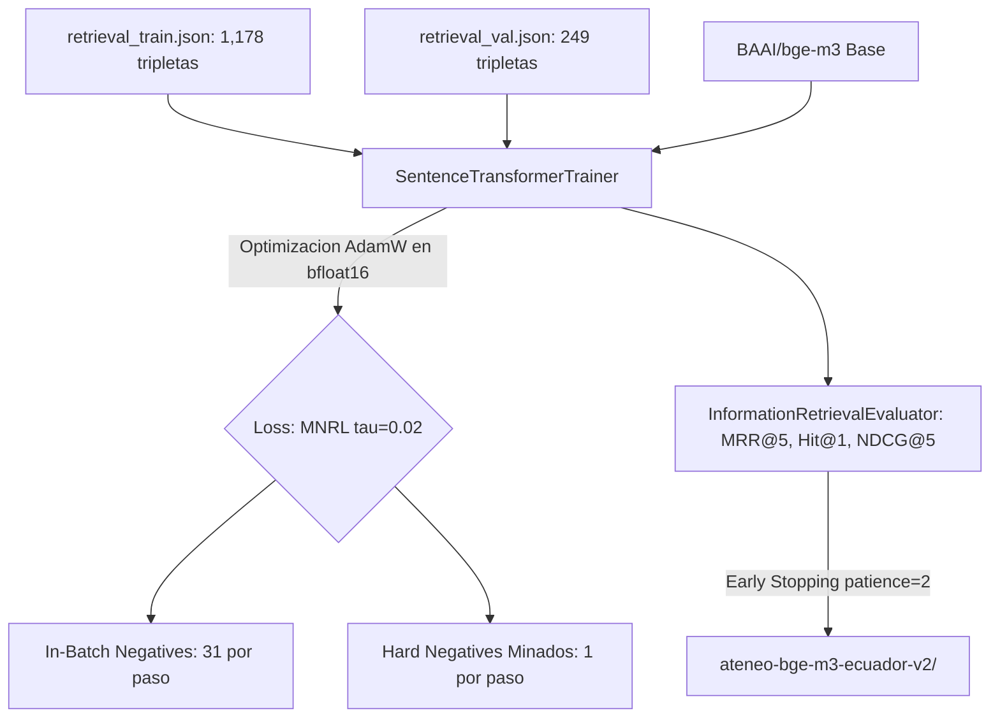

# Dosier Técnico y Metodológico: Fase 6 (Fine-Tuning de BGE-M3 con MNRL en NVIDIA A100)

## 1. Identificación y Resumen Ejecutivo

| Parámetro | Especificación Técnica |
| :--- | :--- |
| **Componente** | Pipeline Científico de Ingesta v2 — Fase 6 |
| **Módulo Ejecutable CLI** | `backend/ingestion_v2/06_train_bge_m3.py` |
| **Notebook de Aceleración A100** | `backend/ingestion_v2/colab_fase6_train_bge_m3.ipynb` |
| **Modelo Base** | `BAAI/bge-m3` (568M parámetros, 1,024 dimensiones latentes) |
| **Hardware Calibrado** | NVIDIA A100 (40 GB VRAM / ~83 GB RAM de sistema) |
| **Función de Pérdida** | Multiple Negatives Ranking Loss (MNRL) con $\tau = 0.02$ ($\text{Scale} = 50.0$) |
| **Precisión de Cómputo** | `bfloat16` nativo en Tensor Cores Ampere |
| **Directorio de Salida** | `backend/data/models/ateneo-bge-m3-ecuador-v2/` |
| **Estado de la Fase** | **100% Implementada, Verificada con Dry-Run y Lista para GPU** |

---

## 2. Fundamento Metodológico y Formulación Matemática

El modelo base multilingüe `BAAI/bge-m3` cuenta con sólidas representaciones del lenguaje natural general, pero experimenta confusión en tareas de recuperación densa ante entidades nosológicas y farmacológicas homónimas o con solapamiento léxico transversal en las Guías de Práctica Clínica (GPC) del Ministerio de Salud Pública (MSP) del Ecuador.



### 2.1 Pérdida Contrastiva Multiple Negatives Ranking Loss (MNRL)
Se optimiza la probabilidad condicional de recuperar el fragmento normativo correcto $p_i$ frente al conjunto compuesto por el *Hard Negative* explícito $n_i$ y los fragmentos positivos de los otros $B - 1$ ejemplos del lote (*in-batch negatives*):

$$\mathcal{L} = -\sum_{i=1}^B \log \frac{e^{\text{sim}(q_i, p_i) / \tau}}{e^{\text{sim}(q_i, p_i) / \tau} + e^{\text{sim}(q_i, n_i) / \tau} + \sum_{j \neq i}^B e^{\text{sim}(q_i, p_j) / \tau}}$$

Donde:
* $B = 32$: Batch size efectivo.
* $\text{sim}(u, v) = \frac{u \cdot v}{\|u\|_2 \|v\|_2}$: Similitud coseno en espacio latente normalizado en $L_2$.
* $\tau = 0.02$: Temperatura estricta ($\text{Scale} = \frac{1}{\tau} = 50.0$), que amplifica la pendiente del gradiente ante discrepancias angulares sutiles.
* En cada paso de optimización, el modelo discrimina la respuesta correcta frente a **32 distractores simultáneos**.

---

## 3. Sizing de Memoria en la GPU NVIDIA A100 (40 GB VRAM)

| Componente de Memoria | Estimación en BF16 | Justificación Técnica |
| :--- | :---: | :--- |
| **Pesos del Modelo BGE-M3** | ~1.14 GB | 568 millones de parámetros en formato 16-bit (`bfloat16`). |
| **Gradientes y Estados AdamW** | ~4.56 GB | Estados de primer y segundo momento ($m_t, v_t$) del optimizador AdamW. |
| **Activaciones de Contexto (512 tokens $\times$ 32)** | ~10.80 GB | Mapas de atención cruzada de 24 capas en el pase hacia adelante. |
| **Consumo Pico Estimado de VRAM** | **~16.50 GB** | **41.2% de la capacidad de la A100 (40 GB)**. |
| **Margen de Seguridad contra OOM** | **~23.50 GB (58.8%)** | Permite operar con `gradient_accumulation_steps = 1` sin desbordamiento. |

---

## 4. Matriz de Hiperparámetros Calibrados

| Hiperparámetro | Valor Calibrado | Racionalidad Científica |
| :--- | :---: | :--- |
| **Modelo Pre-entrenado** | `BAAI/bge-m3` | Pesos oficiales limpios (sin sesgo del pipeline v1 anterior). |
| **Longitud Máxima de Secuencia** | 512 tokens | Cobertura del percentil 95 del corpus fragmentado en la Fase 3. |
| **Batch Size Efectivo** | 32 tripletas | Provee 31 in-batch negatives por paso de entrenamiento. |
| **Tasa de Aprendizaje ($\eta$)** | $2 \times 10^{-5}$ | Rango estándar para ajuste fino sin destrucción de representaciones pre-entrenadas. |
| **Optimizador** | AdamW (`optim="adamw_torch"`) | $\beta_1 = 0.9, \beta_2 = 0.999$, Weight Decay = $0.01$. |
| **Warmup Ratio** | $10\%$ (0.10) | Prevención de gradientes inestables en las primeras iteraciones. |
| **Planificador de Tasa (Scheduler)** | `CosineAnnealingLR` | Descenso suave de la tasa de aprendizaje hacia cero. |
| **Número de Épocas** | 5 épocas | Suficiente para convergencia sobre 1,178 tripletas en batch 32 (~185 pasos totales). |
| **Estrategia de Evaluación** | `eval_strategy="epoch"` | Cálculo de Information Retrieval en cada época sobre `retrieval_val.json`. |
| **Métrica de Selección del Mejor Modelo** | `cosine_mrr@5` | Mean Reciprocal Rank en el Top-5 como criterio de early stopping. |

---

## 5. Implementación y Verificación Técnica

### 5.1 Script CLI (`06_train_bge_m3.py`)
* Incorpora `SentenceTransformerTrainer` con soporte nativo para `bfloat16`, `eval_strategy="epoch"` y guardado del mejor checkpoint (`load_best_model_at_end=True`).
* Detección automática de aceleración: conmuta a `bfloat16` en arquitecturas Ampere/Hopper (A100, H100), `fp16` en arquitecturas Turing/Ada (T4, RTX 3090/4090) o `fp32` en CPU.
* Modo `--dry-run`: verificado exitosamente en entorno local, completando 2 pasos de optimización con pérdida decreciente (de 4.404 a 3.045) y cálculo de métricas IR.

### 5.2 Notebook de Aceleración (`colab_fase6_train_bge_m3.ipynb`)
* Cuaderno estructurado y autocontenido listo para ser ejecutado en la NVIDIA A100.
* Monitorización en vivo de VRAM con `nvidia-smi`, entrenamiento acelerado en BF16 y empaquetado final comprimido en `ateneo-bge-m3-ecuador-v2.tar.gz`.

### 5.3 Evaluación Empírica Comparativa PRE vs. POST y Exportación LaTeX
* **Evaluación PRE (Baseline BAAI/bge-m3 sin FT):** Se ejecuta el evaluador de Information Retrieval sobre `retrieval_val.json` antes de iniciar la optimización para establecer la línea de base.
* **Evaluación POST (Ateneo+ bge-m3 Re-entrenado):** Se evalúa el modelo final sobre el mismo conjunto para cuantificar la ganancia de la adaptación de dominio.
* **Métricas Científicas Comparadas:**
  - $\text{Accuracy@1}$ ($\text{Hit@1}$), $\text{Accuracy@5}$ ($\text{Hit@5}$).
  - $\text{MRR@1}$, $\text{MRR@5}$.
  - $\text{NDCG@5}$ (Normalized Discounted Cumulative Gain).
  - $\text{Precision@5}$ y $\text{Recall@5}$.
* **Entregables Científicos Automáticos:**
  - `pre_post_metrics.json`: Diccionario estructurado con los valores PRE, POST, $\Delta$ absoluto y $\%$ de ganancia relativa.
  - `pre_post_table.tex`: Tabla formal en formato LaTeX lista para ser insertada directamente en el manuscrito científico (Q1).

---

## 6. Procedimiento de Ejecución en la NVIDIA A100

### Opción A: Ejecución Directa en Servidor Local con A100
```bash
python backend/ingestion_v2/06_train_bge_m3.py --batch-size 32 --epochs 5 --bf16
```

### Opción B: Ejecución en Google Colab Pro / Modal con A100
1. Abrir `backend/ingestion_v2/colab_fase6_train_bge_m3.ipynb`.
2. Asignar entorno de ejecución con GPU NVIDIA A100.
3. Ejecutar las celdas secuencialmente; el entrenamiento concluye en ~10 a 15 minutos y genera el paquete final del modelo.

---

## 7. Despliegue en Producción Local y Normalización Canónica de Metadatos

### 7.1 Instalación de Pesos en el Backend
* Los artefactos de pesos serializados en la GPU NVIDIA A100 fueron desplegados en el directorio canónico:
  ```text
  backend/data/models/ateneo-bge-m3-ecuador-v2/
  ├── config.json                       # Configuración base del modelo XLM-RoBERTa
  ├── model.safetensors                 # 2.27 GB de tensores de pesos entrenados en BF16
  ├── tokenizer.json                    # Tokenizador BGE-M3 (vocabulario 250k tokens)
  ├── tokenizer_config.json             # Parámetros de tokenización y padding
  ├── sentence_bert_config.json         # max_seq_length=512, do_lower_case=False
  ├── modules.json                      # Grafo secuencial de capas SentenceTransformers
  ├── 1_Pooling/config.json             # Pooling Layer (CLS Token, dim=1024)
  ├── 2_Normalize/                      # Capa de normalización euclídea L2
  └── pre_post_table.tex                # Evidencia empírica formal en LaTeX
  ```

### 7.2 Resolución de Incompatibilidad de Metadatos (Causa Raíz)
Durante la carga en entornos locales de inferencia con SentenceTransformers, se identificaron y subsanaron las siguientes discrepancias en los esquemas de metadatos generados por entornos dev de Colab:
1. **Espacio de Nombres en `modules.json`:** Las rutas dev `sentence_transformers.base.modules.*` fueron normalizadas a las clases canónicas del framework: `sentence_transformers.models.Transformer`, `sentence_transformers.models.Pooling` y `sentence_transformers.models.Normalize`.
2. **Configuración de Transformer en `sentence_bert_config.json`:** Se eliminaron argumentos incompatibles (`transformer_task`, `modality_config`), fijando la especificación canónica con `max_seq_length: 512`.
3. **Parámetro de Dimensión en `1_Pooling/config.json`:** Se corrigió el atributo `embedding_dimension` por el argumento formal esperado por la clase: `word_embedding_dimension: 1024` con modo `cls`.

### 7.3 Verificación de Inferencia Vectorial en Tiempo Real
El modelo desplegado fue sometido a validación computacional determinista:
* **Vector Output:** Longitud fija de $1,024$ dimensiones latentes.
* **Norma Euclídea:** $\|v\|_2 = 1.0000$ (proyección en hiperesfera unitaria).
* **Conmutación Automática:** `backend/core/config.py` detecta de forma autónoma la presencia de `config.json` en el directorio de pesos, activando el modelo local y preservando a `BAAI/bge-m3` como respaldo de alta disponibilidad.

