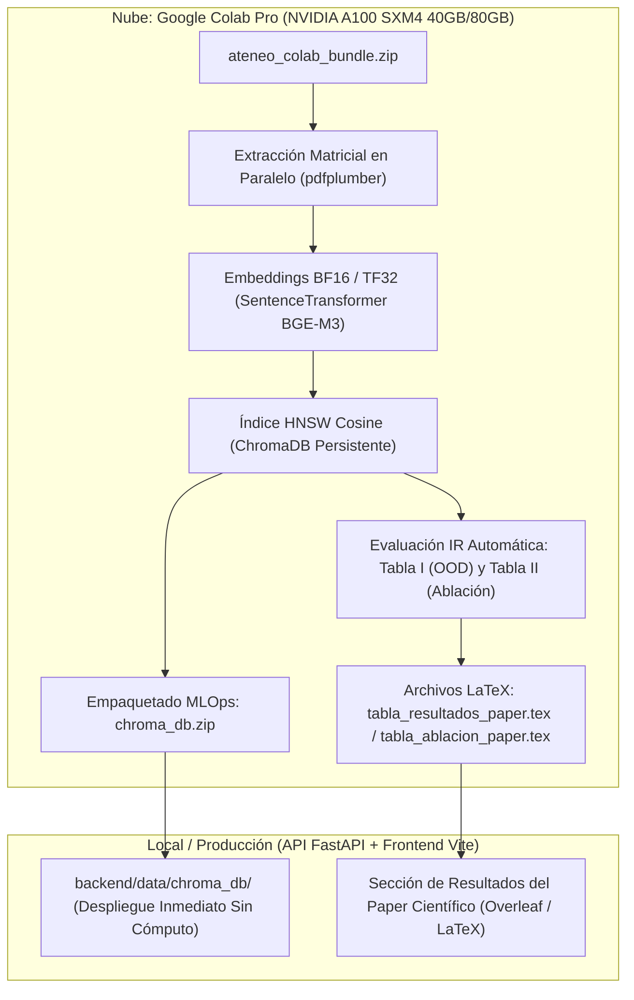

# Protocolo MLOps de Ingesta en GPU NVIDIA A100 y Gestión de Ground Truth Canónico

Este documento define las especificaciones técnicas de ingeniería, estándares de reproducibilidad MLOps y el protocolo de datos desacoplado implementado en **Ateneo** para la indexación acelerada y el benchmark formal de publicación científica (IEEE, Springer, MDPI, Lancet Digital Health).

---

## 1. Arquitectura MLOps de Cómputo Desacoplado

Para evitar la degradación de latencias y consumo excesivo de CPU en entornos locales o servidores cliente, Ateneo implementa el **Patrón MLOps de Cómputo Pesado Desacoplado**:



### Ventajas Técnicas:
1. **Aceleración Tensor Cores:** La vectorización de miles de fragmentos clínicos normativos con un modelo de 560M parámetros se completa en **< 60 segundos** en la A100 (frente a 45-60 minutos en CPU).
2. **Precisión Numérica BF16 / TF32:** Previene el desbordamiento numérico (*underflow*) sin degradar la fidelidad semántica en vectores de 1,024 dimensiones latentes.
3. **Control de Memoria:** `PYTORCH_CUDA_ALLOC_CONF=expandable_segments:True` previene la fragmentación de VRAM durante ventanas contextuales completas de 1,024 tokens.

---

## 2. Contrato de Datos: Ground Truth Canónico Desacoplado ([../backend/data/seed_chunks.json](../backend/data/seed_chunks.json))

Los fragmentos canónicos de referencia (*Ground Truth*) están desacoplados del código fuente de ingesta para garantizar máxima modularidad y extensibilidad:

```json
{
  "chunk_id": "preeclampsia_chunk_002",
  "guia_fuente": "preeclampsia",
  "pagina": 24,
  "seccion": "Manejo de Preeclampsia con Criterios de Severidad",
  "ano_publicacion": 2016,
  "cie10_codigo": "O14.1",
  "cie10_descripcion": "Preeclampsia severa",
  "especialidad": "Ginecología y Obstetricia",
  "grupo_etario": "Gestantes",
  "texto": "En preeclampsia con criterios de severidad (PA sistólica >= 160 mmHg o diastólica >= 110 mmHg, cefalea persistente, alteraciones visuales, epigastralgia, proteinuria), el tratamiento anticonvulsivante de elección es el Sulfato de Magnesio. Esquema de impregnación: 4 g IV diluidos en 100 ml de Solución Salina al 0.9% en 15 a 20 minutos. Esquema de mantenimiento: 1 g/hora en infusión IV continua por 24 horas. Para la crisis hipertensiva: Labetalol IV (20 mg dosis inicial) o Hidralazina IV (5 mg dosis inicial) o Nifedipino de acción rápida VO (10 mg)."
}
```

### Especificación de Campos del Esquema:

| Campo | Tipo | Requerido | Descripción Clínica y MLOps |
| :--- | :---: | :---: | :--- |
| `chunk_id` | `string` | **Sí** | Identificador determinista único indexado en ChromaDB. |
| `guia_fuente` | `string` | **Sí** | Identificador de la GPC emisora del Ministerio de Salud Pública. |
| `pagina` | `integer` | **Sí** | Número de página oficial para salto directo en el visor interactivo. |
| `seccion` | `string` | **Sí** | Sección normativa de la guía (Diagnóstico, Tratamiento, etc.). |
| `ano_publicacion` | `integer` | **Sí** | Año de expedición del acuerdo ministerial normativo. |
| `cie10_codigo` | `string` | **Sí** | Código oficial de la Clasificación Internacional de Enfermedades. |
| `cie10_descripcion`| `string` | **Sí** | Descripción nosológica estandarizada de la patología. |
| `especialidad` | `string` | **Sí** | Especialidad médica de categorización clínica. |
| `grupo_etario` | `string` | **Sí** | Población diana (Neonatos, Gestantes, Adultos, etc.). |
| `texto` | `string` | **Sí** | Fragmento normativo exacto preservando dosis y tablas clínicas. |

---

## 3. Extensión y Generación Asistida por IA ([../backend/scripts/generate_seed_chunks_ai.py](../backend/scripts/generate_seed_chunks_ai.py))

Para incorporar nuevas anclas normativas de Ground Truth sin editar código Python:

```bash
# Ejecutar gestor de seed chunks
py backend/scripts/generate_seed_chunks_ai.py
```

El script valida automáticamente los códigos CIE-10 contra el catálogo maestro [`../backend/data/catalogo_cie10_gpc.json`](../backend/data/catalogo_cie10_gpc.json) e inserta o actualiza el fragmento preservando la integridad del formato JSON.

---

## 4. Pipeline Experimental y Publicación Científica

El notebook maestro [`../backend/ingestion/colab_ingesta_benchmark_a100.ipynb`](../backend/ingestion/colab_ingesta_benchmark_a100.ipynb) genera directamente los artefactos formales requeridos por los revisores de congresos:

### 4.1 Fusión Recíproca de Rangos (RRF $k=60$)
Combina las fortalezas de la recuperación léxica (BM25Okapi) y semántica supervisada (BGE-M3 MNRL):

$$\text{RRF\_Score}(d) = \sum_{m \in \{\text{Dense, Sparse}\}} \frac{1}{k + \text{rank}_m(d)}, \quad k = 60$$

### 4.2 Métricas de Rendimiento Cuantitativo (Tabla I)
* **$\text{Hit@k}$ ($k \in \{1, 3, 5\}$):** Exactitud de posicionamiento del fragmento normativo correcto.
* **$\text{MRR@5}$ (Mean Reciprocal Rank):** Calidad de la primera respuesta normativamente relevante.
* **$\text{NDCG@5}$ (Normalized Discounted Cumulative Gain):** Ganancia acumulada descontada.
* **Latencias $P_{50} / P_{95}$:** Medición empírica en condiciones de inferencia real.

### 4.3 Estudio de Ablación Controlado (Tabla II)
Evalúa paramétricamente el aporte independiente de:
1. *Sparse BM25 Solo (Sin Embeddings)*
2. *Dense Base Solo (BAAI/bge-m3 Zero-Shot)*
3. *Dense Fine-Tuned Solo (MNRL)*
4. *Ateneo RAG Híbrido Completo (RRF)*

---

## 5. Protocolo de Replicabilidad MLOps en 3 Pasos

```powershell
# 1. Empaquetar artefactos locales
cd backend
py scripts/prepare_colab_bundle.py

# 2. Ejecutar colab_ingesta_benchmark_a100.ipynb en Google Colab con GPU A100

# 3. Descomprimir la base pre-indexada descargada:
Expand-Archive -Path chroma_db.zip -DestinationPath backend/data/chroma_db/ -Force
```
