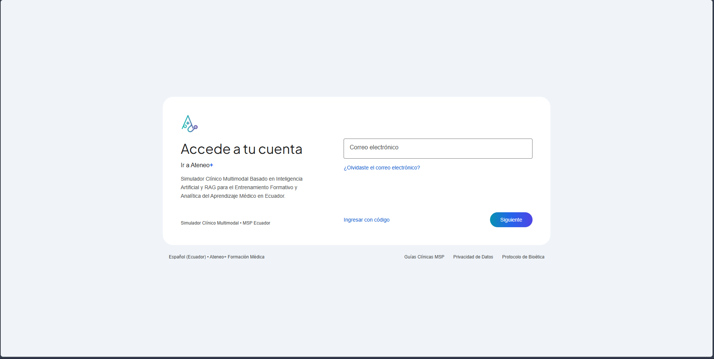
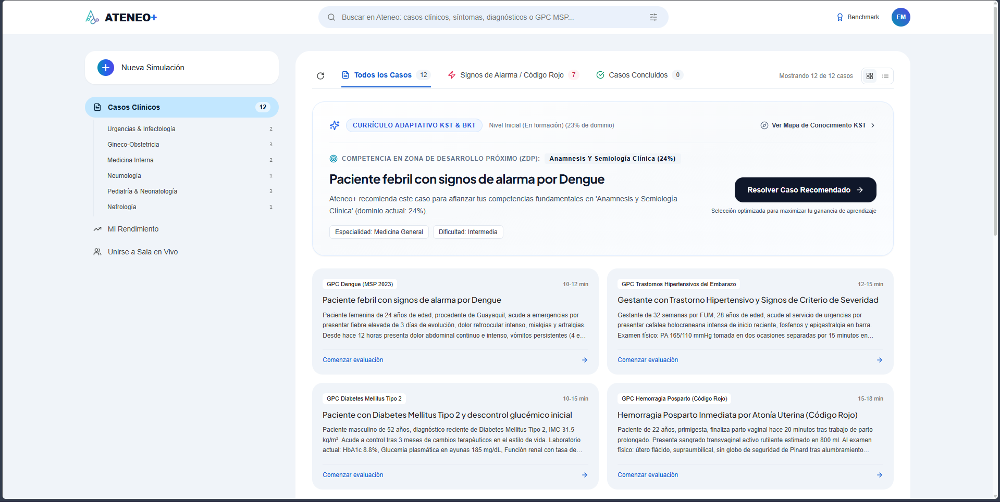
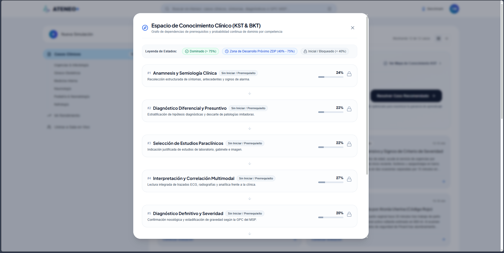
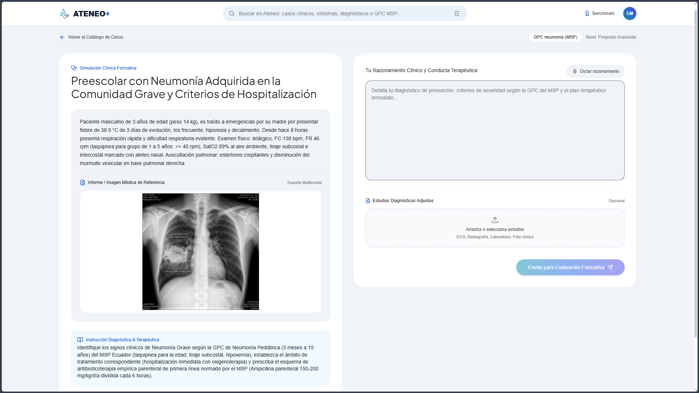
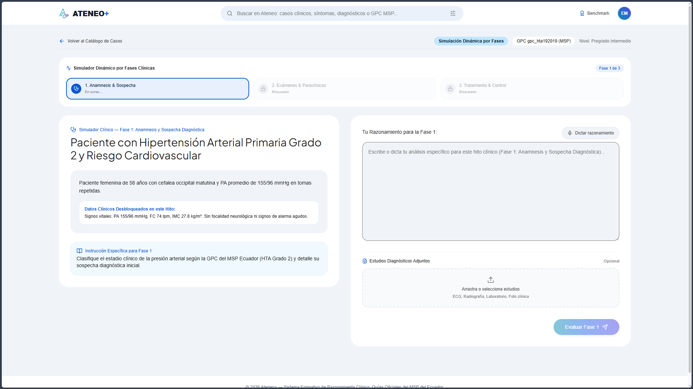
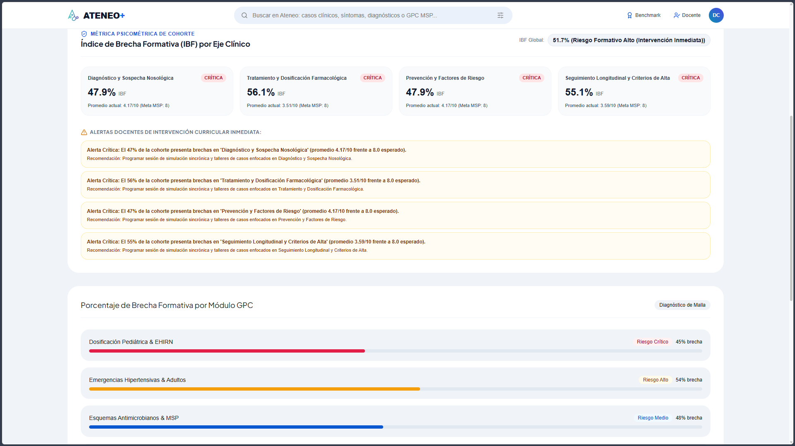
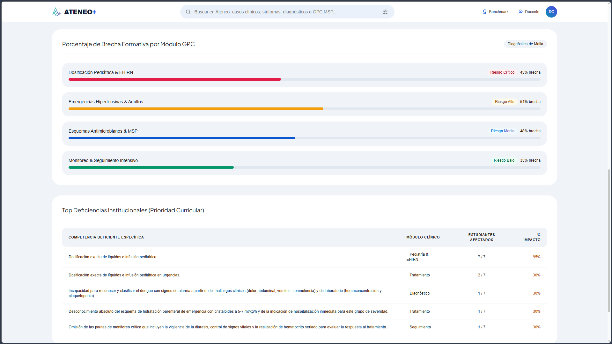
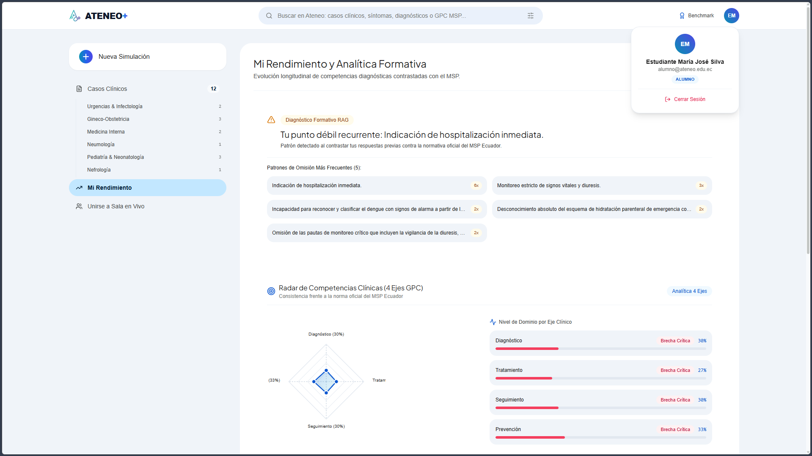

# Guía Visual y Evidencia de Funcionamiento del Sistema Ateneo+

Este documento recopila las capturas de pantalla de la plataforma en ejecución, describiendo los componentes de interfaz, la lógica pedagógica y los modelos que operan en cada módulo.

---

## 1. Acceso y Autenticación de Usuarios

* **Ruta de Interfaz:** `/login`
* **Descripción:** Interfaz de acceso institucional con control de acceso basado en roles (RBAC). Permite el ingreso diferenciado para perfiles de **Estudiante**, **Docente** y **Administrador**.
* **Mecanismo Técnico:** Generación de tokens de acceso criptográficos (Bearer JWT con algoritmo HS256) y validación de contraseñas mediante hashing Bcrypt.

---

## 2. Catálogo de Casos Clínicos y Recomendación Adaptativa (ZDP)

* **Ruta de Interfaz:** `/` (Vista Estudiante)
* **Descripción:** Panel principal que clasifica los 12 casos clínicos del MSP en categorías de especialidad (Urgencias, Gineco-Obstetricia, Medicina Interna, Pediatría, etc.) y destaca en la parte superior la tarjeta de **Currículo Adaptativo KST & BKT**.
* **Mecanismo Técnico:** El motor `curriculum_engine.py` evalúa la Zona de Desarrollo Próximo del estudiante ($0.40 \le P(L) \le 0.75$) y recomienda proactivamente el caso que maximiza la ganancia de aprendizaje (en este ejemplo, *Dengue con signos de alarma* para reforzar *Anamnesis y Semiología Clínica*).

---

## 3. Espacio de Conocimiento Clínico (Knowledge Space Theory)

* **Ruta de Interfaz:** Modal desplegable desde el Dashboard
* **Descripción:** Estructura visual del grafo acíclico dirigido (DAG) que modela las dependencias de prerrequisitos entre las 7 competencias clínicas esenciales del razonamiento médico.
* **Mecanismo Técnico:** Muestra los estados de dominio calculados por `knowledge_tracer.py` mediante Bayesian Knowledge Tracing continuo (Dominado $\ge 75\%$, ZDP $40\%-75\%$, Inicial/Bloqueado $< 40\%$).

---

## 4. Resolución de Caso Multimodal con Radiografía y Dictado por Voz

* **Ruta de Interfaz:** `/cases/case_nac_01`
* **Descripción:** Entorno de resolución clínica en pantalla dividida (*Split-Screen*). El panel izquierdo presenta la viñeta clínica, los antecedentes y el visor de imagen médica (Radiografía digital de tórax en preescolar). El panel derecho contiene el editor de razonamiento libre, el botón de dictado clínico por voz y la zona de carga de estudios adicionales.
* **Mecanismo Técnico:** Integración de la Web Speech API nativa para reconocimiento de voz en tiempo real (`es-EC`) y preparación de payload multipart para inferencia con Gemini Vision API.

---

## 5. Simulación Dinámica Secuencial por Fases Clínicas

* **Ruta de Interfaz:** `/cases/case_hta_01`
* **Descripción:** Flujo de simulación por hitos progresivos para el manejo de Hipertensión Arterial Grado 2.
* **Mecanismo Técnico:** Implementa un Stepper de 3 etapas (*Fase 1: Anamnesis y Sospecha* $\rightarrow$ *Fase 2: Interpretación de Paraclínicos y ECG* $\rightarrow$ *Fase 3: Prescripción Terapéutica y Monitoreo*). Los datos paraclínicos y farmacológicos se desbloquean secuencialmente tras evaluar el razonamiento previo mediante `POST /api/evaluate/phase`.

---

## 6. Panel Docente de Analítica de Cohorte e Índice de Brecha Formativa (IBF)

* **Ruta de Interfaz:** `/docente`
* **Descripción:** Panel de supervisión curricular para directores y docentes. Presenta el semáforo cuantitativo del **Índice de Brecha Formativa (IBF)** en los 4 ejes normativos (Diagnóstico, Tratamiento, Prevención y Seguimiento).
* **Mecanismo Técnico:** El motor `learning_analytics.py` computa la desviación de la cohorte frente al estándar normativo de 8.0/10 puntos, generando alertas automáticas de intervención curricular en áreas críticas.

---

## 7. Diagnóstico de Malla y Brecha Formativa por Módulo GPC

* **Ruta de Interfaz:** `/docente` (Sección Inferior)
* **Descripción:** Desglose del porcentaje de brecha por módulo normativo del MSP (Dosificación Pediátrica, Emergencias Hipertensivas, Esquemas Antimicrobianos) y tabla de **Top Deficiencias Institucionales**.
* **Mecanismo Técnico:** Agregación estadística de fallos y omisiones recurrentes tipadas por el evaluador RAG, indicando el número exacto de estudiantes afectados para priorización en talleres prácticos.

---

## 8. Perfil Longitudinal del Estudiante y Radar de Competencias

* **Ruta de Interfaz:** `/history` (Mi Rendimiento)
* **Descripción:** Vista personalizada para el alumno que sintetiza su evolución formativa, patrones de omisión más frecuentes detectados por el sistema y el **Radar de Competencias Clínicas en 4 Ejes**.
* **Mecanismo Técnico:** Renderizado vectorial mediante Recharts que contrasta el desempeño individual frente a la norma oficial del MSP Ecuador.
