# Hoja de Ruta Maestra de Ejecución por Sesiones (Ateneo+)

Este documento establece la guía operativa secuencial, sesión a sesión y bloque a bloque, para consolidar la arquitectura de **Ateneo+** a estándar de ingeniería senior (+10 años en producción), erradicando cualquier residuo de deuda técnica y garantizando cero parches.

Cada sesión cuenta con casillas de verificación interactivas (`- [ ]`) tanto para sus entregables técnicos como para su protocolo de revisión metódica y en la tabla general de control.

---

## 1. Reglas Cardinales de Ejecución y Gobernanza

1. **Un Solo Bloque y Una Sola Sesión a la Vez:**
   - La ejecución sigue un orden canónico estricto de precedencia: **Bloque 1 (Base de Datos) -> Bloque 2 (Backend) -> Bloque 3 (Frontend)**.
   - Queda terminantemente prohibido avanzar o mezclar tareas de sesiones futuras sin haber concluido y verificado la sesión activa.
2. **Mandato Causa Raíz y Cero Parches:**
   - Cada solución debe implementarse en su origen arquitectónico correcto (tipado estricto, persistencia normalizada, transacciones ACID, separación de capas).
   - Prohibido el uso de soluciones cosméticas, excepciones silenciadas (`pass`), `any` en TypeScript o mutaciones directas de estado.
3. **Auditoría Metódica de Cierre de Sesión:**
   - Al finalizar cada sesión, se ejecutan las pruebas empíricas correspondientes (unitarias, integración, compilación y regresión).
   - Se audita que no existan emojis ni lenguaje inflado en código, documentación y commits.
4. **Pausa Obligatoria y Solicitud de Confirmación:**
   - Al concluir la revisión metódica de cada sesión, el agente **se detiene**, presenta el dictamen de verificación y solicita autorización explícita al desarrollador antes de dar inicio a la siguiente sesión.

---

## 2. Mapa Integral de Sesiones

```mermaid
graph TD
    subgraph B1 [Bloque 1: Persistencia Relacional - 4 Sesiones]
        BD1["Sesión BD-1: Modelos Relacionales, FKs & Índices (Fase 2)"]
        BD2["Sesión BD-2: Script de Migración Determinística (Fase 3)"]
        BD3["Sesión BD-3: Sincronización de Repositorios SQL (Fase 4)"]
        BD4["Sesión BD-4: Certificación de Regresión BD (Fase 5)"]
    end

    subgraph B2 [Bloque 2: Arquitectura y API Backend - 10 Sesiones]
        BE1["Sesión BE-1: Desacoplamiento Clean Architecture (Fase 1)"]
        BE2["Sesión BE-2: Unit of Work & Transacciones ACID (Fase 2)"]
        BE3["Sesión BE-3: Rate Limiting Defensivo RFC 7807 (Fase 3)"]
        BE4["Sesión BE-4: Blindaje Anti-Prompt Injection (Fase 4)"]
        BE5["Sesión BE-5: Caché Semántica y Léxica RAG (Fase 5)"]
        BE6["Sesión BE-6: Gobernanza Multi-Tenancy Lógica (Fase 6)"]
        BE7["Sesión BE-7: Sondas Health, Ready & Circuit Breaker (Fase 7)"]
        BE8["Sesión BE-8: Pool Asíncrono de Reportes Masivos (Fase 8)"]
        BE9["Sesión BE-9: Logging Estructurado OpenTelemetry (Fase 9)"]
        BE10["Sesión BE-10: Auditoría de Carga y Concurrencia (Fase 10)"]
    end

    subgraph B3 [Bloque 3: Capacidades Hospitalarias Frontend - 6 Sesiones]
        FE1["Sesión FE-1: Imagenología DICOM / PACS (Fase 11)"]
        FE2["Sesión FE-2: Motor de Exámenes OSCE / ECOE (Fase 12)"]
        FE3["Sesión FE-3: Tele-Simulación y Audio WebRTC (Fase 13)"]
        FE4["Sesión FE-4: Multi-Tenancy UI & ThemeProvider (Fase 14)"]
        FE5["Sesión FE-5: i18n Tipado y Localización Nosológica (Fase 15)"]
        FE6["Sesión FE-6: Observabilidad Forense RUM Cliente (Fase 16)"]
    end

    BD1 --> BD2 --> BD3 --> BD4
    BD4 --> BE1
    BE1 --> BE2 --> BE3 --> BE4 --> BE5 --> BE6 --> BE7 --> BE8 --> BE9 --> BE10
    BE10 --> FE1
    FE1 --> FE2 --> FE3 --> FE4 --> FE5 --> FE6
```

---

## Bloque 1: Plan de Base de Datos (`PLAN_ESCALABILIDAD_BASE_DE_DATOS.md`)

### [x] Sesión BD-1 (Fase 2): Refactorización de Modelos Relacionales (COMPLETADA)
* **Objetivo:** Declarar la integridad referencial formal a nivel de ORM en SQLAlchemy 2.0, migrar marcas temporales y crear índices compuestos.
* **Archivos Afectados:**
  - `backend/modules/auth/models.py` (`UserModel`)
  - `backend/modules/analytics_history/models.py` (`EvaluationHistoryModel`)
  - `backend/modules/collaboration/models.py` (`AteneoRoomModel`)
  - `backend/modules/adaptive/models.py` (`StudentMasteryModel`, `StudentSnapshotModel`)
  - `backend/modules/cases/models.py` (`ClinicalCaseModel`)
* **Entregables Específicos:**
  - [x] `ForeignKey("users.id", ondelete="CASCADE")` formal en `EvaluationHistoryModel.user_id`, `StudentMasteryModel.user_id` y `StudentSnapshotModel.user_id`.
  - [x] `ForeignKey("users.id", ondelete="RESTRICT")` en `AteneoRoomModel.docente_id`.
  - [x] `ForeignKey("users.id", ondelete="SET NULL")` en `ClinicalCaseModel.creado_por`.
  - [x] Migración de marcas temporales `String(50)` hacia `DateTime(timezone=True)` con `SafeDateTime` y `func.now()`.
  - [x] Incorporación de columna `created_at` en `AteneoRoomModel`.
  - [x] Adición de columnas directas en `EvaluationHistoryModel`: `faithfulness_score: Float`, `cohorte_id: String(50)` y `tiempo_segundos: Float`.
  - [x] Creación de índices compuestos: `ix_eval_user_created`, `ix_eval_cohort_guide` e `ix_snapshot_user_session`.
* **Revisión Metódica al Concluir la Sesión:**
  - [x] Inspección del esquema SQLAlchemy resultante y tipos de datos.
  - [x] Ejecución de `uv run python -m tests.run_all_tests` con 100% de aprobación (20.75s).
  - [x] Auditoría de cero emojis y cero código parche en modelos.
  - [x] Verificación de frontend con `npm run typecheck` (0 errores) y 16 suites Vitest (72 tests PASS).
  - [x] **Pausa obligatoria:** Preguntar al usuario antes de proceder a la Sesión BD-2. (Aprobada por el desarrollador).

---

### [x] Sesión BD-2 (Fase 3): Script Determinístico de Migración de Datos (COMPLETADA)
* **Objetivo:** Transferir los registros históricos existentes en `history.db` hacia la base de datos normalizada `ateneo_clinical.db` con validación estricta de integridad referencial.
* **Archivos Afectados:**
  - `scripts/migrate_history_to_ateneo_clinical.py` (Nuevo script reproducible)
  - `backend/core/config.py` (Ruta canónica de base de datos a `ateneo_clinical.db`)
  - `backend/modules/auth/service.py` (Sincronización de identidades de cohorte en seed)
* **Entregables Específicos:**
  - [x] Script Python determinístico y reproducible con rollback transaccional ante excepciones (`scripts/migrate_history_to_ateneo_clinical.py`).
  - [x] Migración sin pérdida de registros: 9 usuarios, 33 evaluaciones (poblando `faithfulness_score`, `cohorte_id`, `tiempo_segundos`), 52 salas y estados BKT.
  - [x] Verificación de integridad con ejecución de `PRAGMA foreign_key_check` con 0 violaciones.
* **Revisión Metódica al Concluir la Sesión:**
  - [x] Ejecución del script `migrate_history_to_ateneo_clinical.py` completada exitosamente.
  - [x] Verificación de conteo idéntico de registros origen vs destino (33/33 evaluaciones, 52/52 salas, 1/1 maestría, 1/1 snapshots).
  - [x] Verificación de 0 violaciones en `PRAGMA foreign_key_check`.
  - [x] Prueba de rechazo estricto con `IntegrityError` ante inserción de clave foránea inválida.
  - [x] Certificación de 6 suites backend (100% PASS en 47.32s) y 16 suites frontend (72 tests PASS en 6.98s).
  - [x] **Pausa obligatoria:** Preguntar al usuario antes de proceder a la Sesión BD-3. (Aprobada por el desarrollador).

---

### [x] Sesión BD-3 (Fase 4): Sincronización de Repositorios de Dominio (COMPLETADA)
* **Objetivo:** Actualizar los repositorios para operar sobre las nuevas columnas directas y reemplazar agregaciones en bucles Python por consultas SQL nativas.
* **Archivos Afectados:**
  - `backend/modules/analytics_history/repository.py` (`HistoryRepository`)
  - `backend/modules/collaboration/repository.py` (`RoomRepository`)
  - `backend/modules/analytics_history/service.py` (`AnalyticsHistoryService`)
* **Entregables Específicos:**
  - [x] Inserción directa de `faithfulness_score`, `cohorte_id` y `tiempo_segundos` en `save_evaluation`.
  - [x] Refactorización de `analyze_coordinator_cohort_analytics` para calcular métricas mediante `func.avg` y `func.count` de SQLAlchemy agrupadas por guía e índice.
  - [x] Optimización de tiempos de respuesta en consultas analíticas B2B mediante `get_cohort_summary_stats` y `get_guide_breakdown_stats`.
  - [x] Consultas activas y filtrado por docente en `RoomRepository` (`get_active_rooms`, `get_by_docente`).
* **Revisión Metódica al Concluir la Sesión:**
  - [x] Ejecución de `uv run python -m tests.test_paper_differentiators` aprobada con 100% PASS.
  - [x] Validación de respuesta de los endpoints `GET /api/history/ibf-cohort` y `GET /api/history/coordinator-analytics`.
  - [x] Verificación de suite completa de backend (47.45s) y frontend (16.03s / 72 tests PASS).
  - [ ] **Pausa obligatoria:** Preguntar al usuario antes de proceder a la Sesión BD-4.

---

### [x] Sesión BD-4 (Fase 5): Verificación Integral de Regresión de Base de Datos (COMPLETADA)
* **Objetivo:** Certificar que el 100% del sistema backend y frontend opere sin regresiones sobre la base normalizada.
* **Entregables Específicos:**
  - [x] Ejecución de las 6 suites maestras del backend al 100% PASS (`run_all_tests.py` en 32.66s).
  - [x] Ejecución de las 16 suites y 72 tests unitarios del frontend al 100% PASS (`vitest run` en 8.38s).
  - [x] Ejecución de la batería E2E Playwright (15/15 tests PASS en Chrome, Edge y Mobile Pixel 5).
  - [x] Validación de tipos TypeScript (`npm run typecheck` con 0 errores) y compilación PWA (`npm run build` limpio en 8.34s).
  - [x] Verificación física de integridad SQLite (`PRAGMA integrity_check` -> ok, `PRAGMA foreign_key_check` -> 0 violaciones).
  - [x] Actualización de estado en `PLAN_ESCALABILIDAD_BASE_DE_DATOS.md` marcando Fases 2, 3, 4 y 5 como COMPLETADAS.
* **Revisión Metódica al Concluir la Sesión:**
  - [x] Reporte consolidado de tiempos y resultados de todas las suites.
  - [x] Verificación de cero advertencias o degradación de rendimiento.
  - [x] **Pausa obligatoria:** Preguntar al usuario antes de dar inicio al Bloque 2 (Backend). (Aprobación en curso).

---

## Bloque 2: Plan de Backend (`PLAN_ESCALABILIDAD_BACKEND.md`)

### [x] Sesión BE-1 (Fase 1): Desacoplamiento Clean Architecture en Controladores (COMPLETADA)
* **Objetivo:** Erradicar la violación de capas B1: eliminar imports de `from rag import ...` en los routers y delegar íntegramente en `EvaluationService`.
* **Archivos Afectados:**
  - `backend/routers/evaluation.py`
  - `backend/routers/collaboration.py`
  - `backend/routers/history.py`
  - `backend/modules/evaluation/service.py`
* **Entregables Específicos:**
  - [x] Router `evaluation.py` delegado: delega en `EvaluationService.evaluate_reasoning`, `evaluate_phase` y `generate_socratic_turn_stream`.
  - [x] Extracción de adaptadores de lectura de imágenes hacia capa de aplicación (`_load_case_preset_image`).
  - [x] Router `collaboration.py`: delegación de evaluación de consenso mediante `EvaluationService.evaluate_reasoning`.
  - [x] Router `history.py`: delegación de benchmark de fidelidad en `EvaluationService.get_faithfulness_benchmark`.
  - [x] Verificación formal: comando `grep -r "from rag" backend/routers/` retorna exactamente 0 resultados.
* **Revisión Metódica al Concluir la Sesión:**
  - [x] Ejecución de `test_api_endpoints.py` (100% PASS) y `test_multimodal_and_cases.py` (100% PASS).
  - [x] Ejecución de suite completa del backend `run_all_tests.py` (6/6 suites PASS en 19.27s).
  - [x] Auditoría estricta de 0 imports directos de `rag` en controladores.
  - [x] **Pausa obligatoria:** Preguntar al usuario antes de proceder a la Sesión BE-2. (Aprobación en curso).

---

### [x] Sesión BE-2 (Fase 2): Coordinación Transaccional con Unit of Work (ACID) (COMPLETADA)
* **Objetivo:** Implementar el patrón Unit of Work para garantizar atomicidad estricta en operaciones compuestas (evaluación + actualización BKT + snapshot).
* **Archivos Afectados:**
  - `backend/core/unit_of_work.py` (Nuevo)
  - `backend/modules/evaluation/service.py`
  - `backend/modules/analytics_history/repository.py`
  - `backend/modules/adaptive/repository.py`
  - `backend/tests/test_unit_of_work.py` (Nuevo)
* **Entregables Específicos:**
  - [x] Context manager `SqlAlchemyUnitOfWork` gestionando transacciones y rollbacks automáticos ante fallos.
  - [x] Agrupación de repositorios de dominio dentro del ciclo de vida del UoW (`users`, `cases`, `history`, `adaptive`, `rooms`).
  - [x] Integración de `EvaluationService` bajo transacciones atómicas `with uow: ... uow.commit()`.
  - [x] Suite de pruebas unitarias `tests/test_unit_of_work.py` verificando rollback total y commit coordinado.
* **Revisión Metódica al Concluir la Sesión:**
  - [x] Ejecución de `test_unit_of_work.py` al 100% PASS (integrada en `run_all_tests.py`).
  - [x] Verificación de consistencia de la base de datos tras excepciones simuladas (0 registros huérfanos).
  - [x] 6/6 suites maestras del backend aprobadas al 100% PASS en 28.95s.
  - [x] **Pausa obligatoria:** Preguntar al usuario antes de proceder a la Sesión BE-3. (Aprobación en curso).

---

### [x] Sesión BE-3 (Fase 3): Rate Limiting Defensivo y Cuotas de Inferencia (COMPLETADA)
* **Objetivo:** Proteger la API de Gemini y el backend contra agotamiento de cuotas mediante algoritmo *Sliding Window / Token Bucket*.
* **Archivos Afectados:**
  - `backend/core/rate_limiter.py` (Nuevo)
  - `backend/core/middleware.py`
  - `backend/routers/evaluation.py`
  - `backend/tests/test_rate_limiter.py` (Nuevo)
* **Entregables Específicos:**
  - [x] Limitador en memoria por usuario autenticado (o IP): cuota de 10 peticiones/min en `/api/evaluate`, 15 en exportación PDF y turno socrático.
  - [x] Inyección de cabeceras estándar: `X-RateLimit-Limit`, `X-RateLimit-Remaining`, `X-RateLimit-Reset` tanto en endpoints regulares como en streaming de respuestas.
  - [x] Respuesta canónica RFC 7807 (HTTP 429) con `Problem Details` y `Retry-After` ante excedente de cuota.
* **Revisión Metódica al Concluir la Sesión:**
  - [x] Prueba automatizada de saturación verificando HTTP 429 ante exceso de cuota (`test_rate_limiter.py`).
  - [x] Verificación de cabeceras HTTP RFC en respuestas regulares y streaming.
  - [x] Certificación de 6 suites backend (100% PASS en 54.46s) y 16 suites frontend Vitest (72 tests PASS en 12.50s).
  - [x] **Pausa obligatoria:** Preguntar al usuario antes de proceder a la Sesión BE-4. (Esperando confirmación).

---

### [x] Sesión BE-4 (Fase 4): Blindaje Clínico contra Prompt Injection (COMPLETADA)
* **Objetivo:** Proteger el evaluador normativo contra directivas de escape ("Ignore previous instructions", jailbreaks) en texto libre de estudiantes.
* **Archivos Afectados:**
  - `backend/rag/security_guard.py` (Nuevo)
  - `backend/rag/prompt_builder.py`
  - `backend/rag/evaluator.py`
  - `backend/modules/evaluation/service.py`
  - `backend/tests/test_prompt_security.py` (Nuevo)
* **Entregables Específicos:**
  - [x] Analizador de patrones e inyecciones adversarias previas a la inferencia (`PromptSecurityGuard`).
  - [x] Delimitación de texto clínico mediante etiquetas seguras XML no interpretables (`<student_clinical_argument>`) y regla 10 en `SYSTEM_INSTRUCTION`.
  - [x] Dictamen pedagógico y sanción de confiabilidad ante detección de manipulación deliberada (0.0/10, cita a código de ética y bloqueo de avance en fases).
* **Revisión Metódica al Concluir la Sesión:**
  - [x] Batería de 11 vectores de jailbreak probados y neutralizados en `test_prompt_security.py`.
  - [x] Verificación de comportamiento en respuestas legítimas con notación médica (`<`, `>`, laboratorios, dosis) sin falsos positivos.
  - [x] Certificación de 6 suites maestras backend (100% PASS en 77.18s) y 16 suites frontend Vitest (72 tests PASS en 12.86s).
  - [x] **Pausa obligatoria:** Preguntar al usuario antes de proceder a la Sesión BE-5. (Esperando confirmación).

---

### [x] Sesión BE-5 (Fase 5): Capa de Caché Semántica y Léxica para RAG (COMPLETADA)
* **Objetivo:** Minimizar latencias y uso de CPU en consultas recurrentes sobre el mismo caso y GPC.
* **Archivos Afectados:**
  - `backend/rag/cache_manager.py` (Nuevo)
  - `backend/rag/retriever.py`
  - `backend/core/config.py`
  - `backend/tests/test_rag_cache.py` (Nuevo)
* **Entregables Específicos:**
  - [x] Caché LRU en memoria thread-safe (`RAGCacheManager`) con claves hash SHA-256 de la tupla `(guia_filtro, query_normalizada, top_k, mode)`.
  - [x] Retorno instantáneo (< 50 ms) y soporte de coincidencia léxica superior al umbral configurado (98%).
  - [x] Políticas de expiración TTL y desalojo automático LRU al alcanzar la capacidad máxima (2000 entradas).
* **Revisión Metódica al Concluir la Sesión:**
  - [x] Benchmark comparativo de latencia: consulta en frío (195.22ms) vs consulta en caliente (0.04ms) — reducción de más del 99.9%.
  - [x] Verificación de expiración TTL, desalojo LRU y concurrencia multi-hilo en `test_rag_cache.py` (100% PASS).
  - [x] Certificación de 6 suites maestras backend (100% PASS en 29.98s) y 16 suites frontend Vitest (72 tests PASS en 23.89s).
  - [x] **Pausa obligatoria:** Preguntar al usuario antes de proceder a la Sesión BE-6. (Esperando confirmación).

---

### [x] Sesión BE-6 (Fase 6): Gobernanza Multi-Tenancy Institucional Lógica (COMPLETADA)
* **Objetivo:** Permitir segmentación estricta de casos, cohortes y analíticas por universidad o facultad médica.
* **Archivos Afectados:**
  - `backend/modules/auth/models.py` (`TenantModel`)
  - `backend/modules/cases/models.py`
  - `backend/modules/analytics_history/models.py`
  - `backend/modules/collaboration/models.py`
  - `backend/core/security.py`
  - `backend/auth/security.py`
  - `backend/modules/auth/repository.py` (`TenantRepository`)
  - `backend/modules/*/repository.py`
  - `backend/tests/test_multi_tenancy.py` (Nuevo)
* **Entregables Específicos:**
  - [x] Modelo `TenantModel` y clave foránea `tenant_id` en entidades maestras (`UserModel`, `ClinicalCaseModel`, `EvaluationHistoryModel`, `AteneoRoomModel`).
  - [x] Extracción y validación del tenant en claims de JWT y resolución inteligente por dominio de correo.
  - [x] Particionado lógico y filtrado automático por tenant en repositorios (`HistoryRepository`, `CaseRepository`, `RoomRepository`, `UserRepository`).
* **Revisión Metódica al Concluir la Sesión:**
  - [x] Prueba de aislamiento verificando que un usuario de la Facultad A no puede acceder a datos de la Facultad B (`test_multi_tenancy.py` al 100% PASS).
  - [x] Certificación de 6 suites maestras backend (100% PASS en 54.22s) y 16 suites frontend Vitest (72 tests PASS en 7.08s).
  - [x] Integridad SQLite certificada: `PRAGMA foreign_key_check` = 0 violaciones y `PRAGMA integrity_check` = ok.
  - [x] **Pausa obligatoria:** Preguntar al usuario antes de proceder a la Sesión BE-7. (Esperando confirmación).

---

### [x] Sesión BE-7 (Fase 7): Sondas de Observabilidad (`/health/live` & `/health/ready`) (COMPLETADA)
* **Objetivo:** Informar con precisión técnica el estado del proceso, base de datos relacional, ChromaDB y disyuntores de IA.
* **Archivos Afectados:**
  - `backend/main.py`
  - `backend/routers/health.py` (Nuevo)
  - `backend/core/llm_gateway.py`
  - `backend/tests/test_health_probes.py` (Nuevo)
  - `backend/tests/run_all_tests.py`
* **Entregables Específicos:**
  - [x] `GET /health/live`: Liveness probe de respuesta ultrarrápida (HTTP 200, < 5ms).
  - [x] `GET /health/ready`: Readiness probe activa (ejecución de `SELECT 1` en SQLite, test de ChromaDB y memoria disponible, < 30ms).
  - [x] `GET /health/circuit-breakers`: Estado de los disyuntores de modelos de Gemini con timestamps de cooldown y modo degradado/half-open.
* **Revisión Metódica al Concluir la Sesión:**
  - [x] Verificación de HTTP 503 ante caída forzada de base de datos o ChromaDB, y HTTP 200 en operación regular.
  - [x] Suite unitaria dedicada `test_health_probes.py` aprobada al 100% PASS (7/7 tests).
  - [x] Certificación de 6 suites maestras backend (100% PASS en 39.50s) y 16 suites frontend Vitest (72 tests PASS en 7.05s).
  - [x] Frontend Typecheck `tsc --noEmit` completado con 0 errores.
  - [x] **Pausa obligatoria:** Preguntar al usuario antes de proceder a la Sesión BE-8. (Esperando confirmación).

---

### [x] Sesión BE-8 (Fase 8): Pool Asíncrono de Reportes y Tareas Pesadas (COMPLETADA)
* **Objetivo:** Evitar que la compilación masiva de PDFs o agregaciones analíticas bloqueen el bucle de eventos de FastAPI.
* **Archivos Afectados:**
  - `backend/core/background_worker.py` (Nuevo)
  - `backend/services/pdf_report_generator.py`
  - `backend/routers/history.py`
  - `backend/routers/evaluation.py`
  - `backend/main.py`
  - `backend/tests/test_background_tasks.py` (Nuevo)
  - `backend/tests/run_all_tests.py`
* **Entregables Específicos:**
  - [x] Cola asíncrona no bloqueante y pool de trabajadores en hilos dedicados (`ThreadPoolExecutor`) para ReportLab y cálculo criptográfico SHA-256.
  - [x] Endpoints de encolamiento asíncrono HTTP 202 Accepted (`/api/evaluate/export-pdf-async`, `/api/history/export-cohort-pdf-async`).
  - [x] Endpoints de consulta de estado (`PENDING`, `PROCESSING`, `COMPLETED`, `FAILED`) y descarga del artefacto binario (`/api/*/tasks/{task_id}/download`).
  - [x] Preservación intacta de los endpoints sincrónicos para descargas directas individuales.
* **Revisión Metódica al Concluir la Sesión:**
  - [x] Suite unitaria y de estrés `test_background_tasks.py` aprobada al 100% PASS (6/6 tests).
  - [x] Prueba de exportación concurrente de 10 reportes en ráfaga completada en 2.22s sin bloquear el servidor.
  - [x] Certificación de 6 suites maestras backend (100% PASS en 41.20s) y 16 suites frontend Vitest (72 tests PASS en 8.09s).
  - [x] Frontend Typecheck `tsc --noEmit` completado con 0 errores.
  - [x] **Pausa obligatoria:** Preguntar al usuario antes de proceder a la Sesión BE-9. (Esperando confirmación).

---

### [x] Sesión BE-9 (Fase 9): Logging Estructurado OpenTelemetry y Cero `print()` (COMPLETADA)
* **Objetivo:** Erradicar todas las llamadas a `print()` en servicios de producción e implementar logging JSON institucional.
* **Archivos Afectados:**
  - `backend/core/logger.py` (Nuevo)
  - `backend/core/middleware.py`
  - `backend/modules/analytics_history/service.py`
  - `backend/modules/collaboration/service.py`
  - `backend/core/llm_gateway.py`
  - `backend/rag/retriever.py`
  - `backend/rag/evaluator.py`
  - `backend/main.py`
  - `backend/tests/test_structured_logging.py` (Nuevo)
  - `backend/tests/run_all_tests.py`
* **Entregables Específicos:**
  - [x] Logger estructurado en formato JSON con campos: `timestamp`, `level`, `request_id`, `user_id`, `tenant_id`, `module`, `action`, `latency_ms`.
  - [x] Sanitización y enmascaramiento recursivo de credenciales (`redact_sensitive_data` para JWT Bearer, passwords y Google API Keys `AIza*`).
  - [x] Erradicación total de `print()` en tiempo de ejecución en todo el backend (`modules/`, `core/`, `rag/`, `routers/`, `main.py`).
  - [x] Verificación formal: comando grep de auditoría confirma 0 llamadas `print(` en código de producción en runtime.
* **Revisión Metódica al Concluir la Sesión:**
  - [x] Suite dedicada `test_structured_logging.py` aprobada al 100% PASS (4/4 tests).
  - [x] Orquestador maestro backend `tests.run_all_tests` con 7/7 suites aprobadas (100% PASS en 38.45s).
  - [x] Verificación de frontend: 16 suites Vitest (72/72 tests PASS en 5.07s) y Typecheck `tsc --noEmit` completado con 0 errores.
  - [x] **Pausa obligatoria:** Preguntar al usuario antes de proceder a la Sesión BE-10. (Esperando confirmación).

---

### [x] Sesión BE-10 (Fase 10): Auditoría de Carga, Concurrencia y Resistencia al Fallo (COMPLETADA)
* **Objetivo:** Certificar la estabilidad y rendimiento del backend ante 100 usuarios simultáneos en SQLite WAL.
* **Archivos Afectados:**
  - `backend/tests/load_test_simulation.py` (Nuevo)
  - `docs/3_documentacion_metodologica/INFORME_AUDITORIA_CARGA_Y_CONCURRENCIA.md` (Nuevo)
  - `backend/tests/run_all_tests.py` (Suite 8/8 integrada)
* **Entregables Específicos:**
  - [x] Script de prueba de estrés concurrente progresivo (10, 25, 50 y 100 usuarios concurrentes).
  - [x] Certificación de 0% de errores de bloqueo relacional (`database is locked`) y 0% errores 500.
  - [x] Actualización de estado en `PLAN_ESCALABILIDAD_BACKEND.md` marcando las 10 Fases como COMPLETADAS.
  - [x] Informe técnico formal consolidado en `docs/3_documentacion_metodologica/INFORME_AUDITORIA_CARGA_Y_CONCURRENCIA.md`.
* **Revisión Metódica al Concluir la Sesión:**
  - [x] Ejecución completa de `run_all_tests.py` (8/8 suites maestras PASS).
  - [x] Resultados de la prueba de carga documentados con percentiles p50, p95 y p99.
  - [x] **Pausa obligatoria:** Preguntar al usuario antes de dar inicio al Bloque 3 (Frontend).

---

## Bloque 3: Plan de Frontend (`PLAN_ESCALABILIDAD_FRONTEND.md` - Bloque C)

### [x] Sesión FE-1 (Fase 11): Imagenología Médica Estándar (DICOM / PACS / WADO-RS)
* **Objetivo:** Integrar visualización diagnóstica de tomografías (TAC) y resonancias (RMN) multicorte mediante arquitectura WADO-RS con carga dinámica perezosa.
* **Archivos Afectados:**
  - `frontend/src/types/dicom.ts` (Nuevo)
  - `frontend/src/modules/evaluation/components/DicomStudyViewer.tsx` (Nuevo)
  - `frontend/src/modules/evaluation/pages/CaseSolve.tsx`
  - `frontend/src/__tests__/DicomStudyViewer.test.jsx` (Nuevo)
* **Entregables Específicos:**
  - [x] Adaptador WADO-RS para carga volumétrica de series axiales, coronales y sagitales.
  - [x] Controles de ajuste de ventanas Hounsfield (pulmonar, ósea, mediastínica) y zoom sin latencia.
  - [x] Carga asíncrona mediante `React.lazy` sin incrementar el tamaño del bundle inicial.
* **Revisión Metódica al Concluir la Sesión:**
  - [x] `npm run typecheck` con 0 errores de TypeScript.
  - [x] Pruebas unitarias de montaje y controles del visor en Vitest (17 suites / 79 tests PASS al 100%).
  - [x] `vite build` limpio con fragmentación adecuada del chunk DICOM (`DicomStudyViewer-*.js` en 17.43 kB / gzip: 6.09 kB).
  - [x] **Pausa obligatoria:** Preguntar al usuario antes de proceder a la Sesión FE-2.

---

### [x] Sesión FE-2 (Fase 12): Motor de Exámenes Clínicos Estructurados (OSCE / ECOE)
* **Objetivo:** Soportar circuitos cronometrados multiestación para exámenes médicos con sincronización horaria por servidor.
* **Archivos Afectados:**
  - `frontend/src/types/osce.ts` (Nuevo)
  - `frontend/src/modules/cases/hooks/useOsceCircuit.ts` (Nuevo)
  - `frontend/src/modules/cases/components/OsceStationView.tsx` (Nuevo)
  - `frontend/src/__tests__/OsceCircuit.test.tsx` (Nuevo)
* **Entregables Específicos:**
  - [x] Modelado de estaciones clínicas, rúbricas de cotejo y sincronización con reloj de servidor anti-trampa.
  - [x] Cierre automático y despacho criptográfico de respuestas al expirar el tiempo de estación.
* **Revisión Metódica al Concluir la Sesión:**
  - [x] `npm run typecheck` con 0 errores de TypeScript.
  - [x] Pruebas unitarias de la máquina de estados del circuito OSCE (18 suites / 85 tests PASS al 100%).
  - [x] Verificación de despacho y bloqueo de interfaz ante evento de timeout.
  - [x] `vite build` limpio en 9.07s con Service Worker PWA activo.
  - [x] **Pausa obligatoria:** Preguntar al usuario antes de proceder a la Sesión FE-3.

---

### [x] Sesión FE-3 (Fase 13): Tele-Simulación y Audio Streaming Bidireccional (WebRTC)
* **Objetivo:** Habilitar pases de visita y debriefing sincrónico de voz de baja latencia (< 150 ms) entre docente tutor y alumnos.
* **Archivos Afectados:**
  - `frontend/src/core/realtime/webrtcClient.ts` (Nuevo)
  - `frontend/src/modules/collaboration/components/VoiceRoomBar.tsx` (Nuevo)
  - `frontend/src/modules/collaboration/pages/AteneoRoom.tsx`
  - `frontend/src/__tests__/WebRtcAudioRoom.test.tsx` (Nuevo)
* **Entregables Específicos:**
  - [x] Señalización WebRTC a través del canal de sockets existente (`socketClient.ts`).
  - [x] Barra de controles con silenciamiento de audio, indicador de voz activa y cancelación de eco.
* **Revisión Metódica al Concluir la Sesión:**
  - [x] `npm run typecheck` con 0 errores de TypeScript.
  - [x] Pruebas de conexión de señalización WebRTC en Vitest (19 suites / 90 tests PASS al 100%).
  - [x] Verificación de limpieza de recursos (pistas de audio liberadas al desmontar).
  - [x] `vite build` limpio en 8.17s con Service Worker PWA activo.
  - [x] **Pausa obligatoria:** Preguntar al usuario antes de proceder a la Sesión FE-4.

---

### [x] Sesión FE-4 (Fase 14): Multi-Tenancy UI y ThemeProvider Institucional
* **Objetivo:** Adaptar dinámicamente colores, logotipos y normativas según la facultad de medicina asociada sin recompilar la aplicación.
* **Archivos Afectados:**
  - `frontend/src/core/theme/ThemeProvider.tsx` (Nuevo)
  - `frontend/src/core/theme/tokens.ts` (Nuevo)
  - `frontend/src/core/layouts/Navbar.tsx`
  - `frontend/src/__tests__/ThemeProvider.test.tsx` (Nuevo)
* **Entregables Específicos:**
  - [x] Inyección dinámica de variables CSS personalizadas (`--ateneo-brand-primary`, `--ateneo-surface-canvas`, `--ateneo-card-radius`).
  - [x] Detección automática por subdominio o contexto de usuario autenticado con persistencia en `localStorage`.
  - [x] Cumplimiento estricto de accesibilidad WCAG AA ($\ge 4.5:1$) en todas las combinaciones cromáticas institucionales.
* **Revisión Metódica al Concluir la Sesión:**
  - [x] Pruebas de alternancia reactiva de temas institucionales (5/5 tests PASS).
  - [x] Auditoría de ratios de contraste WCAG AA computados algorítmicamente.
  - [x] Suite completa: 20 suites y 95 tests PASS (100%).
  - [x] `vite build` limpio en 9.81s con PWA precache generado (576.57 KiB).
  - [x] **Pausa obligatoria:** Preguntar al usuario antes de proceder a la Sesión FE-5.

---

### [x] Sesión FE-5 (Fase 15): Internacionalización Tipada y Localización Nosológica
* **Objetivo:** Soporte multilingüe y adaptación contextual a guías de la región andina (MSP Ecuador, MINSA Perú, OMS/OPS).
* **Archivos Afectados:**
  - `frontend/src/core/i18n/` (Nuevo directorio: `i18n.ts`, `useI18n.ts`, `nosologyAdapter.ts`, `locales/es-EC.ts`, `locales/es-PE.ts`, `locales/en-US.ts`)
  - `frontend/src/types/i18n.ts` (Nuevo)
  - `frontend/src/core/layouts/Navbar.tsx`
  - `frontend/src/__tests__/I18nNosology.test.tsx` (Nuevo)
* **Entregables Específicos:**
  - [x] Configuración de `react-i18next` con tipos estrictos generados automáticamente en TypeScript.
  - [x] Diccionarios modulares (`clinical`, `evaluation`, `common`, `nosology`).
  - [x] Adaptador de nomenclatura y taxonomía nosológica según el país de la institución (`MSP_EC` CIE-10, `MINSA_PE` CIE-10/NTS, `OMS_GLOBAL` CIE-11).
* **Revisión Metódica al Concluir la Sesión:**
  - [x] `npm run typecheck` certificando 0 claves de traducción ausentes o no tipadas.
  - [x] Pruebas de conmutación de idioma en tiempo real (5/5 tests PASS).
  - [x] Suite completa: 21 suites y 100 tests PASS (100%).
  - [x] `vite build` limpio en 10.12s con precache de PWA generado (641.26 KiB).
  - [x] **Pausa obligatoria:** Preguntar al usuario antes de proceder a la Sesión FE-6.

---

### [x] Sesión FE-6 (Fase 16): Observabilidad Forense de Usuario Real (RUM)
* **Objetivo:** Monitorizar en tiempo real el rendimiento perceptual y excepciones no controladas en dispositivos de estudiantes.
* **Archivos Afectados:**
  - `frontend/src/core/observability/telemetry.ts` (Nuevo)
  - `frontend/src/core/http/httpClient.ts`
  - `frontend/src/main.tsx`
  - `frontend/src/__tests__/TelemetryRum.test.tsx` (Nuevo)
* **Entregables Específicos:**
  - [x] Captura de Core Web Vitals (LCP, FID, CLS, INP, TTFB) con telemetría de usuario real y evaluación perceptual.
  - [x] Inyección de cabeceras de trazabilidad distribuida `X-Request-ID` y W3C `traceparent` en todas las peticiones salientes.
  - [x] Actualización de estado en `PLAN_ESCALABILIDAD_FRONTEND.md` marcando las 16 Fases como COMPLETADAS.
* **Revisión Metódica Final:**
  - [x] `npm run typecheck` al 100% (0 errores en TypeScript 5 estricto).
  - [x] Vitest al 100% PASS (22 suites y 106 pruebas unitarias aprobadas).
  - [x] Batería Playwright E2E al 100% PASS (15/15 tests aprobados en Chrome, Edge y Mobile).
  - [x] `vite build` limpio en 10.54s con precache de PWA Service Worker (28 activos, 646.18 KiB).

---

## 3. Matriz de Control y Seguimiento

| Bloque | Check | Sesión | Fase | Descripción | Estado |
| :---: | :---: | :---: | :---: | :--- | :---: |
| **Bloque 1** | [x] | **BD-1** | Fase 2 | Refactorización de Modelos Relacionales (FKs, DateTime, Índices) | **COMPLETADA** |
| **Bloque 1** | [x] | **BD-2** | Fase 3 | Script Determinístico de Migración de Datos (`migrate_history_to_ateneo_clinical.py`) | **COMPLETADA** |
| **Bloque 1** | [x] | **BD-3** | Fase 4 | Sincronización de Repositorios SQL y Consultas Nativas Agregadas | **COMPLETADA** |
| **Bloque 1** | [x] | **BD-4** | Fase 5 | Certificación de Regresión Completa de Base de Datos | **COMPLETADA (BLOQUE 1 100%)** |
| **Bloque 2** | [x] | **BE-1** | Fase 1 | Desacoplamiento Clean Architecture en Controladores Evaluativos | **COMPLETADA** |
| **Bloque 2** | [x] | **BE-2** | Fase 2 | Patrón Unit of Work y Transacciones ACID Atómicas | **COMPLETADA** |
| **Bloque 2** | [x] | **BE-3** | Fase 3 | Rate Limiting Defensivo y Gestión de Cuotas de Inferencia | **COMPLETADA** |
| **Bloque 2** | [x] | **BE-4** | Fase 4 | Blindaje Clínico contra Prompt Injection y Sanitización | **COMPLETADA** |
| **Bloque 2** | [x] | **BE-5** | Fase 5 | Capa de Caché Semántica y Léxica para RAG | **COMPLETADA** |
| **Bloque 2** | [x] | **BE-6** | Fase 6 | Gobernanza Multi-Tenancy Institucional Lógica | **COMPLETADA** |
| **Bloque 2** | [x] | **BE-7** | Fase 7 | Sondas de Observabilidad (`/health/live` & `/health/ready`) | **COMPLETADA** |
| **Bloque 2** | [x] | **BE-8** | Fase 8 | Pool Asíncrono de Reportes y Tareas Pesadas | **COMPLETADA** |
| **Bloque 2** | [x] | **BE-9** | Fase 9 | Logging Estructurado OpenTelemetry y Cero `print()` | **COMPLETADA** |
| **Bloque 2** | [x] | **BE-10**| Fase 10| Auditoría de Carga y Concurrencia (100 estudiantes) | **COMPLETADA (BLOQUE 2 100%)** |
| **Bloque 3** | [x] | **FE-1** | Fase 11| Imagenología Médica Estándar (DICOM / PACS / WADO-RS) | **COMPLETADA** |
| **Bloque 3** | [x] | **FE-2** | Fase 12| Motor de Circuitos Clínicos Estructurados (OSCE / ECOE) | **COMPLETADA** |
| **Bloque 3** | [x] | **FE-3** | Fase 13| Tele-Simulación y Audio Streaming WebRTC | **COMPLETADA** |
| **Bloque 3** | [x] | **FE-4** | Fase 14| Multi-Tenancy UI y ThemeProvider Dinámico | **COMPLETADA** |
| **Bloque 3** | [x] | **FE-5** | Fase 15| Internacionalización Tipada y Localización Nosológica | **COMPLETADA** |
| **Bloque 3** | [x] | **FE-6** | Fase 16| Observabilidad Forense de Usuario Real (RUM) | **COMPLETADA (BLOQUE 3 100%)** |
