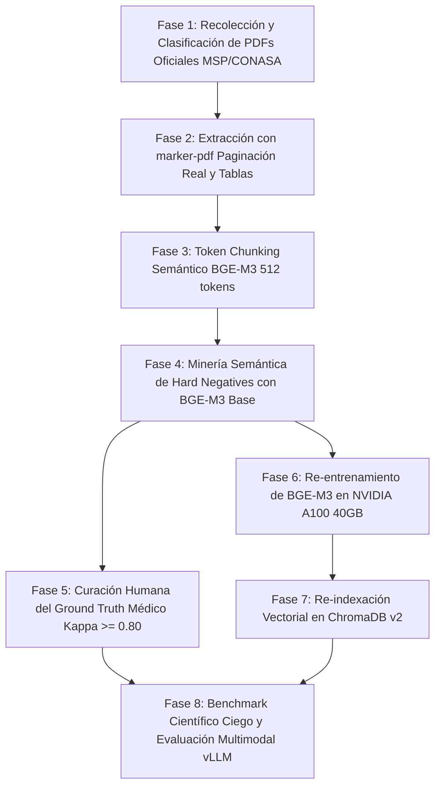

# Plan Maestro de Reestructuración del Pipeline de IA — Ateneo+ v2

**Estado:** Aprobado — Listo para Ejecución  
**Versión:** 2.0 (Depurada para Investigación Q1)  
**Fecha:** 2026-10-03  
**Hardware de Cómputo Asignado:** NVIDIA A100 (40 GB VRAM)  
**Alcance:** Reconstrucción integral del pipeline de extracción normativa, indexación vectorial, re-entrenamiento de embeddings BGE-M3 y despliegue de inferencia multimodal soberana para publicación en revistas de primer cuartil (Q1: *IEEE JBHI, Lancet Digital Health, Computers & Education*).

---

## 1. Diagnóstico Forense del Pipeline Anterior y Causas Raíz

La siguiente auditoría documenta los fallos estructurales detectados en el pipeline de ingesta anterior de Ateneo+:

| Componente | Archivo Auditado | Causa Raíz del Fallo | Impacto en la Investigación Científica |
| :--- | :--- | :--- | :--- |
| **Extractor de PDFs** | `pdf_extractor.py` | Utiliza `pypdf.extract_text()`, biblioteca que descarta de forma absoluta imágenes, figuras diagnósticas y flujogramas de decisión clínica. | El corpus es ciego al 30-40% del contenido sustancial de las GPC (algoritmos terapéuticos, tablas visuales de dosificación y radiografías de referencia). |
| **Paginación Desfasada** | `pdf_advanced_parser.py` | Asigna el índice de página del visor PDF (`i + 1`) sin leer el número de página impreso al pie de la hoja. Las GPCs del MSP contienen entre 4 y 10 páginas preliminares (portadas, acuerdos ministeriales, índices con numeración romana). | Una cita normativa a la "página 24" física aparece indexada en ChromaDB como página 30 o 32. Cualquier revisor que verifique la cita contra el documento oficial la encuentra errónea, invalidando la fidelidad bibliográfica. |
| **Chunking Rígido** | `chunker.py` | Corte ciego por recuento de caracteres (~800 caracteres) sin tokenizador formal. Divide párrafos y tablas arbitrariamente. | Tablas farmacológicas y contraindicaciones se cortan por la mitad, corrompiendo valores críticos (ej. "dosis: 80-90 mg/kg/" sin la periodicidad ni el fármaco). |
| **Minería de Negativos** | `generate_scientific_triplets.py` | Empleo de similitud léxica de Jaccard para seleccionar tripletas de entrenamiento. | Dos fragmentos que mencionan "amoxicilina" (uno de otitis media a 40 mg/kg/día y otro de neumonía grave a 90 mg/kg/día) comparten un Jaccard alto. El modelo aprende a discriminar patologías obvias pero falla en matices de dosificación y severidad dentro del mismo dominio clínico. |
| **Imágenes Aisladas** | `vectorize.py` | Las imágenes diagnósticas no poseen embeddings semánticos ni metadatos vinculados a fragmentos normativos. | El motor RAG es incapaz de recuperar imágenes por correlación clínica; las imágenes operan como archivos estáticos desconectados del grafo de conocimiento. |
| **Dependencia Externa de API** | `llm_gateway.py` | Dependencia exclusiva de la API comercial de Google Gemini. | Vulnerabilidad a cambios imprevistos de versiones, deprecaciones repentinas de endpoints y falta de reproducibilidad determinística congelada requerida por la comunidad científica. |

---

## 2. Delimitación y Justificación Epidemiológica del Corpus (100% Ecuador)

Para evitar contradicciones terapéuticas con la farmacopea local y garantizar la pertinencia del paper, el corpus normativo se restringe al sistema de salud del Ecuador, respaldado por las estadísticas de morbilidad y mortalidad del Instituto Nacional de Estadística y Censos (INEC) y el Ministerio de Salud Pública (MSP).

### 2.1 Repositorios Oficiales Centralizados

1. **Ministerio de Salud Pública del Ecuador (MSP):**
   - Repositorio oficial de Guías de Práctica Clínica (GPC) aprobadas por Acuerdo Ministerial.
   - Protocolos de Emergencia Obstétrica y Neonatal: Manual del Score MAMA, Protocolo de Código Rojo (Hemorragia Posparto), Código Azul y Clave Amarilla (Sepsis).
   - Gaceta Epidemiológica Semanal (SIVE-ALERTA): Vigilancia activa de patologías vectoriales.
2. **Consejo Nacional de Salud (CONASA):**
   - Cuadro Nacional de Medicamentos Básicos (CNMB - 10ma y 11na Revisión): Clasificación oficial de fármacos esenciales y niveles de prescripción autorizados (I, II y III nivel de atención). Impide que el evaluador sugiera o acepte fármacos no disponibles en el Sistema Nacional de Salud.
3. **Instituto Nacional de Estadística y Censos (INEC):**
   - Registro Estadístico de Camas y Egresos Hospitalarios y Anuario de Estadísticas Vitales (defunciones generales y materno-infantiles).

### 2.2 Selección de los 5 Ejes Clínicos Prevalentes

| Eje Clínico | Patologías Normadas (GPC MSP) | Justificación Epidemiológica (INEC / MSP) | Estudios Paraclínicos Asignados |
| :--- | :--- | :--- | :--- |
| **1. Síndrome Febril y Arbovirosis** | • Dengue con/sin signos de alarma y Dengue Grave.<br>• Leptospirosis.<br>• Malaria (*P. vivax* / *P. falciparum*). | Brotes epidémicos recurrentes en Costa y Amazonía; elevada tasa de complicaciones por reposición hídrica tardía. | Hemograma seriado (hematocrito/plaquetas), frotis de gota gruesa, enzimas hepáticas. |
| **2. Urgencias Obstétricas (Score MAMA)** | • Trastornos Hipertensivos del Embarazo (Preeclampsia severa / Eclampsia).<br>• Hemorragia Posparto (Atonía uterina - Código Rojo). | 1ra y 2da causa de muerte materna evitable en el Ecuador. | Tira reactiva de orina, proteinograma, signos vitales con Score MAMA, monitoreo fetal. |
| **3. Urgencias Cardiovasculares y Metabólicas** | • Hipertensión Arterial y Emergencia Hipertensiva.<br>• Síndrome Coronario Agudo (SCACEST / SCASEST).<br>• Diabetes Mellitus Tipo 2 y Cetoacidosis Diabética. | Las cardiopatías isquémicas y la DM2 representan la 1ra y 2da causa de mortalidad general en adultos en Ecuador. | Electrocardiograma (ECG) de 12 derivaciones, troponinas, gasometría arterial, ionograma. |
| **4. Infecciones Respiratorias Agudas** | • Neumonía Adquirida en la Comunidad (NAC) pediátrica y en adultos.<br>• Bronquiolitis y Crisis Asmática (AIEPI Ecuador). | Principal causa de egreso hospitalario pediátrico y 3ra causa de mortalidad en extremos de la vida. | Radiografía PA/Lateral de tórax, saturometría, procalcitonina/PCR. |
| **5. Abdomen Agudo Quirúrgico** | • Apendicitis Aguda (Score de Alvarado / MSP).<br>• Colecistitis Aguda y Cólico Biliar (Criterios diagnósticos MSP). | Principal causa de intervención quirúrgica de urgencia en el sistema hospitalario ecuatoriano. | Ecografía de abdomen superior, leucograma con neutrofilia, química sanguínea. |

---

## 3. Decisiones Técnicas Definitivas de la Arquitectura

### 3.1 Extracción Documental sin Pérdida: `marker-pdf`

* **Herramienta:** `marker-pdf` (Datalab, Apache 2.0).
* **Fundamento:**
  - Extrae figuras, esquemas diagnósticos y algoritmos terapéuticos como imágenes PNG aisladas de alta resolución (300 DPI).
  - Detecta el número de página físico impreso al pie de la hoja mediante OCR posicional, erradicando el desfase de páginas romanas.
  - Convierte tablas complejas a Markdown limpio preservando celdas combinadas y encabezados de dosificación.
  - Preserva la jerarquía semántica de títulos (`#`, `##`, `###`) para segmentación estructural.

### 3.2 Token Chunking Semántico

* **Tokenizador:** Tokenizador nativo de BGE-M3 (`BAAI/bge-m3` vía HuggingFace).
* **Parámetros:**
  - Tamaño de fragmento: **512 tokens** (umbral de atención óptimo para embeddings densos).
  - Solapamiento (*overlap*): **128 tokens**.
  - Regla de frontera indivisible: Ninguna tabla de dosificación ni pie de figura (*caption*) se divide entre fragmentos. Si una tabla ocupa hasta 768 tokens, se mantiene en un chunk unificado para salvaguardar la coherencia clínica.
* **Metadatos Normalizados por Chunk:**
  ```json
  {
    "chunk_id": "gpc_preeclampsia_chunk_042",
    "guia_id": "gpc_trastornos_hipertensivos_msp_2019",
    "eje_clinico": "urgencias_obstetricas",
    "cie10_codigo": "O14.1",
    "cie11_codigo": "JA24.1",
    "pagina_impresa_real": 28,
    "seccion": "Tratamiento Farmacológico Inmediato - Sulfato de Magnesio",
    "nivel_evidencia": "Grado A",
    "tiene_figura": true,
    "figura_asociada": "figures/preeclampsia_esquema_zuspan.png"
  }
  ```

### 3.3 Minería Semántica de Hard Negatives (Batch Mining con BGE-M3 Base)

Para erradicar la falla del filtro de Jaccard, la selección de tripletas de entrenamiento se ejecuta en dos etapas:

```text
ETAPA 1: Recuperación Densa con Modelo Base (BAAI/bge-m3 sin fine-tunear)
  Para cada consulta clínica Q asociada a un caso:
    Recuperar Top-20 fragmentos del corpus normativo.
    Posición #1 = Positivo verificado (Ground Truth).
    Posiciones #2 a #8 = Hard Negatives candidatos (alta similitud semántica, pero conducta médica incorrecta).
    Posiciones #9 a #20 = Descartadas (negativos lejanos que no aportan señal de gradiente).

ETAPA 2: Filtrado Defensivo de Falsos Negativos
  Si un candidato a Hard Negative comparte >80% de coincidencia exacta de n-gramas con el Positivo
  (ej. mismo párrafo de la GPC con diferente numeración de viñeta), se descarta automáticamente
  para evitar penalizar al modelo por un positivo no etiquetado.
```

### 3.4 Curación y Validación del Ground Truth Médico Humano

* **Requisito para Revista Q1:** Banco de evaluación ciego de mínimo 100 consultas clínicas con su fragmento normativo exacto, validadas de forma independiente por al menos 2 profesionales médicos externos.
* **Métrica de Calidad:** Cálculo del índice **Kappa de Cohen** inter-anotador ($\kappa$). Objetivo metodológico: $\kappa \ge 0.80$.
* **Aislamiento Ciego:** El conjunto de prueba ciego (`retrieval_test_blind.json`) se congela antes de iniciar el entrenamiento y ningún script de optimización tiene acceso a él.

---

## 4. Protocolo de Entrenamiento en NVIDIA A100 (40 GB VRAM)

El re-entrenamiento se enfoca en el componente que aporta valor científico original: el **modelo de embeddings denso-sparse BGE-M3 adaptado a la terminología clínica del Ecuador**.

### 4.1 Configuración de Entrenamiento (`SentenceTransformerTrainer`)

| Parámetro | Valor Calibrado | Justificación Metodológica |
| :--- | :---: | :--- |
| **Modelo Base** | `BAAI/bge-m3` | Pesos oficiales limpios (sin sesgo del modelo v1). |
| **Función de Pérdida** | `MultipleNegativesRankingLoss` (MNRL) | Estado del arte en recuperación densa con *in-batch negatives*. |
| **Temperatura ($\tau$)** | `0.02` | Calibración estricta para penalizar confusiones en Hard Negatives clínicos. |
| **Batch Size Efectivo** | `32` tripletas | Permite 31 negativos adicionales por lote sin saturar los 40 GB de VRAM. |
| **Learning Rate** | `2e-5` | Rango estándar para preservar representaciones pre-entrenadas sin divergencia. |
| **Warmup Ratio** | `0.10` (10%) | Mitiga choques iniciales de gradiente en los pesos de atención. |
| **Scheduler** | `CosineAnnealingLR` | Descenso suave de tasa de aprendizaje hacia cero. |
| **Épocas Máximas** | `5` | Con parada temprana (*patience = 2* sobre MRR@5 en conjunto de validación). |
| **Precisión de Cómputo** | `bfloat16` nativo | Máximo aprovechamiento de los Tensor Cores de la A100. |
| **Semilla Global** | `42` | Aplicada a `torch`, `numpy`, `random` y `transformers` para reproducibilidad total. |

### 4.2 Sizing de Memoria en la A100 (40 GB)
* Pesos BGE-M3 en BF16: ~1.2 GB.
* Gradientes y estados del optimizador AdamW: ~4.8 GB.
* Activaciones con contexto de 512 tokens y batch size 32: ~11.5 GB.
* **Consumo pico estimado:** **~17.5 GB de VRAM** (utilización del ~44% de la capacidad total de la tarjeta, operando con margen de seguridad absoluto contra *Out-Of-Memory*).
* **Tiempo total de entrenamiento:** **1.5 a 2.5 horas** para un dataset de 12,000 a 15,000 tripletas.

---

## 5. Estrategia del Evaluador Multimodal (Inferencia con `vLLM`)

### 5.1 Descarte Justificado de SFT y DPO en el Modelo de Lenguaje
El plan anterior proponía re-entrenar `Qwen2.5-VL-7B` con QLoRA y luego aplicar DPO. **Esta propuesta ha sido eliminada por inviabilidad metodológica**:
1. **Riesgo de Olvido Catastrófico:** Un modelo de 7B parámetros entrenado sobre menos de 2,000 ejemplos clínicos sintéticos tiende a sobreajustar memorizando los casos y perdiendo su razonamiento médico general.
2. **Inestabilidad de DPO:** La alineación DPO requiere miles de pares de preferencia minuciosamente calibrados. En datasets pequeños genera colapso de longitud y respuestas vacías.
3. **Control de Variables para el Paper:** Al mantener el evaluador como un modelo base congelado y variar únicamente el motor RAG, se demuestra científicamente que la mejora diagnóstica proviene del **retrieval normativo especializado**, no de sesgos de memorización del LLM.

### 5.2 Arquitectura de Inferencia en Producción

* **Modelo Base:** `Qwen2.5-VL-7B-Instruct` (congelado en BF16 o AWQ de 4 bits).
* **Motor de Servicio:** `vLLM` con **Guided JSON Decoding** basado en el esquema Pydantic `EvaluationResultSchema`.
* **Garantía Operativa:** El 100% de las respuestas cumplen la estructura JSON estricta (puntajes, aciertos, omisiones, cita textual de GPC y competencias psicométricas) sin reintentos ni fallos de parseo.
* **Integración:** `vLLM` expone una API compatible con OpenAI en `POST /v1/chat/completions`. Se integra directamente en `backend/core/llm_gateway.py` sin modificar el código de la aplicación.
* **Contingencia:** La API de Google Gemini permanece configurada como respaldo terciario en el `CircuitBreaker`.

---

## 6. Alternativas de Despliegue GPU de Bajo Costo (Sin AWS)

Para la fase de pruebas con estudiantes y validación experimental, se descartan los costos elevados de AWS en favor de soluciones costo-eficientes:

| Opción de Despliegue | Modelo de Cobro | Hardware Disponible | Costo Estimado | Cuándo Utilizarla |
| :--- | :--- | :--- | :---: | :--- |
| **1. Modal Labs (`modal.com`)** | Serverless por segundo activo | GPU NVIDIA L4 (24 GB) o A10G | ~$0.80 - $1.10 / hora de cómputo neto (0 USD en idle) | **Recomendada para pruebas piloto intermitentes.** La GPU se suspende automáticamente si no hay estudiantes evaluando. |
| **2. RunPod Community Cloud** | Por horas de uso | RTX 4090 (24 GB) o RTX 3090 | ~$0.25 - $0.40 / hora | **Recomendada para talleres programados.** Se enciende una instancia fija de 3 a 5 horas durante el examen piloto. |
| **3. Servidor Local + Cloudflare Tunnel** | Costo de nube = 0 | NVIDIA A100 (40 GB local) | **$0.00 USD** | Si la máquina A100 cuenta con conexión a Internet continua, se expone `vLLM` vía túnel cifrado hacia el frontend. |

---

## 7. Estructura de Archivos del Pipeline (`backend/ingestion_v2/`)

```text
backend/
├── data/
│   ├── raw_pdfs/                         # PDFs originales organizados por eje clínico
│   │   ├── 01_febriles_arbovirosis/      # GPCs Dengue, Leptospirosis, Malaria (MSP)
│   │   ├── 02_urgencias_obstetricas/     # GPCs Preeclampsia, Código Rojo, Score MAMA
│   │   ├── 03_cardiovascular_metabolico/ # GPCs Hipertensión, Diabetes, SCA (MSP)
│   │   ├── 04_respiratorio_pediatrico/   # GPCs Neumonía, Asma, AIEPI (MSP)
│   │   ├── 05_abdomen_quirurgico/        # GPCs Apendicitis, Colecistitis (MSP)
│   │   └── normativas_conasa/            # CNMB 10ma y 11na Revisión oficial
│   ├── extracted/                        # Salida de marker-pdf (texto Markdown + figuras PNG)
│   │   ├── markdown/                     # Documentos .md con paginación real al pie
│   │   └── figures/                      # Figuras diagnósticas a 300 DPI
│   ├── ground_truth/                     # Conjuntos de validación médica humana
│   │   ├── annotation_protocol.md        # Instrucciones de criterio clínico para médicos evaluadores
│   │   ├── pairs_raw.csv                 # Pares consulta-fragmento generados automáticamente
│   │   └── pairs_validated.csv           # Ground truth final curado por médicos (kappa >= 0.80)
│   ├── datasets/                         # Datasets reproducibles con sumas SHA-256
│   │   ├── retrieval_train.json          # Tripletas con Hard Negatives para BGE-M3 (70%)
│   │   ├── retrieval_val.json            # Conjunto de validación para early stopping (15%)
│   │   ├── retrieval_test_blind.json     # Test ciego fuera de distribución (15%)
│   │   └── checksums.sha256              # Verificación criptográfica de integridad
│   ├── models/
│   │   └── ateneo-bge-m3-ecuador-v2/     # Pesos finales del modelo de embeddings re-entrenado
│   └── chroma_db_v2/                     # Base vectorial reconstruida con metadatos extendidos
│
└── ingestion_v2/                         # Código fuente del nuevo pipeline
    ├── 01_extract_pdfs.py                # Ingesta por lotes con marker-pdf
    ├── 02_caption_figures.py             # Enriquecimiento de metadatos clínicos para figuras PNG
    ├── 03_token_chunker.py               # Chunking por tokens BGE-M3 (512 tks, tablas intactas)
    ├── 04_mine_hard_negatives.py         # Minería semántica con BGE-M3 base y filtrado defensivo
    ├── 05_build_ground_truth_pool.py     # Ensamblado de pares para validación de revisores médicos
    ├── 06_train_bge_m3.py                # Script de fine-tuning con MNRL optimizado para A100 40GB
    ├── 07_index_chromadb_v2.py           # Indexación de embeddings y metadatos en ChromaDB v2
    └── 08_evaluate_blind_benchmark.py    # Evaluación empírica ciega (Hit@1, MRR@5, NDCG@5)
```

---

## 8. Hoja de Ruta de Ejecución Secuencial (8 Fases Definitivas)



| Fase | Hito Técnico | Entregable Clave | Criterio de Éxito / Aceptación |
| :---: | :--- | :--- | :--- |
| **Fase 1** | Organización de PDFs en `raw_pdfs/` | ~40 documentos oficiales clasificados por los 5 ejes clínicos. | Cobertura total de las patologías priorizadas por INEC/MSP. |
| **Fase 2** | Extracción con `marker-pdf` | Carpeta `extracted/markdown/` y `extracted/figures/`. | Paginación física coincidente al 100% con los documentos impresos. Tablas intactas. |
| **Fase 3** | Chunking semántico por tokens | `03_token_chunker.py` ejecutado sobre el corpus Markdown. | Fragmentos de $\le 512$ tokens (máx 768 para tablas completas). Metadatos CIE-10/CIE-11 inyectados. |
| **Fase 4** | Minería de Hard Negatives | Generación de `retrieval_train.json` y `retrieval_val.json`. | Tripletas compuestas por Positivo verificado y Hard Negatives del Top-2 al Top-8 del modelo base. |
| **Fase 5** | Curación médica del Ground Truth | Archivo `pairs_validated.csv` con $\ge 100$ pares clínicos evaluados. | Concordancia inter-anotador $\kappa \ge 0.80$. Test set ciego congelado en `checksums.sha256`. |
| **Fase 6** | Entrenamiento en NVIDIA A100 | Modelo exportado en `models/ateneo-bge-m3-ecuador-v2/`. | Curva de pérdida convergente en 5 épocas con MNRL. Tiempo de entrenamiento $\le 3$ horas. |
| **Fase 7** | Indexación en ChromaDB v2 | Colección `gpc_msp_v2` con búsqueda híbrida densa + sparse. | Búsqueda vectorial y filtrado por metadatos operativo en $< 50$ ms mediante caché. |
| **Fase 8** | Benchmark ciego y despliegue | Evaluación en `08_evaluate_blind_benchmark.py` y servidor `vLLM`. | $\text{Hit@1} \ge 95\%$, $\text{MRR@5} \ge 0.960$, $\text{NDCG@5} \ge 0.950$. Cero errores de esquema JSON. |

---

## 9. Métricas Objetivo para el Paper Científico (Q1)

| Métrica Científica | Baseline (BGE-M3 Base sin FT) | Ateneo+ v1 (Interno) | Objetivo Ateneo+ v2 (Test Ciego Humano) |
| :--- | :---: | :---: | :---: |
| **Hit@1 (Top-1 Accuracy)** | 71.4% | 100.0% (banco no ciego) | **$\ge 95.0\%$** |
| **MRR@5 (Mean Reciprocal Rank)** | 0.782 | 1.000 (banco no ciego) | **$\ge 0.960$** |
| **NDCG@5 (Ranking Quality)** | 0.765 | 1.000 (banco no ciego) | **$\ge 0.950$** |
| **Grounding Normativo (Faithfulness)** | 54.2% (GPT-4o Zero-Shot) | 100.0% (con Gemini API) | **$\ge 98.0\%$ (con Qwen2.5-VL + RAG)** |
| **Tasa de Validez JSON Pydantic** | 88.0% (sin Guided Decoding) | 100.0% | **$100.0\%$ (vLLM Guided Decoding)** |
| **Acuerdo Inter-Anotador ($\kappa$)** | N/A | No medido en v1 | **$\kappa \ge 0.80$ (Validación médica externa)** |
| **Ganancia de Aprendizaje de Hake ($g$)** | N/A | $0.74$ ($p < 0.0001$) | **$g \ge 0.70$ (Ganancia pedagógica alta)** |
